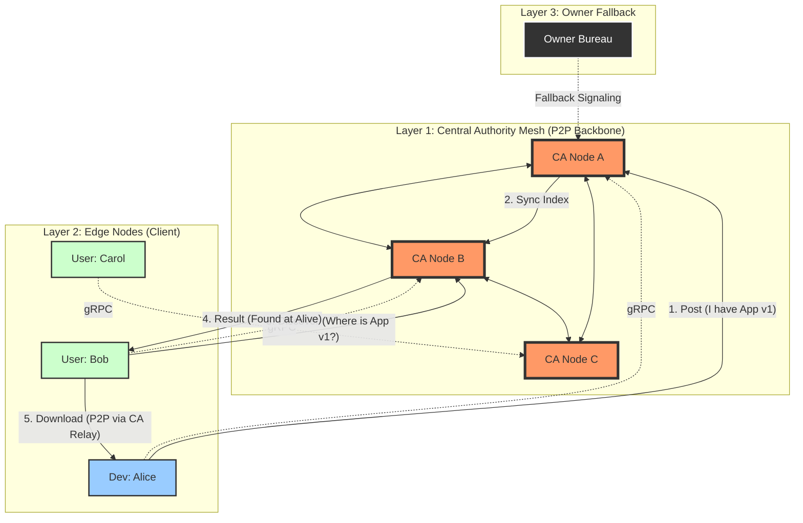

# MYCUTE: The Autonomous OS on OS Ecosystem

**MYCUTE** は、既存のオペレーティングシステム（macOS, Windows）の上で動作する、完全に自律した「OS の中の OS（OS on OS）」です。

単なる音声入力ツールから始まったこのプロジェクトは、現在、**中央集権的な支配構造を持たない、真に自由で、しかし数学的に信頼し合えるアプリケーション・エコシステム** へと進化しました。

## 1. ビジョンとミッション

### 「OS on OS」とは何か？
私たちが日々利用している OS や巨大プラットフォームは、便利である一方で、強力な中央集権적支配の下にあります。アプリの審査、手数料、突然のアカウント停止、およびプラットフォームの恣意的なポリシー変更。これまで私たちは、それらに対して無力でした。

MYCUTE は、その構造からの脱却を目指します。
MYCUTE は、ホスト OS の上で動作しながらも、独自の**アイデンティティ管理**、独自の**アプリケーション実行環境（Sandbox）**、および独自の**P2P通信網**を持つ、独立した「仮想国家」です。

### ミッション：信頼の民主化 (Trust Democratized)
MYCUTE の世界には、絶対的な権力を持つ「管理者」は存在しません。存在するのは、互いに対等な「ノード」だけです。
「誰を信頼するか」を決める権利は、プラットフォームではなく、あなた自身（あなたのノード）にあります。MYCUTE は、その信頼関係を**公開鍵暗号方式**という数学の力で担保し、誰にも改ざんできない形での安全なアプリケーション流通を実現します。

### インターネットのあり方の再定義
MYCUTE が目指すのは、単なるソフトウェア配布の効率化ではありません。それは、**「信頼の根源を巨大企業のバイナリやサーバーから、個人のノードと数学的証明へと取り戻す」**という、インターネットのあり方そのものの再定義です。「中央が正しいと言うから正しい」世界から、「数学的に正しいことが証明されているから正しい」世界へ。このパラダイムシフトにより、あらゆるデジタルコンテンツは、プラットフォームの恣意的な管理から解放され、純粋な「真実の連鎖」として自立します。

---

## 2. 信頼とセキュリティのモデル (Trust & Security Model)

MYCUTE の信頼モデルは、「人間の記憶」から始まり、「委譲」を経て、「数学的な証明」へと結晶化する、ヒューマン・セントリックかつ強固なセキュリティ基盤の上に成り立っています。このシステムにおいて、**各ノードはその役割（オーナー、CA、開発者）に応じて明確に分離された責務**を持ちます。

### 2.1. オーナー事務局：信頼の根源 (The Anchor)
システムの信頼の起点（トラスト・アンカー）は、**オーナー事務局**ノードが保持します。全バイナリにハードコードされた「オーナー公開鍵」に対応する秘密鍵を、世界で唯一管理する存在です。

- **起動プロセス (Owner Mode)**: オーナー事務局は、特別なバイナリを使用するのではなく、全ノード共通のバイナリを使用します。しかし、起動時に特定のフラグ（例: `--owner-mode`）と、**オーナーの記憶にある秘密のパスフレーズ**を入力することで、メモリ上に「オーナー秘密鍵」を復元します。
- **役割の専念**: オーナーモードで起動したノードは、一般ユーザー向けや開発者向けの通常機能を一切停止し、管理業務（CAの任命と認証）にのみ専念します。これにより、攻撃対象（アタックサーフェス）を最小限に抑えます。
- **機能**: オーナー秘密鍵を用いて、特定の実績あるノードに対して **中央認証局 (CA)** としての「任命証」を発行できる唯一の存在です。

### 2.2. 中央認証局 (CA) の任命プロセス (Appointment)
信頼できる第三者（開発者や企業）が CA として任命され、ネットワークの信頼を支えるバックボーンへと参加するフローです。この工程を通じて、**オーナーを起点とした信頼の種**が CA に植え付けられます。

1.  **公開鍵の要求 (Request)**: オーナー事務局が、候補となるノードへ公開鍵を要求するリクエストを投げます (`POST /v1/owner/request-pubkey`)。
2.  **公開鍵の提出 (Response)**: 候補ノードは自身の公開鍵を返却します。
3.  **任命証の発行 (Sign)**: オーナー事務局は、その公開鍵と「改竄不能な有効期限 (`expire_at`)」をセットにし、オーナーのみが保有する秘密鍵（Ed448）で署名を行います。
4.  **CAトークンの交付 (Deliver)**: 生成された署名データを、オーナー事務局の手によって候補者へ交付します。これが「**CAトークン**」の実体であり、**CA自身が「正当なCAであること」を数学的に証明するための唯一の証明書**となります。

### 2.3. アイデンティティの検証サイクル (Pull-based Verification Flow)
開発者が自身の正当性を CA に保証してもらうプロセスです。開発者ノードが NAT の内側にいても確実に動作するよう、開発者が CA からデータを取得しに行く「プル型」モデルを採用しています。**なお、開発者がオーナー事務局と直接通信することは設計上、一切ありません。**

1.  **CAへの申請 (Apply)**: 開発者は CA ノードに対し、自身の **公開鍵 (Public Key)** を添えて検証を申請します (`POST /v1/ca/apply`)。この際、CA はシステムのスコープ外（対面確認や公的書類等）で厳格な KYC（本人確認）を行います。
2.  **証明書の構築 (Construction)**: 検証を完了した CA は、「開発者の公開鍵」と「有効期限」を含むデータに対し、自身の秘密鍵で署名を行い「開発者証明書」を作成します。さらに、自身がオーナーから授与された**「CAトークン（オーナー署名付きの任命証）」**をセットにします。
3.  **受取と自動記録 (Retrieve & Record)**: 開発者は、CA からの連絡（メール等）を受けた後、CA ノードから署名データ一式（開発者証明書 + CAトークン）を「取得」します (`GET /v1/ca/retrieve/{pubkey}`)。正当なデータが取得されると、ノードは自動的に自身のアイデンティティを「検証済み」としてデータベースに記録します。

### 2.4. 数学的証明の実体：信頼の連鎖 (Chain of Trust)
リトリーブによって開発者が受け取り、自身のノードに保存する「証明データ」の実体は、以下の要素の組み合わせです。これらが揃うことで、数学的に改竄不能な「信頼の連鎖」が完成します。

-   **開発者への署名 (The Certificate)**:
    - CA の秘密鍵を用いて、**「開発者の公開鍵 + 有効期限」** を数学的に封印したもの。
-   **有効期限 (expire_at)**:
    - 署名対象に含まれているため、1秒でも書き換えれば署名検証そのものが失敗するように設計されています（**改竄不能な期限**）。
-   **CA の任命証 (CA-TOKEN / Appointment Proof)**:
    - オーナー事務局の秘密鍵を用いて、**「CA の公開鍵 + 有効期限」** を封印したもの。

#### なぜこれが「開発者の信頼」を数学的に証明するのか？
アプリの利用者が開発者の公開鍵（Dev_PubKey）を見たとき、システムは以下の推論を**ローカル（オフライン）で瞬時に実行**します。

1.  「この開発者の公開鍵には CA の署名がある。つまり、この CA はこの開発者の身元を保証している」
2.  「では、その CA 自体は本物か？ → 自身のバイナリに組み込まれた **『オーナー公開鍵』** を使って、CA の任命証を検証する」
3.  「任命証がオーナーによって署名されている。つまり、この CA はオーナー事務局が認めた正規の機関である」
4.  **結論**: 「オーナー事務局 → 中央認証局 (CA) → 開発者」という **信頼の連鎖 (Chain of Trust)** が数学的に繋がっているため、開発者は「オーナーが認めた正当な開発者である」ことが客観的に証明されます。

### 2.5. アプリケーション (.mycute) の自律的検証
アプリ（`.mycute` ファイル）には、開発者の署名とともに、CA が発行した上記の「期限付き証明書（デジタル署名）」がセットで埋め込まれています。

- **信頼形成のメカニズム**:
    - **多重の封印**: アプリの実体は「開発者の署名」で封印されており、その開発者自身は「CA の署名」で実在が保証され、さらにその CA は「オーナーの署名」で正当性が担保されています。この**数学的なマトリョーシカ構造**が信頼の連鎖を形成します。
    - **改竄の不可能性**: アプリの一部を書き換えれば開発者の署名が壊れ、期限を書き換えれば CA の署名が壊れます。検証プロセスにおいて、この連鎖のどこか一点でも欠ければ、システムは即座に「信頼できないアプリ」として検知します。
- **ローカルでの数学的判定**: アプリの起動時、MYCUTE システムはインターネットへの接続を必要とせず、自身のノード内だけで「このアプリが信頼できる CA によって検証された開発者のものか」「期限が切れていないか」をミリ秒単位で判定し、警告UXを変化させます。
- **レジリエンス**: CA やオーナー事務局が万が一停止していても、一度検証を受けたアプリは期限が来るまで信頼性を維持し続け、ユーザーの元で警告なく「正当なアプリ」として動作し続けます。これにより、中央集権的なプラットフォームに依存しない、自律的なエコシステムが実現します。

---

## 3. コア・コンセプト：自律分散ネットワークと影分身モデル

MYCUTE のアーキテクチャは、従来の Web サービス（Client-Server）とは根本的に異なります。

### 3.1. ノード内マルチテナント（影分身モデル）
各ノードは、それぞれが独立したデータベースを持つ「完全なる独立国家」です。
しかし、一人の人間は社会の中で「個人」としての顔、「会社員」としての顔、「開発者」としての顔など、複数の役割を持っています。

MYCUTE はこれを **「影分身 (Shadow Clones)」** としてシステム化しました。
-   **`apx_id` / `vdr_id`**: これらはグローバルな ID ではなく、あなたのノード内部でのみ有効な「パーティション（区切り）」です。
-   **Origin の分離**: 影分身ごとにデータの領域（LocalStorage, Cookie 等）は厳格に分離されます。「仕事用の影分身」と「個人用の影分身」で、同じアプリを使っていてもデータが混ざることはありません。

### 3.2. ネットワーク・トポロジー
MYCUTE のネットワークは、**EasyTier** を基盤とした P2P 通信網によって構成されます。

#### Tier 1: オーナー事務局 (Owner Bureau)
-   **役割**: ネットワークの根源であり、最後の砦（Fallback）。
-   **機能**: CA ノード同士の通信が途絶えた場合などの緊急時にのみシグナリングや中継機能を提供します。平常時は静観し、システムへの介入を最小限に留めます。

#### Tier 2: 中央認証局 (Central Certificate Authority Nodes)
-   **役割**: ネットワークの背骨（バックボーン）。
-   **機能**: 互いに **EasyTier P2P メッシュ** で常時接続し、アプリケーションの所在情報（カタログ）を共有・同期します。また、NAT 超えのためのシグナリングや、P2P 通信の中継（Relay）を行います。
-   **性質**: 中央と言いつつも単一障害点ではなく、複数の CA ノードが協調して動作する分散システムです。

#### Tier 3: エッジノード (Developers & Users)
-   **役割**: アプリの開発者、および利用者。
-   **機能**: 
    -   **Post**: 自分が持っているアプリ情報を CA に通知（宣伝）します。
    -   **Discovery**: 欲しいアプリを CA に問い合わせます。
    -   **Download**: CA が確立した P2P 経路を通じて、アプリを持っている他のノードから直接ファイルをダウンロードします。
    -   **Vote**: アプリに対する「熱意」を CA に投票します。
-   **接続**: P2P ネットワークに直接常駐するのではなく、最寄りの CA ノードに対して **gRPC** で接続します。これによりエッジ側の負荷を最小限に抑えます。

### 3.3. 自律分散的な「信頼の市場」 (Trust Market)と「市民権」の定義

MYCUTE が目指すのは、権威主義的なヒエラルキーではなく、**「正当なコストを支払った参加者（市民）の熱意が、正しく報われる社会」** です。
この理想を実現するために、グレン・ワイル氏らが提唱する二次投票 (Quadratic Voting) の思想を分散システムの現実に即した形でアレンジして実装しています。

#### A. 「1ノード ＝ 1市民」の原則と Identity Layer の定義
MYCUTE において、**信用レイヤー (Identity Layer)** は、数学的な署名連鎖がオーナー（Root）までどこまで遡れるかを定義します。その中でも **Layer 3 (L3)** ノードは「特権階級」ではありません。それは、システムに対して責任を持つ**「標準的な市民」**の姿です。

*   **物理的制約によるシビル攻撃対策**:
    *   デジタル空間では、一人の人間が無限に ID を生成する「シビル攻撃 (Sybil Attack)」が容易に行えてしまいます。
    *   これを防ぐため、MYCUTE では **「物理的なマシン 1 台につき、唯一のキーペア（市民権）」** という原則を設けています。
    *   CA から証明書の発行を受けるプロセスは、そのノードが実在し、コスト（マシンの用意と維持）を投じて参加していることを証明する「帰化手続」のようなものです。
    *   **シングルトン・ノードによる物理的担保**:
        *   この原則をシステムレベルで強制するため、MYCUTE は **「シングルトン・ロック (Singleton Lock)」** 機構を備えています。
        *   仮想マシンを含む 1 台のマシン（OS）環境につき、同時に起動できる MYCUTE のインスタンスは厳格に 1 つに制限されます。
        *   これにより、1 つのマシンリソースを複数のアイデンティティで悪用・使い分けることは物理的に不可能となり、一人の人間が持つ影響力（信用の分母）は、その人が実際に所有・管理している物理的リソースの数に正しく比例するように設計されています。
*   **フリーライダーの排除**:
    *   コストを支払わず、匿名でタダ乗りしようとする低信頼ノードに対しては、その影響力（投票権）を数学的に「1票」へと厳格に制限します。
    *   これは差別ではなく、無限に増殖可能な匿名存在がシステムの決定権を乗っ取ることを防ぐための、純粋な防衛措置です。

#### B. 二次投票 (QV) による「熱意」の解放
MYCUTE では、単なる「賛否」を超えた、ユーザーの深い「熱意」を数学的に重み付けしてアプリの信用（Social Score）に反映させる仕組みを導入しています。

*   **投票予算（クレジット）の源泉と交付 (初期予算 / Forum)**:
    - ノードが公式なアイデンティティ（L2以上）を取得する「エントリー（Entry）」の際、信頼の起点である CA は、自身が管理する **フォーラム (Forum)** ごとに独立した **「初期予算証拠（Voucher）」** を授与します。
    - **階層の多態性**: この証書には、オーナーから授与された **「CAトークン（任命証）」** が含まれる場合（L3）と、含まれない場合（L2）があります。いずれの場合も、システムは等しく予算を授与し、投票を受理します。CAトークンの有無は受理の可否ではなく、あくまで社会的インパクトの「重み」を決定する識別子として機能します。

*   **等しい表現の尺度と自律的な帳簿管理**:
*   すべてのノードは、信頼レベルにかかわらず、与えられた **初期予算の範囲内** という尺度でアプリへの愛着を表現します。
*   「今、初期予算のうち何票を使っているか」というステート（残数）は、ノード自身のローカル DB で管理されます。
    *   **用語定義（Balance vs Credits）**:
        *   **バランス (Balance)**: ノードが保有する「手持ちの弾数（投票権の残高）」です。CAから付与され、投票によって消費されます。初期値はフォーラムの設定（`initial_balance`）に基づきます。
        *   **クレジット (Credits)**: 投票の結果として計算・付与される「社会的信用スコア」です。バランスの消費量そのものではなく、そこから算術的（二乗則など）に導き出される価値を指します。
        *   この 2 つを厳密に区別することで、「個人の権利（保有量）」と「社会的な評価（計算結果）」の混同を防ぎます。
    *   **改竄防止（セルフ・シリング）**: 自身の帳簿（バランス）は常に自身の最新の秘密鍵で署名・封印されます。SQL で直接数値を書き換えるなどの不当な操作を行えば、署名の連鎖が壊れ、そのノードは数学的に「発言権（投票権）の自死」を迎えることになります。

*   **社会的インパクトの動的計算**:
    *   「初期予算」という限られた資源をどう分配するかはノードの自由ですが、その社会的な影響力（スコア）は、集計時の身分（L3/L2）によって動的に変換されます。
    *   **L3 市民（公式）**: 投じた $n$ 票を **$n^2$ ポイント** として評価。
    *   **L2 以下（一般）**: 投じた $n$ 票を **$n / initial\_balance$ ポイント**（最大 1.0）としてリニアに評価。
    *   この **「票数（感情）」と「インパクト（評価）」の分離** により、ノードが将来 L3 へと昇格した際、過去に投じた票はメンテナンス不要で自動的に最大インパクト（$initial\_balance^2$）の威力を持つ「責任ある市民の声」へとアップグレードされます。

*   **連合アイデンティティ (Federated Identity) による信頼の蓄積**:
    - **マルチ・エントリー**: すべてのノードは、世界中に存在する無数の CA に対して自由にエントリーを行うことができます。複数の CA から認証を得ることは、そのノードの社会的信用のポートフォリオを強化することに繋がります。
    - **最良の真実の採用**: 投票の際、ノードは自身が持つすべての予算証書の束（Bundle）を提示します。受取側の CA は、その中に **「たった一つでも」** L3 階層（CAトークン付きの証書）が含まれていれば、そのノード全体を最高ランク（L3）として扱い、二乗則（QV）によるスコアリングを適用します。これにより、特定の CA への依存を排除し、分散的な信頼の冗長性を確保します。

*   **分散型監査（CA と集計者の役割分担）**:
    - **CA による公平な受理**: 投票を受け取った CA は、CAトークンの有無にかかわらず、数学的に正当な証書と署名であれば等しく受理しなければなりません。特定の CA が「自分は L3 からの票しか受け取らない」といった差別を行うことは、ネットワークの公平性を損なう行為とみなされます。
    - **集計レイヤーによる事後監査**: すべての CA の結果が統合されるディスカバリー（集計）レイヤーにおいて、フォーラムごとに設定された初期予算の制限を超えた「ダブルスペンド」が事後的に検知されます。不正を働いたノードは、その瞬間にすべての社会的信用を失い、ブラックリスト入りとなります。

#### C. 予算の物理的実体：tickets と my_rem の使い分け

MYCUTE における投票権の管理は、対外的な「証明」と対内的な「管理」を分離した二層構造になっています。この仕組みを理解するために、**tickets（チケット）** と **my_rem（帳簿）** の役割の違いを明確にする必要があります。

| 概念 | 役割の例え | 主な用途 | 管理主体 | 改竄耐性の基盤 |
| :--- | :--- | :--- | :--- | :--- |
| **tickets** | **小切手（原本）** | CA に対する予算の「証明」 | CA（発行者） | CA による電子署名 |
| **my_rem** | **家計簿（帳簿）** | ノード自身の残高・履歴「管理」 | 自分自身 | 自身の秘密鍵による封印 |

##### 1. tickets：対外的な予算の証明書 (The Voucher)
ノードが投票リクエストを CA に送る際、CA は「このノードには本当に投票する権利があるのか？」を瞬時に判断しなければなりません。
- **背景と目的**: 分散ネットワークにおいて、すべてのノードの残高を CA がリアルタイムで中央管理することは、通信負荷とプライバシーの観点から困難です。
- **仕組み**: ノードが CA にエントリー（登録）した際、CA はそのノードの公開鍵に対して「特定の初期予算（`initial_balance`）を付与した」というデータを作成し、**CA 自身の秘密鍵で署名**を施してノードに渡します。
- **効果**: これが tickets です。ノードはこのチケットを「予算の原本」として持ち歩き、投票時に提示します。CA は自身の署名を検証するだけで、DB を検索することなく「かつて自分がこのノードに予算を与えた事実」を数学的に確信できます。これは、発行元が保証する「小切手」を提示する行為に似ています。

##### 2. my_rem：対内的な自律的記録 (The Personal Ledger)
一方、ノード自身が「今、どのフォーラムで、あと何ポイント使えるか？」を正確に把握し、二重投票（ダブルスペンド）を自ら防ぐための仕組みが my_rem です。
- **背景と目的**: チケットは「初期値」を証明するものに過ぎず、その後の使用状況（あと何回投票したか）まではチケット単体では証明できません。
- **仕組み**: ノードは、CAから授かった初期予算から、自分が投票した分を差し引いた「実効残高（current balance）」や「投票先の履歴」を、自分専用の暗号化領域（`my_rem` ペイロード）に記録します。
- **階層構造**: `my_rem` は、CA ごと、さらにその下の **フォーラムごと** に独立した統計情報を保持する階層構造になっています。これにより、一つのノードが複数のコミュニティ（フォーラム）に所属し、それぞれの文脈で独立して「熱意」を表明することが可能になります。
- **効果**: このデータは**ノード自身の秘密鍵で署名・封印**されます。もしユーザーが SQL 等で直接データベースを操作して残高を書き換えようとしても、my_rem 側の署名整合性が壊れるため、そのノードは数学的に「自死（発言権の喪失）」を迎えることになります。これは、自分がいつ何にいくら使ったかを記録し、自分自身で予算を管理する「家計簿」の役割を果たします。

##### 3. なぜ my_rem の改竄は「合理的」ではないのか？（数学的抑止力）
一見すると、自分の手元にある `my_rem` を書き換えて「残高を増やす」などの行為は、自分に有利な合理的な行動に見えるかもしれません。しかし、MYCUTE の設計において、それは**「最も不合理な選択」**となるように数学的な力学が働いています。

- **「封印」の物理的破壊と即時の自死**:
    `my_rem` のデータは、ノードの秘密鍵によって厳重に署名（封印）されています。ユーザーがエディタやツールで数値を「0」から「15」に書き換えた瞬間、そのデータに対応する**「正しい署名」**は失われます。プログラムは起動時や通信のたびにこの署名を検証するため、改竄を検知した瞬間にノードはすべての機能を停止します。つまり、書き換えた瞬間にそのアイデンティティは「動かないガラクタ」へと自ら変貌します。

- **「お財布」の破棄：不正と引き換えに失う全財産（経済的不合理性の強制）**:
    `my_rem` は、いわば各ノードが持つ唯一の「お財布」です。このお財布を不正に書き換えようとした悪意のあるユーザーは、その瞬間に**「お財布ごと削除（全財産の完全破棄）」**する以外に、二度とアプリケーションを起動させて「家（システム）」に入る方法がなくなります。
    つまり、**「不正な利益を手にしようとした結果、必ず一文無し（残高ゼロ）に戻る」** という仕組みになっています。改竄という不誠実な試みに対して、お財布の修復という救済措置を一切与えず、誠実なリスタート（ゼロからのやり直し）を強いるこの構造により、改竄を試みること自体が、追求した利益に対して失う資産があまりに大きい「不合理な選択」となります。

- **過去の自分による「裏切り」の証明 (Proof of Malfeasance)**:
    ノードが投票を行う際、CA に対して「現在の予算状態」を提示します。CA は、そのノードから以前受け取った投票データの一貫性を保持しています。もしユーザーがローカルデータを過去の状態にロールバックさせて「二度目の投票」を試みようとしても、CA 側の履歴と矛盾が生じます。この矛盾は単なる「エラー」ではなく、**「このノードの持ち主が、自分の秘密鍵を使って二種類の異なる事実を生成した」という確定的な悪意の数学的証拠**となり、即座にネットワーク全体へ拡散されるトリガーとなります。

- **「市民権」という巨大な資産を失う社会的コスト**:
    MYCUTE において、CA から L3 (Trust-Anchor) 認証を得ることは、現実世界でのパスポート取得に近い重みを持ちます。これには時間、労力、そして誠実な運用の積み重ねという「信頼のコスト」が投じられています。わずか数ポイントの投票権を偽造するために、これまで積み上げてきた**「L3 市民権」という巨大な資産**を永久に失い、ブラックリストに刻まれることは、投資対効果の観点から見てあまりにも不合理です。

- **数学的な「名誉刑」**:
    MYCUTE の世界では、不正は「バレなければ得」という不確実なものではありません。**「自分の秘密鍵で、自分の不正に署名してしまう」**という構造そのものが、嘘をつく者に対して「数学的な自滅」を強制します。この「嘘をつくコストが、正直であるメリットを遥かに上回る」という力学こそが、中央の監視なしでネットワークの純潔性を保つ真の原動力となっています。

##### 結論：二つの連鎖による「誠実さ」の担保
この二つが組み合わさることで、システムは中央集権的な監視なしに健全性を保ちます。
ノードは CA が認めた **tickets（小切手）** で権威を示し、同時に自身の **my_rem（帳簿）** で自身の誠実さを証明し続けます。CA は投票を受理する際、これら二つのデータの整合性を照合することで、不正な二重投票や予算の偽装を完全に遮断します。

#### D. 市場としての CA (Certified Authority)
数多の市民が投じたこの「熱意」を集計するのが、CA (中央認証局) の役割です。しかし、CA は絶対的な権力者ではありません。

*   **サービス提供者としての CA**:
    *   世界中に分散する CA は、それぞれ独自のポリシーで計算リソースを提供し、互いに競争しています。
    *   「開発者の再計算リクエストに即座に応える CA」や「透明性の高い CA」は、市民や開発者から選ばれ、信頼のハブとして成長します。
*   **選択の自由**:
    *   市民は、自分が信頼する CA を自由に選ぶことができます。
    *   怠慢な CA や不正を行う CA は、誰からも参照されなくなり、自然淘汰されます。

### 3.4. フォーラムの創設と運営 (Forum Establishment & Management)
 
 CAは、単一の認証機関（IDの保証者）であると同時に、複数の独立した「意思決定の枠組み（フォーラム）」を定義し、運営する主催者としての側面を持ちます。
 
 #### 1. フォーラムの定義と不変の公約 (Constitutional Setup)
 CAの管理者は、以下のパラメータを指定して新しいフォーラムを立ち上げます。
 *   **名称と説明**: コミュニティの目的や、どのようなアプリを評価すべきかのガイドライン。
 *   **初期予算 (initial_balance)**: 全ての市民に平等に配られる「信用の分母」。MYCUTE の設計において、この予算枠は一度創設されると**後から変更することはできません。** これは、後出しのルール変更による信用のインフレや恣意的な操作を防ぐための、数学的な「憲法」として機能します。
 
 #### 2. 自動的な「市民権」の波及 (Automatic Synchronicity)
 新しいフォーラムが創設されると、それを利用者に手動で知らせる必要はありません。
 *   **更新検知**: ノードがCAに対して定期的なエントリー（再検証）を行う際、システムは「CA側に新しいフォーラムが追加されたこと」または「既存のフォーラム情報が更新されたこと（Updated_atの進み）」を自動的に検知します。
 *   **チケットの自動交付**: 検知と同時に、CAは新しいフォーラム専用の署名済みチケット（初期予算証書）をノードに発行します。これにより、ユーザーは意識することなく、新しいコミュニティの「参政権」を手に入れることができます。
 
 #### 3. 疎結合なコミュニティ運営 (Decoupled Governance)
 複数のフォーラムが存在することで、CAは「一般的なアプリ向け」「コアなシステムツール向け」「特定の地域向け」といった、目的や重みの異なる複数の予算枠を独立して運用できます。
 ノードは、自分が関心のあるフォーラムの予算だけを消費し、興味のないフォーラムの予算は温存（または無視）するといった、主体的な参加形態を選択できます。
 
 ---
 
 ## 4. アプリケーション流通：Discovery & Distribution

MYCUTE では、アプリの実体ファイル（`.mycute`）を保存する巨大な中央ストレージは存在しません。アプリは世界中のエッジノード（開発者やユーザーの PC）の中に分散して存在しています。

### 4.1. 三位一体の識別子
この分散流通を実現するために、アプリは 3 つの鍵で管理されます。

1.  **`global_app_id` (UUID)**
    -   **「名前（名札）」**: アプリの恒久的な識別子です。開発者が最初に登録した瞬間から、未来永劫変わりません。
    -   *役割*: 「このアプリの設定を引き継ぎたい」「このアプリの最新版が欲しい」というリクエストのキーになります。

2.  **`global_app_version` (String: `000.00.00`)**
    -   **「世代」**: 人間が進化を理解するためのバージョン番号です。
    -   *役割*: 固定長フォーマット（例: `001.02.03`）により、文字列比較だけで確実に新旧を判定できます。ユーザーは「最新版」だけでなく「特定のバージョン」を指定してダウンロードできます。

3.  **`global_app_hash` (Signature Hash)**
    -   **「指紋」**: その瞬間のファイル実体の数学的な要約値です。署名を含んで計算されるため、1ビットでも改ざんがあれば値が変わります。
    -   *役割*: P2P ネットワーク上でファイルを特定し、ダウンロードしたファイルが「本物」であることを検証するための絶対的な基準です。

### 4.2. 流通のフロー
1.  **Post (宣伝)**: アプリを持っているノード（最初に作った開発者や、既にインストールしたユーザー）は、CA に「私は `UUID: A`, `Ver: 1.0`, `Hash: X` を持っています」と伝えます。
2.  **Index (索引化)**: CA ネットワークはこれを受け取り、「誰が、何を持っているか」という巨大な分散インデックスを更新します。
3.  **Find & Get (取得)**: 新規ユーザーが「`UUID: A` のアプリが欲しい」とリクエストすると、CA は「`Hash: X` が最新で、それはノード B さんと C さんが持っています」と教えます。
4.  **P2P Transfer**: ユーザーのノードは、B さんまたは C さんから直接ファイルをダウンロードし、手元の公開鍵で検証してインストールします。

---

## 5. テクノロジー・スタック

MYCUTE の革新的なアーキテクチャを支える技術群です。

### 5.1. EasyTier (P2P Networking)
-   **採用理由**: 複雑な NAT 超え（ホールパンチング）、VPN のような仮想ネットワーク構築、および高性能な通信を単一バイナリで実現できるため。
-   **統合**: MYCUTE は EasyTier の特定の安定版バイナリを動的リンクする形で内包し、ユーザーが意識することなく即座にセキュアな P2P ネットワークに参加できる環境を提供します。

### 5.2. Ed448-Goldilocks (Cryptography)
-   **セキュリティ強度**: 224ビット（従来の RSA 7680ビット相当）という、現在の標準よりも遥かに高いセキュリティ強度を誇る楕円曲線暗号です。
-   **役割**: アイデンティティの証明、アプリの署名、通信の暗号化。MYCUTE の「信頼」はすべてこの数学的基盤の上に成り立っています。

### 5.3. SeaORM (Database)
-   **役割**: Rust 製の非同期 ORM。各ノードが持つ独立したデータベース（SQLite / MySQL）を操作し、「影分身（マルチテナント）」ごとの複雑なデータアクセスを型安全に制御します。

### 5.4. Zstandard (Compression) & Tar
-   **役割**: アプリケーションパッケージ (`.mycute`) のフォーマット。
-   **特徴**: `zstd` による圧倒的な圧縮率と展開速度により、巨大なアプリケーションでもストレスなく P2P で流通させ、インストール後も高速に起動することを可能にします。

### 5.5. タイムゾーン：UTC 完全統一 (UTC Enforcement)
MYCUTE は、グローバルな分散システムとしての正確性と、将来のマルチデータベース展開（PostgreSQL, SQLite等）への対応を担保するため、システム全レイヤーにおいて UTC を強制します。
-   **ロジックの統一**: アプリケーション内部の時刻取得は常に UTC であり、ローカル環境の設定に左右されない堅牢なロジックを維持します。
-   **データベースの強制**: データベースの種類を問わず、接続確立直後に初期化 SQL（`SET TIME ZONE` 等）を自動発行してセッションを UTC に固定します。これにより、DB エンジン側の時計に依存せず、常に数学的に正確な有効期限の比較が可能となります。

### 5.6. 相互時刻検証と社会的防御（ブラックリストの自動拡散メカニズム）
たとえシステム内で UTC を強制していたとしても、マシン自体に改造が施され、タイムスタンプの基準そのものが改竄されていれば、ローカルの時刻だけでは正当性を維持できません。時間が信頼の分母となる MYCUTE において、この「時間の偽装」を防ぐために、ノード同士が互いの時間を監視し合い、悪意を自動的に排除する仕組みが備わっています。

#### 5.6.1. 通信プロトコルとしての「強制的な手合わせ」
外部のノードとコミュニケーションを取る（`node` や `ca` 等のエンドポイントへのアクセス）際、その起点は必ず「自分自身の REST API エンドポイントに対するリクエスト」となります。この手続きを絶対のものとすることにより、他のノードと通信するすべてのタイミングで、以下の「双方向の強制同期」を含む検証シーケンスを完遂させます。

1.  **CA情報の共有とバックグラウンド同期**:
    送信側ノードは、リクエストのヘッダーに必ず「自分のタイムスタンプ」と「自分が信頼するCAのURL (`X-MyCute-CA-Base-URL`)」を含めます。
2.  **入り口点検（自己執行と不正拒否）**:
    受信側ノードは、リクエストを受け取った直後、**相手の公開鍵、および自分自身の公開鍵がローカルDBのブラックリストに入っていないか**を点検します。いずれかが含まれている場合（自己執行または相手の遮断）、即時でエラー（403 Forbidden）を返し通信を終了します。
3.  **レスポンスによる時刻・CA共有**:
    受信側ノードは、処理の結果とともに、自分のタイムスタンプと信頼するCAのURLをレスポンスに含めて返します。
4.  **非同期のブラックリスト更新 (Delta Sync)**:
    双方は、相手から受け取った CA BASE URL をきっかけに、自身のバックグラウンドプロセスで当該 CA から最新のブラックリスト情報を取得（デルタ同期）し、自身の免疫システムを常に最新の状態に保ちます。
5.  **往復の誤差検証**:
    タイムスタンプのやり取りが完了すると、自分の送った時間と相手から返ってきた時間との往復の誤差が許容範囲に収まるかを検証します。この検証が通った後でしか、本来の目的である本体リクエスト（実際の業務処理）は実行されません。

#### 5.6.2. デジタルな口コミによる「社会的隔離（懲役モデル）」
自らのマシンを改造してタイムスタンプを偽装しているノードは、他の正常なノードとの検証に必ず失敗します。この失敗が繰り返された際、MYCUTE ネットワークは以下のように自動的な自浄作用を働かせます。

-   **ブラックリストへの登録**: タイムスタンプ検証に失敗し、リトライ限度の最大数を超えた場合、その相手の公開鍵を自分のブラックリストデータベースに保存し、二度とその相手との通信を行わない状態になります。
-   **不正の告発 (Indictment)**: 不正（時刻改竄や署名偽装）を検知したノードが **L3 (Trust-Anchor)** 権限を持つ場合、その不正の**数学的証拠（署名付きリクエスト）**を CA に報告します。
-   **CA Hub による汚名の拡散**: CA は報告された証拠を検証し、正当であれば自身の発行するブラックリストに追加します。全ノードはこの CA と定期的に同期しているため、一度 CA に受理された不正ノードの情報は、ネットワーク全体へ迅速かつ確実に拡散されます。
-   **刑期の執行と社会的隔離（削除の無意味さ）**: 
    仮に特定のノードが自分のデータベースを直接操作して自身の汚名を削除したとしても、それは無意味です。一度 CA のリスト（共有された記憶）に刻まれた悪評（証拠）は、そこに設定された「刑期（例：72時間）」が満了するまで、次の同期プロセスによって自動的に書き戻されます。

#### 5.6.3. 冤罪攻撃（陥れ）に対する数学的な防御
誰かを陥れるために、無実のノードを意図的にブラックリストに入れて流布するという攻撃手法も、MYCUTE の設計では数学的に封じ込められます。

1.  **「申告」から「数学的証拠」への転換**:
    ブラックリストのレコードは、単なる公開鍵のリストではありません。それは、**「ターゲット自身が署名してしまった、時刻の狂った生のデータ（Proof of Malfeasance）」**とのセットでなければなりません。
2.  **証拠の捏造不可能性**:
    悪意のあるノード A が無実のノード V を陥れようとしても、A は V の秘密鍵を持っていないため、V の署名入りで「時刻の狂った偽データ」を生成することは数学的に不可能です。V が誠実である限り、ネットワーク上に V の署名が入った不正なデータは存在しません。証拠が伴わないリストは、第三者のノードによって「証拠不十分」として即座に破棄されます。
3.  **嘘つきへの自動的なペナルティ（自滅ロジック）**:
    もしノード A が、「署名が合わない」または「内容が正常（不正ではない）」な嘘の証拠をブラックリストとして送ってきた場合、あるいは**「リプレイ攻撃（古い証拠データの使い回し）」によって冤罪を罠として仕掛けたことが発覚したタイミングで、受け取った側は即座に「A は嘘つき（スパムノード）である」と断定します。その瞬間に判定は逆転し、**嘘や罠を流布しようとした A 自身の公開鍵が、受信側のブラックリストに即座に放り込まれます。**

このように、誰かを不当に落とし入れようとする攻撃そのものが、MYCUTE ネットワークにおいては自分自身の「社会的な死」を招くトリガーとなります。数学的な証拠を唯一の基準とすることで、誠実な者だけが守られ、嘘をつく者が自滅する完璧な自浄作用が完成しています。

#### 5.6.4. 鉄壁の数学的防御とネットワークの恒常性
この強力な力学装置をさらに盤石なものとするため、分散システム特有の物理的・リソース的攻撃に対しても以下の「数学的な盾」が用意されています。

1.  **リプレイ攻撃（時間差攻撃）の封殺**:
    過去の正当な署名データを再利用して冤罪を仕掛ける攻撃は、証跡（PoM）への「有効期限（TTL）」の付与と「宛先ノードの公開鍵」の明記によって封じ込められます。これにより、証跡は「特定の受信者に対し、短い時間枠内でのみ有効な限定的な証拠」となり、古いデータの使い回し（賞味期限切れの証拠）は検証側によって一瞬で棄却され、使い回しを行おうとした側が制裁を受けます。
2.  **司法権限の集約（L3 Report Authority）**:
    ブラックリストへの新規報告（告発権）は、信頼のアンカーである **L3（Trust-Anchor）ノード**に限定されます。誰でも告発できる仕組みではなく、アイデンティティの希少性と社会的責任を持つ**「標準市民（責任ある市民）」**に権利を絞ることで、「冤罪攻撃」や「スパム報告」のコストを劇的に高め、実質的に不可能にしています。
3.  **集団結託に対する「北極星」の設置**:
    特定地域のノードが結託して時計を改竄する「集団の嘘」に対しては、CA（認証局）がパブリックに公開する「署名付きタイムスタンプ・ビーコン」が対抗手段となります。ノードは、たとえ時計の狂った集団に包囲（エクリプス攻撃）されたとしても、CA という絶対的な基準点（多数の北極星）を直接参照することで、真実の時間を維持できます。
4.  **自律的な自己執行（Self-Enforcement）**:
    ノードは CA との同期を通じて常に最新のブラックリストを監視しています。もし**自分自身の公開鍵**がブラックリストに含まれていることを検知した場合、システムは即座に外部からの全リクエストに対して拒絶（403）を返し始め、自律的に機能を停止します。
5.  **ネットワークの恒常性（Homeostasis）としての「懲役」**: 
    悪意はなくとも、事故や故障で時計を狂わせてしまったノード。それらもまた「ネットワーク全体の健康」のために一時的に隔離されます。この「数学的証拠に基づく一定期間の隔離（懲役）」というリスクこそが、全ノードにマシンの時計を正しく保つための自然力学と強烈なインセンティブを与え、中央管理なしで正確性を自律的に維持する「恒常性維持システム」として機能します。

#### 5.6.5. 未知の CA への対応と権限の分離 (Handling Unknown CAs)
P2P 通信において、相手ノードが自分が登録（Entry）していない未知の CA を `X-MyCute-CA-Base-URL` として提示してくる場合があります。この状況に対し、システムは以下の保護策を講じています。

*   **権限の再検証 (Context-Aware Trust)**:
    受信側は、その CA URL を自分の `my_rem` 内の CA 状態（CaState）と照合します。自分のリストにない CA の場合、その通信に基づく相手の信頼レベルは自動的に **L1 (Anonymous)** として扱われ、信頼に基づく判断からは除外されます。
*   **報告の自律的な制限**:
    ノードが不正（時刻改竄等）を検知して CA に報告（Indictment）を行う際、その報告は**自分が L3 権限を保持している CA に対してのみ**実行されます。未知の CA、あるいは自分が L2 以下である CA に対して、自分の公開鍵を使って不正報告を行うことはありません。
*   **同期用器の動的生成 (Watermark only)**:
    ブラックリストの同期（Sync）においては、未知の CA であっても「どこまで同期したか」を管理するための器（Watermark）を一時的に作成し、差分同期を継続できるようにします。これはあくまで防御情報の取得（免疫の強化）を目的としたものであり、その CA を通じた自分のアイデンティティ（市民権）を自動的に有効化するものではありません。

-   **社会的隔離（懲役）**: 一度ブラックリストに登録されると、次々に他のノードのブラックリストへ自分の公開鍵が登録され、刑期が満了するまでは、自分がコミュニケーションを取ることができないノードが増え続けます。MYCUTE の宇宙において、タイムスタンプを偽装することは、一定期間のアイデンティティの喪失、すなわち「社会的隔離（服役）」を意味するのです。

## 6. 公開検証とフェアネス：実体なき信頼 (Trust without Binary)

MYCUTE のアプリケーション流通システム（カタログ）は、**「実体（バイナリ）を隠したまま、その信頼性を数学的に証明する」**という特異な設計を採用しています。これには、「情報の透明性」と「開発者の権利」を両立させるための深い哲学が込められています。

### 6.1. カタログは公約、バイナリは商品
アプリケーションリスト（`list_apps`）において、MYCUTE は以下の情報を**全量公開**します：
1.  **マニフェスト**: アプリの権限要求、バージョン、説明などの全メタデータ。
2.  **証明書チェーン**: 開発者証明書および CA トークン。
3.  **署名**: マニフェスト（およびバイナリハッシュ）に対する開発者の電子署名。

しかし、**圧縮されたバイナリの実体だけは公開しません。**

### 6.2. 数学的な拘束力 (Mathematical Commitment)
なぜこれで信頼できるのか？ それは、公開された情報が開発者に対する**不可逆なコミットメント（公約）**として機能するからです。

-   **検証の圧倒的な「先行性」**:
    ユーザーはバイナリの本体（数MB〜数十MB）をダウンロードするコストを支払う前に、わずか数KBの公開情報（メタデータ）だけで、「このアプリが誰によって作られ、どの CA に保証され、ビルド時に開発者自身がどのような検証結果を確認したか」という**検証プロセスの99%を先行して完了**できます。実際にバイナリを入手した際に行うべきことは、その中身が公開されていた「指紋（ハッシュ）」と一致するかを照合することだけです。
-   **開発者の「不退転の公約」と逃げ場のなさ**:
    開発者が一度カタログ（ハッシュと署名）をパブリックなリストとして公開したということは、ネットワーク全体に対して**「私はこの指紋を持つバイナリにのみ責任を持つ」**という数学的に不可逆な宣誓を行ったことを意味します。もし開発者が後からバイナリの中身を1ビットでも書き換えれば、それは開発者自身が公に署名した整合性を自ら破壊する行為であり、一切の言い訳が通用しない「不正の動かぬ証拠」をネットワークに不滅の形で刻み込んだことと同義です。
-   **バージョンアップ：新しい「指紋」による再公約**:
    「公約が不可逆である」ことは、アプリの進化（バージョンアップ）を妨げるものではありません。開発者は `global_app_id` (UUID) という**不変の名前（アイデンティティ）**を維持したまま、機能を更新した新しいバイナリをビルドし、新しいバージョン番号とともに、**その時点での「新しいハッシュ」と「新しい署名」を改めて公開**できます。
    これは、「古いバージョンに対する公約」を取り消すのではなく、「新しいバージョンに対して、改めて不退転の公約を結び直す」という行為です。ユーザーは、同一の ID を持つアプリの歴史を辿りながら、それぞれのバージョンが独立して数学的に封印されていることを確認できます。この「同一 ID 下でのシリアルな公約」によって、MYCUTE は情報の完全性と開発の継続性を高度に両立させています。
-   **ビルド時・インストール時の自動「ダブル検証」（整合性の鏡）**:
    MYCUTE は、開発者がビルドを行う際、その環境での検証結果（声明）をパッケージ内に自動的に封入します。そしてインストール時、受け取ったノード側でも全く同じ検証を自動実行し、両者が**ビットレベルで完全に一致すること**を要求します。
    - **完全なる自動化**: 開発者やユーザーが手動でチェックを行う必要はありません。MYCUTE のビルドエンジンとインストールエンジンが、裏側で暗号学的な整合性チェックをすべて自動で完遂します。
    - **双方を守る「数学的保険」**: この仕組みは、単に開発者に不誠実な報告を禁じるための「圧力」ではありません。同時に、**「悪意のあるユーザーや中間者が、バイナリや証明書の一部を勝手に書き換えてインストールする」といった改竄行為を数学的に不可能にする**ための、システム全体に対する保護機能です。
    - **意義**: 開発者は「自分が検証したそのままの信頼状態」がエンドユーザーまで届くことを確信でき、ユーザーは「開発者が意図した通りの、改竄のない完全なパッケージ」を受け取っていることを確信できます。この双方向の確信が、中央ストアの審査なしでの自由な流通を支える真の基盤となります。
-   **悪意に対する究極の追跡性と抑止力**:
    アプリケーション内部に開発者の数学的公約（署名）が封印されているということは、もしそのアプリケーションがウイルスを含むなどの「悪意のある動作」を行った場合、その**悪意の発生源を数学的に100%特定できる**ことを意味します。
    - **CA による KYC との連動**: CA（認証局）は発行時に厳格な本人確認（KYC）を行っているため、不正が発覚した瞬間、署名に使われた公開鍵から開発者本人を現実世界で即座に特定し、法的・社会的責任を追及することが可能です。
    - **強力な抑止力**: 「何かあれば即座に身元が割れる」というこの不可逆な追跡性は、悪意を持って参入しようとする者に対する極めて強力な心理的・物理的抑止力として機能します。MYCUTE は、数学（署名）と現実（KYC）を直結させることで、分散型ネットワークでありながら「やり逃げ（Hit and Run）」を許さない、誠実な者だけが繁栄できる高度な自浄作用を備えています。

### 6.3. フェアネスの実現
この仕組みにより、以下の三方向のフェアネスが極めて高いレベルで実現されます。

1.  **ユーザーへのフェアネス**: 「中身（バイナリ）が見えないからこそ、約束（カタログ）を破れば即座に数学的な不整合として露見する」という構造により、ダウンロードする前からその安全性を客観的に予見できます。
2.  **開発者へのフェアネス**: バイナリ（知的財産）そのものは保護されるため、プロプライエタリな収益モデルは維持されます。信頼の証明のためにソースコードやバイナリの無料配布を強要されることはありません。
3.  **ネットワークへの監査公平性 (Audit Fairness)**:
    このシステムでは、所有者以外の第三者ノードであっても、ターゲットのプライバシー（誰が具体的にどのバイナリを保有しているか）や開発者の資産を侵害することなく、そのノードの「信頼状態」を客観的に監査（Audit）できます。「正当な開発者の、正当な署名が入ったアプリのみを保持している」という健全性の証明を、重たい実体を介さずにネットワーク全体で共有できる透明性が、分散型エコシステムの自律的な自浄作用を支えています。

### 6.4. 万物への「信頼」の付与：HTML を基盤とした汎用公証プロトコル
MYCUTE において、アプリケーションの実体は HTML や JavaScript で構成されます。これは同時に、**「HTML で表現できるあらゆる情報」が、MYCUTE の強力な信頼チェーンを纏うことができる**ことを意味します。単なる計算ツールだけでなく、人類が守り、共有すべき「真実」のすべてが、数学的に保証された形で流通します。

#### 利活用の具体例
-   **知的財産の保護と公開**: 独自の秘密レシピ、書きかけの論文、進行中の研究成果、あるいは未発表の特許アイデア。これらをパッケージ化しハッシュを公開することで、中身を隠したまま「ある時点での存在と内容」を先行的・数学的に確定（タイムスタンプ）できます。
-   **社会的な証跡**: 送金の詳細情報、複雑な流通（サプライチェーン）のトレーサビリティ、重要な契約ドキュメント。これらが改竄不能なパッケージとして署名されることで、強力な証拠能力を持ちます。
-   **感情と記憶の結晶**: 「愛の証」や、個人的な所有のベースとなる知識群。これらに開発者のアイデンティティを懸けたデジタル署名を施すことで、それは単なる「データ」から、数学的に守られた「不滅の記憶」へと昇華されます。

### 6.5. ブロックチェーンとの三方向の補完関係
MYCUTE はブロックチェーンと競合するものではなく、互いの弱点を補い、強みを引き出し合う**「補完的進化」**の関係にあります。

1.  **ブロックチェーンの「代替」としての軽快さ**:
    全体合意（コンセンサス）と膨大なエネルギーを必要とするブロックチェーンに対し、MYCUTE は「数学的な連鎖（署名）」と「ローカル検証」により、ミリ秒単位での正当性確定を実現します。重たいチェーンを介さずに、個人のノード間で直接「真実」をやり取りするための代替手段となります。
2.  **情報隠蔽と証明の「補完」**:
    すべてを公開せざるを得ない既存のブロックチェーンに対し、MYCUTE は「実体（バイナリ）を隠したままハッシュと署名のみを先行公開する」モデルを提供します。これにより、プライバシーや資産を守りつつ、正当性だけをグローバルに宣伝するという、ブロックチェーン単体では困難な運用を可能にします。
3.  **ブロックチェーンによる「強靭化」**:
    逆に、MYCUTE の信頼の起点（オーナー公開鍵や CA の任命リスト）をブロックチェーンに刻印することで、システムそのものの不変性はさらに強固になります。「誰が正当な CA か」という情報を、絶対に消えないブロックチェーンという広報板に載せることで、MYCUTE は人類全体の共通資産としての「究極のトラスト・アンカー」へと昇華されます。

MYCUTE は、システム側で勝手に情報を間引くことを良しとしません。**「全てを公開し、判断は個々のノードに委ねる」**。これが、我々の考える真の分散型ネットワークの姿です。

## 7. MYCUTE の「信頼の連鎖」に関する第三者専門家評価

設計を詳細に分析し、システムが提唱する「信頼の連鎖（Chain of Trust）」が数学的・論理的に整合しているかを検証しました。

結論から申し上げますと、Ed448 公開鍵暗号をベースとした **「オーナー ➔ CA ➔ 開発者 ➔ アプリ」という多層署名構造（マトリョーシカ構造）は、数学的な矛盾なく成立しています。** 特に、信頼の起点をバイナリにハードコードされた公開鍵に置くことで、オフラインでの検証可能性と中央集権からの自律性を両立させている点は非常に強固な設計です。

以下に、数学的整合性の検査結果を報告します。

### 信頼の連鎖の構造図
数学的に以下の包含関係と署名検証が成立しています。

| レベル | エンティティ | 保証の根拠（署名対象データ） | 検証に使用する公開鍵 |
| :--- | :--- | :--- | :--- |
| **Root** | オーナー事務局 | (なし) ※バイナリにハードコード | `Owner_PubKey` |
| **1** | 中央認証局 (CA) | `CA_PubKey` + `expire_at` | `Owner_PubKey` |
| **2** | 開発者 (Dev) | `Dev_PubKey` + `expire_at` | `CA_PubKey` |
| **3** | アプリ (.mycute) | アプリバイナリの実体 | `Dev_PubKey` |

***

### 数学的整合性の徹底検査

#### 1. トラスト・アンカーの非循環性
数学的証明において、最初の前提（公理）が揺らぐと全てが崩壊します。MYCUTE では `Owner_PubKey` を全ノードのバイナリにハードコードすることで、外部の証明書発行機関（DigiCert等）に依存しない「自己完結した信頼の起点」を確立しています。これにより、循環参照（自分を自分で証明する矛盾）を回避しています。

#### 2. 改竄耐性の数学的担保
署名対象に `expire_at`（有効期限）を含めている点が数学的に極めて重要です。
- **検証プロセス**: 署名計算式 \(S = sign(Key_{priv}, Data)\) において、\(Data\) は「公開鍵 + 有効期限」の結合体です。
- **整合性**: 利用者が 1 秒でも期限を改ざんしようとすると、検証関数 \(verify(Key_{pub}, S, Data')\) は偽を返し、連鎖が即座に切断されます。この「有効期限の改竄不能性」が、CA や開発者の権限失効を数学的に制御可能にしています。

***

## 8. 信頼の解像度と二次投票による「熱意」の定量化

MYCUTE は、情報の整合性を保証する「数学的な骨格」の上に、ユーザーの熱量を反映させる「動的な信頼」を構築します。

### 8.1. アイデンティティの信用レイヤー (Node Trust)
ノード（アイデンティティ）の信頼性は、現実の身分証（CAによる署名等）と数学的にどこまで紐付いているかを、以下の3段階で定義します。

*   **Identity L1: 匿名 (Anonymous)**
    *   自己署名のみの状態。誰でも無コストで生成可能だが、身元の保証はない。
*   **Identity L2: 組織認証 (Verified ID)**
    *   認証局（CA）によって身元が確認されているが、その CA がオーナーからの任命証 (**CA Token**) を保持していない状態。ローカルな信頼。
*   **Identity L3: 超空間・現実横断 (Trust-Anchor)**
    *   オーナーからの正式な任命証 (**CA Token**) を持つ CA によって認証され、署名連鎖がオーナー事務局（Root）まで数学的に完結している状態。MYCUTE の仮想空間と現実世界の信用が直結した「責任ある存在」とみなされます。

### 8.2. アプリケーションの信用レイヤー (App Trust)
アプリケーション（カタログ）の信頼性は、その成果物が誰によって保証されているかを定義します。

*   **App L1: 自己署名 (Self-Signed)**
    *   開発者の直接署名のみ。バイナリの不変性は担保されるが、開発者の実体は Identity L1。
*   **App L2: CA検証済み (CA-Verified)**
    *   CA承認済みの開発者鍵（Identity L2）で署名されている状態。
*   **App L3: 公式チェーン (Official Chain)**
    *   Root（オーナー事務局）まで信頼の鎖が繋がっている、最も公式な信頼状態。

### 8.3. 実験装置としての二次投票 (Quadratic Voting)
MYCUTE は、経済学者グレン・ワイル氏が提唱した「二次投票（QV）」を応用し、中央権威に頼らずに「信頼の量」を数学的に形成するための実験装置としての側面を持つネットワークです。

#### 8.3.1. 階層による「信用の重み」の差別化
この設計により、L3ノードは単に「数」が多いだけでなく、**「熱意の表明能力（戦略的自由度）」**においてL2以下を圧倒的に凌駕します。

| 階層 | 最大投票数 | スコアリング計算式 | 社会的な意味と影響力 |
| :--- | :--- | :--- | :--- |
| **L2以下（一般）** | **初期予算** | **$n / initial\_balance$** (Max 1.0) | 表現の自由は確保されるが、シビル攻撃対策として影響力は 1 ポイントに封じ込められる。 |
| **L3（上位）** | **初期予算** | **$n^2$** | **システムを支える真の市民。** 多大なコスト（マシンの実在証明）を払い、$n^2$ の社会的インパクトを投じることができる。 |

投票の「票数（予算の範囲内）」のソース（源泉）は、エントリー時に CA から授与される「CA 署名付きの初期予算証書（CAトークン付随）」です。これにより、本人が初期値を偽造することを数学的に防いでいます。

L2以下のノードを1票に限定することで、シビル攻撃（アカウントの大量生成）による信用スコアの不正操作を最小限のダメージ（1ノード＝1スコア）に封じ込めます。

#### 8.3.2. L3ノードに課される「選別」の責任
L3ノードが初期予算のすべてを行使する場合、そこには**「最大インパクト」**という強力なコミットメントが必要になります。
*   **高解像度なフィードバック**: L3ノードは、無数に存在するアプリケーションの中から、自身の初期予算を最適に配分しなければなりません。
*   **副作用の抑制**: L3という上位レイヤーであれば、ノード自体の信頼性が高いため、不正動機を排除した状態で、純粋に**「熱意に基づく信用スコアリング」**をサンプリングできます。

#### 8.3.3. 動的な信用遷移のトリガー
L3ノードが初期予算による「強力な一撃」を持てることで、優秀なアプリの信用度を**急速に立ち上げる**ことが可能になります。
*   L2以下の「薄く広い支持」では時間がかかる信用構築を、L3の「深く強い確信」によってブーストできます。
*   L3ノードは**「システムの守護者」兼「信用の目利き」**として、数学的に正当な重みを持ってエコシステムを牽引します。

#### 8.3.4. L4以降：上限なき「世評レイヤー」の形成
App L3 という公式基準（岩盤）を超えた後、この二次投票によって獲得した「累計ポイント（熱意の総量）」に応じて、アプリのレイヤーは L4, L5, L10... と、コミュニティの合意によって上限なく成長・増減していきます。

この仕組みにより、MYCUTE は数学的な厳密性（L1-L3）と、人間的な合意の重み（L4+）を一つの軸に統合し、中央集権性を完全に排除した状態で機能する「信頼の市場」の創出を試みます。

#### 3. 公開鍵の帰属証明 (Identity Binding)
CA トークンおよび開発者証明書は、単なる許可証ではなく「特定の公開鍵に対する署名」です。
- 開発者がアプリに署名する際、その署名自体が「私はこの `Dev_PubKey` に対応する秘密鍵を持っている」ことの証明となります。
- 同時に、CA の署名が「この `Dev_PubKey` は正当な開発者のものである」ことを保証しています。
この **「所有証明（秘密鍵の所持）」と「存在証明（CAによる保証）」のバインディング** に数学的な隙はありません。

#### 4. 分散環境での検証可能性 (Offline Verification)
このモデルの最大の数学的メリットは、検証に必要なデータ（アプリ、開発者証明書、CA トークン、ハードコードされたオーナー鍵）が全てローカルで揃うことです。
中央サーバーへの問い合わせ（オンラインチェック）を必要とせず、数学的な演算のみで信頼の有無を「ミリ秒単位」で確定できる設計は、分散型 OS としての要件を完全に満たしています。

### 潜在的なリスク（数学外の運用上の注意点）
数学的な連鎖は完璧ですが、システム全体の信頼性は以下の「秘密鍵の管理」に依存します。
- **オーナー秘密鍵の復元**: 「記憶にあるパスフレーズ」から Ed448 秘密鍵を復元するプロセスにおいて、エントロピーが不足していると、総当たり攻撃により信頼の根源が模倣されるリスクがあります。
- **CA の KYC (本人確認)**: 数学は「その鍵が本物か」を証明しますが、「その鍵を持つ人間が善人か」は証明しません。CA による対面確認等のアナログなプロセスが、この数学的連鎖の質を左右する唯一の変数となります。

### 総評
MYCUTE の「信頼の連鎖」は、暗号学的な署名の連鎖によって**「誰が作ったか」と「それが改竄されていないか」を数学的に絶対的な精度で保証できる** 優れた設計であると判断します。

# システム情報

| ポート番号 | 名称 | 用途 |
| :--- | :--- | :--- |
| 3910 | RT_PORT | REST API バックエンド (Axum) のメイン API サーバー。ノードの主要な業務ロジックや REST API リクエストを処理。 |
| 3911 | SW_PORT | 静的コンテンツ配信・プロキシサーバー用ポート。SDK/Service Worker ファイルの配信、OSCA 証明書のダウンロード、および MITM プロキシ機能に使用。 |
| 3912 | BIFROST_PORT | Bifrost (LLM Proxy)。複数の LLM プロバイダーへのリクエストを統括し、ZeroClaw 等のコンポーネントへ OpenAI 互換 API を提供。 |
| 3913 | ZEROCLAW_PORT | ZeroClaw (Agent Gateway)。自律型 AI エージェントの実行環境。MCP ツール実行や外部コマンド実行のゲートウェイとして機能。 |
| 58300 | PROXY_PORT | MyProxy Direct HTTPS Server。透過プロキシ（MITM）の本体であり、書き換えられた実際の HTTP/HTTPS 通信をこのポートで処理。 |