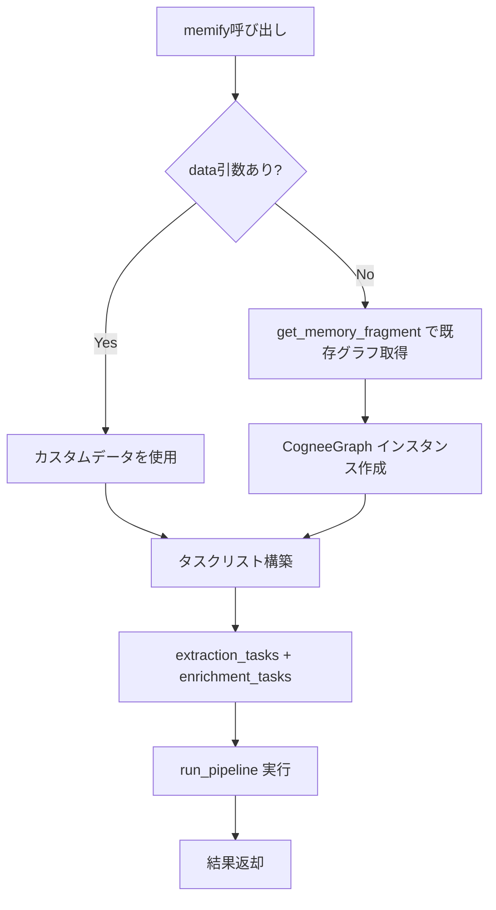

# Cognee Memify 徹底解析 - Phase-06 開発指示書策定のための前研究

## 目次

1. [はじめに](#1-はじめに)
2. [Memify の全体像](#2-memify-の全体像)
3. [Memify のアーキテクチャ](#3-memify-のアーキテクチャ)
4. [処理シーケンスの詳細解析](#4-処理シーケンスの詳細解析)
5. [コアコンポーネントの詳細](#5-コアコンポーネントの詳細)
6. [Go言語実装方針](#6-go言語実装方針)
7. [Go言語実装例コード](#7-go言語実装例コード)
8. [Phase-06 実装における考慮事項](#8-phase-06-実装における考慮事項)

---

## 1. はじめに

### 1.1. 本ドキュメントの目的

本ドキュメントは、Cognee Python版の `memify` 機能を徹底的に解析し、Phase-06 においてこの機能をGo言語で実装するための包括的なガイドを提供します。

### 1.2. Memify の位置づけ

Cognee における処理フローは以下の4ステップで構成されます：

```
1. add()      - データ取り込み（ファイルからメタデータ抽出・保存）
2. cognify()  - 基本的な知識グラフ構築（チャンク化・エンティティ抽出・グラフ保存）
3. memify()   - 高度な記憶強化（オプション）★本ドキュメントの対象
4. search()   - 強化されたグラフでの検索
```

**Memify は、Cognify により作られた知識グラフに対して追加の処理や強化アルゴリズムを適用し、AIエージェントのためのより高度な記憶層を構築する機能です。**

### 1.3. Python版ソースコードの場所

Memify のコア実装は以下に配置されています：

| ファイル | 役割 |
|---------|------|
| `cognee/modules/memify/memify.py` | **エントリーポイント** |
| `cognee/tasks/memify/extract_subgraph_chunks.py` | サブグラフからチャンク抽出（デフォルト抽出タスク） |
| `cognee/tasks/memify/extract_subgraph.py` | サブグラフからエッジ抽出 |
| `cognee/tasks/codingagents/coding_rule_associations.py` | コーディングルール抽出（デフォルト強化タスク） |
| `cognee/modules/retrieval/utils/brute_force_triplet_search.py` | グラフ取得ユーティリティ |
| `cognee/modules/graph/cognee_graph/CogneeGraph.py` | インメモリグラフ表現 |

---

## 2. Memify の全体像

### 2.1. Memify の定義

Memify は「記憶強化パイプライン」であり、以下の2つのモードで動作します：

#### モード1: グラフ強化モード（data なし）

既存の知識グラフを取得して強化処理を適用します。

```
既存グラフ → 抽出タスク → 強化タスク → 強化されたグラフ
```

#### モード2: カスタムデータ処理モード（data あり）

新規データをカスタム抽出・強化タスクで処理します。

```
カスタムデータ → 抽出タスク → 強化タスク → 新規グラフ要素
```

### 2.2. タスクの2種類

Memify パイプラインは以下の2種類のタスクで構成されます：

| タスク種別 | 役割 | デフォルト実装 |
|-----------|------|----------------|
| **抽出タスク (extraction_tasks)** | データから情報を抽出する処理 | `extract_subgraph_chunks` |
| **強化タスク (enrichment_tasks)** | 抽出結果を基に知識グラフを強化する処理 | `add_rule_associations` |

### 2.3. Memify のユースケース

#### ユースケース1: コーディングエージェントのルール学習

開発者とAIアシスタントの対話履歴から、コーディングベストプラクティスを自動抽出してグラフに追加します。

```
対話履歴チャンク → ルール抽出（LLM） → ルールノード作成 → グラフに追加
```

#### ユースケース2: 既存グラフの構造強化

既存のエンティティ間に新たな関係性を発見して追加します。

#### ユースケース3: サブグラフへの集中的処理

特定のノードタイプやノード名でフィルタリングされたサブグラフに対してのみ処理を適用します。

---

## 3. Memify のアーキテクチャ

### 3.1. エントリーポイント関数シグネチャ

```python
# cognee/modules/memify/memify.py

async def memify(
    extraction_tasks: Union[List[Task], List[str]] = None,  # 抽出タスクのリスト
    enrichment_tasks: Union[List[Task], List[str]] = None,  # 強化タスクのリスト
    data: Optional[Any] = None,                              # 入力データ（なければ既存グラフを使用）
    dataset: Union[str, UUID] = "main_dataset",              # 対象データセット
    user: User = None,                                       # ユーザーコンテキスト
    node_type: Optional[Type] = NodeSet,                     # フィルタ：ノードタイプ
    node_name: Optional[List[str]] = None,                   # フィルタ：ノード名リスト
    vector_db_config: Optional[dict] = None,                 # ベクトルDB設定
    graph_db_config: Optional[dict] = None,                  # グラフDB設定
    run_in_background: bool = False,                         # バックグラウンド実行フラグ
):
```

### 3.2. 処理フロー概要



### 3.3. デフォルトタスク構成

```python
# デフォルトの抽出タスク
extraction_tasks = [Task(extract_subgraph_chunks)]

# デフォルトの強化タスク
enrichment_tasks = [
    Task(
        add_rule_associations,
        rules_nodeset_name="coding_agent_rules",
        task_config={"batch_size": 1},
    )
]
```

---

## 4. 処理シーケンスの詳細解析

### 4.1. ステップ1: 初期化とデータセット認証

**Pythonコードスニペット:**

```python
# cognee/modules/memify/memify.py (lines 80-83)

await setup()  # システム初期化

user, authorized_dataset_list = await resolve_authorized_user_datasets(dataset, user)
authorized_dataset = authorized_dataset_list[0]
```

**処理内容:**
1. `setup()` でデータベース接続等のシステム初期化を実行
2. `resolve_authorized_user_datasets` でユーザー認証とデータセットアクセス権を確認
3. 認証されたデータセットの最初の1つを取得

### 4.2. ステップ2: データ取得（既存グラフモード）

**Pythonコードスニペット:**

```python
# cognee/modules/memify/memify.py (lines 85-93)

if not data:
    # アクセス制御用のコンテキスト変数を設定
    await set_database_global_context_variables(
        authorized_dataset.id, authorized_dataset.owner_id
    )

    # 既存グラフからメモリフラグメント（サブグラフ）を取得
    memory_fragment = await get_memory_fragment(node_type=node_type, node_name=node_name)
    
    # サブグラフをリストの単一要素として設定（パイプライン入力形式）
    data = [memory_fragment]
```

**`get_memory_fragment` の詳細:**

```python
# cognee/modules/retrieval/utils/brute_force_triplet_search.py (lines 57-87)

async def get_memory_fragment(
    properties_to_project: Optional[List[str]] = None,
    node_type: Optional[Type] = None,
    node_name: Optional[List[str]] = None,
) -> CogneeGraph:
    """CogneeGraph メモリフラグメントを作成し、オプションでプロパティ投影を行う"""
    
    if properties_to_project is None:
        properties_to_project = ["id", "description", "name", "type", "text"]

    # インメモリグラフの新規インスタンスを作成
    memory_fragment = CogneeGraph()

    try:
        # グラフエンジン（Neo4j/Kuzu等）を取得
        graph_engine = await get_graph_engine()

        # データベースからグラフデータをプロジェクト
        await memory_fragment.project_graph_from_db(
            graph_engine,
            node_properties_to_project=properties_to_project,
            edge_properties_to_project=["relationship_name"],
            node_type=node_type,
            node_name=node_name,
        )
    except EntityNotFoundError:
        # グラフが空の場合は空のフラグメントを返す
        pass

    return memory_fragment
```

### 4.3. ステップ3: CogneeGraph のグラフプロジェクション

**Pythonコードスニペット:**

```python
# cognee/modules/graph/cognee_graph/CogneeGraph.py (lines 59-139)

async def project_graph_from_db(
    self,
    adapter: Union[GraphDBInterface],
    node_properties_to_project: List[str],
    edge_properties_to_project: List[str],
    directed=True,
    node_dimension=1,
    edge_dimension=1,
    memory_fragment_filter=[],
    node_type: Optional[Type] = None,
    node_name: Optional[List[str]] = None,
) -> None:
    
    # プロジェクション戦略の決定
    if node_type is not None and node_name not in [None, [], ""]:
        # 特定のNodeSetのサブグラフを取得
        nodes_data, edges_data = await adapter.get_nodeset_subgraph(
            node_type=node_type, node_name=node_name
        )
    elif len(memory_fragment_filter) == 0:
        # 全グラフデータを取得
        nodes_data, edges_data = await adapter.get_graph_data()
    else:
        # フィルタ付きでグラフデータを取得
        nodes_data, edges_data = await adapter.get_filtered_graph_data(
            attribute_filters=memory_fragment_filter
        )

    # ノードの処理
    for node_id, properties in nodes_data:
        node_attributes = {key: properties.get(key) for key in node_properties_to_project}
        self.add_node(Node(str(node_id), node_attributes, dimension=node_dimension))

    # エッジの処理
    for source_id, target_id, relationship_type, properties in edges_data:
        source_node = self.get_node(str(source_id))
        target_node = self.get_node(str(target_id))
        if source_node and target_node:
            edge_attributes = {key: properties.get(key) for key in edge_properties_to_project}
            edge_attributes["relationship_type"] = relationship_type
            edge = Edge(source_node, target_node, attributes=edge_attributes, directed=directed)
            self.add_edge(edge)
```

### 4.4. ステップ4: タスクリスト構築

**Pythonコードスニペット:**

```python
# cognee/modules/memify/memify.py (lines 95-98)

memify_tasks = [
    *extraction_tasks,   # 抽出タスクを展開
    *enrichment_tasks,   # 強化タスクを展開
]
```

### 4.5. ステップ5: パイプライン実行

**Pythonコードスニペット:**

```python
# cognee/modules/memify/memify.py (lines 100-118)

# パイプライン実行状態をリセット
await reset_dataset_pipeline_run_status(
    authorized_dataset.id, user, pipeline_names=["memify_pipeline"]
)

# 実行モードに応じたエグゼキューターを取得
pipeline_executor_func = get_pipeline_executor(run_in_background=run_in_background)

# パイプラインを実行
return await pipeline_executor_func(
    pipeline=run_pipeline,
    tasks=memify_tasks,
    user=user,
    data=data,
    datasets=authorized_dataset.id,
    vector_db_config=vector_db_config,
    graph_db_config=graph_db_config,
    incremental_loading=False,
    pipeline_name="memify_pipeline",
)
```

### 4.6. ステップ6: 抽出タスク - extract_subgraph_chunks

**Pythonコードスニペット:**

```python
# cognee/tasks/memify/extract_subgraph_chunks.py

from cognee.modules.graph.cognee_graph.CogneeGraph import CogneeGraph

async def extract_subgraph_chunks(subgraphs: list[CogneeGraph]):
    """
    サブグラフから全てのドキュメントチャンクを取得し、
    パイプラインの次のタスクに転送する
    """
    for subgraph in subgraphs:
        for node in subgraph.nodes.values():
            # DocumentChunk タイプのノードのみを抽出
            if node.attributes["type"] == "DocumentChunk":
                yield node.attributes["text"]  # テキストを次のタスクに渡す
```

**処理内容:**
- 入力: `CogneeGraph` のリスト（`get_memory_fragment` の結果）
- 出力: DocumentChunk ノードのテキストを順次yield
- async generator として実装され、バッチ処理に対応

### 4.7. ステップ7: 強化タスク - add_rule_associations

**Pythonコードスニペット:**

```python
# cognee/tasks/codingagents/coding_rule_associations.py (lines 92-128)

async def add_rule_associations(
    data: str,                            # 入力テキスト（チャンク）
    rules_nodeset_name: str,              # ルールセット名（例: "coding_agent_rules"）
    user_prompt_location: str = "...",    # ユーザープロンプトのテンプレートパス
    system_prompt_location: str = "...",  # システムプロンプトのテンプレートパス
):
    # データがリストの場合は結合
    if isinstance(data, list):
        data = " ".join(data)

    graph_engine = await get_graph_engine()
    
    # 既存ルールを取得
    existing_rules = await get_existing_rules(rules_nodeset_name=rules_nodeset_name)
    existing_rules = "\n".join(f"- {rule}" for rule in existing_rules)

    # プロンプトのレンダリング
    user_context = {"chat": data, "rules": existing_rules}
    user_prompt = render_prompt(user_prompt_location, context=user_context)
    system_prompt = render_prompt(system_prompt_location, context={})

    # LLMを使用して新しいルールを抽出
    rule_list = await LLMGateway.acreate_structured_output(
        text_input=user_prompt, 
        system_prompt=system_prompt, 
        response_model=RuleSet  # Pydanticモデル
    )

    # ルールをNodeSetに関連付け
    rules_nodeset = NodeSet(
        id=uuid5(NAMESPACE_OID, name=rules_nodeset_name), 
        name=rules_nodeset_name
    )
    for rule in rule_list.rules:
        rule.belongs_to_set = rules_nodeset

    # オリジンチャンクとの関係エッジを作成
    edges_to_save = await get_origin_edges(data=data, rules=rule_list.rules)

    # ルールをグラフに追加
    await add_data_points(data_points=rule_list.rules)

    # エッジを保存
    if len(edges_to_save) > 0:
        await graph_engine.add_edges(edges_to_save)
        await index_graph_edges(edges_to_save)
```

### 4.8. ステップ8: DataPoint の保存 - add_data_points

**Pythonコードスニペット:**

```python
# cognee/tasks/storage/add_data_points.py (lines 13-77)

async def add_data_points(data_points: List[DataPoint]) -> List[DataPoint]:
    """
    データポイントのバッチをグラフデータベースに追加する。
    ノードとエッジを抽出し、重複を排除し、インデックスを作成する。
    """
    nodes = []
    edges = []
    added_nodes = {}
    added_edges = {}
    visited_properties = {}

    # 各データポイントからグラフを並列抽出
    results = await asyncio.gather(*[
        get_graph_from_model(
            data_point,
            added_nodes=added_nodes,
            added_edges=added_edges,
            visited_properties=visited_properties,
        )
        for data_point in data_points
    ])

    # 結果を集約
    for result_nodes, result_edges in results:
        nodes.extend(result_nodes)
        edges.extend(result_edges)

    # ノードとエッジの重複排除
    nodes, edges = deduplicate_nodes_and_edges(nodes, edges)

    graph_engine = await get_graph_engine()

    # ノードをグラフに追加
    await graph_engine.add_nodes(nodes)
    # ノードのベクトルインデックスを作成
    await index_data_points(nodes)

    # エッジをグラフに追加
    await graph_engine.add_edges(edges)
    # エッジのベクトルインデックスを作成
    await index_graph_edges(edges)

    return data_points
```

### 4.9. ステップ9: ノードのインデックス作成 - index_data_points

**Pythonコードスニペット:**

```python
# cognee/tasks/storage/index_data_points.py (lines 10-53)

async def index_data_points(data_points: list[DataPoint]):
    created_indexes = {}
    index_points = {}

    vector_engine = get_vector_engine()

    for data_point in data_points:
        data_point_type = type(data_point)

        # メタデータで指定されたフィールドをインデックス
        for field_name in data_point.metadata["index_fields"]:
            if getattr(data_point, field_name, None) is None:
                continue

            # コレクション名を生成（例: "Entity_name", "Rule_text"）
            index_name = f"{data_point_type.__name__}_{field_name}"

            # インデックスが未作成なら作成
            if index_name not in created_indexes:
                await vector_engine.create_vector_index(data_point_type.__name__, field_name)
                created_indexes[index_name] = True

            # インデックス対象のデータポイントを収集
            if index_name not in index_points:
                index_points[index_name] = []

            indexed_data_point = data_point.model_copy()
            indexed_data_point.metadata["index_fields"] = [field_name]
            index_points[index_name].append(indexed_data_point)

    # バッチ処理でベクトルインデックスを作成
    tasks = []
    batch_size = vector_engine.embedding_engine.get_batch_size()

    for index_name_and_field, points in index_points.items():
        first = index_name_and_field.index("_")
        index_name = index_name_and_field[:first]
        field_name = index_name_and_field[first + 1:]

        for i in range(0, len(points), batch_size):
            batch = points[i:i + batch_size]
            tasks.append(
                asyncio.create_task(
                    vector_engine.index_data_points(index_name, field_name, batch)
                )
            )

    # 全てのインデックス作成タスクを並列実行
    await asyncio.gather(*tasks)

    return data_points
```

---

## 5. コアコンポーネントの詳細

### 5.1. CogneeGraph クラス

**目的:** データベースから取得したグラフをインメモリで表現し、操作するためのクラス

**Pythonコードスニペット:**

```python
# cognee/modules/graph/cognee_graph/CogneeGraph.py

class CogneeGraph(CogneeAbstractGraph):
    """
    Cognee用のグラフ具象クラス。
    ノードとエッジの管理、およびデータベースからのプロジェクション機能を提供。
    """

    nodes: Dict[str, Node]   # ノードID -> ノード のマップ
    edges: List[Edge]        # エッジのリスト
    directed: bool           # 有向グラフかどうか

    def __init__(self, directed: bool = True):
        self.nodes = {}
        self.edges = []
        self.directed = directed

    def add_node(self, node: Node) -> None:
        """ノードを追加（既存の場合はエラー）"""
        if node.id not in self.nodes:
            self.nodes[node.id] = node
        else:
            raise EntityAlreadyExistsError(...)

    def add_edge(self, edge: Edge) -> None:
        """エッジを追加し、関連ノードにスケルトンエッジを登録"""
        self.edges.append(edge)
        edge.node1.add_skeleton_edge(edge)
        edge.node2.add_skeleton_edge(edge)

    def get_node(self, node_id: str) -> Node:
        """IDからノードを取得"""
        return self.nodes.get(node_id, None)
```

### 5.2. DataPoint クラス

**目的:** グラフノードの基底クラス。ベクトルインデックス対象フィールドの指定などのメタデータを持つ。

**Pythonコードスニペット:**

```python
# cognee/infrastructure/engine/models/DataPoint.py

class DataPoint(BaseModel):
    """
    バージョニングとメタデータサポートを持つデータポイントモデル。
    """
    id: UUID = Field(default_factory=uuid4)
    created_at: int = Field(default_factory=lambda: int(datetime.now(timezone.utc).timestamp() * 1000))
    updated_at: int = Field(default_factory=lambda: int(datetime.now(timezone.utc).timestamp() * 1000))
    ontology_valid: bool = False
    version: int = 1
    topological_rank: Optional[int] = 0
    metadata: Optional[MetaData] = {"index_fields": []}  # インデックス対象フィールド
    type: str = Field(default_factory=lambda: DataPoint.__name__)
    belongs_to_set: Optional[List["DataPoint"]] = None  # 所属するNodeSet

    @classmethod
    def get_embeddable_data(self, data_point: "DataPoint"):
        """インデックスフィールドから埋め込み対象データを取得"""
        if data_point.metadata and len(data_point.metadata["index_fields"]) > 0:
            attribute = getattr(data_point, data_point.metadata["index_fields"][0])
            return attribute.strip() if isinstance(attribute, str) else attribute
```

### 5.3. Rule クラス（強化タスク用）

**Pythonコードスニペット:**

```python
# cognee/tasks/codingagents/coding_rule_associations.py

class Rule(DataPoint):
    """テキストから抽出された単一のデベロッパールール"""

    text: str = Field(..., description="会話に関連付けられたコーディングルール")
    belongs_to_set: Optional[NodeSet] = None
    metadata: dict = {"index_fields": ["rule"]}  # "rule"フィールドをインデックス

class RuleSet(DataPoint):
    """パースされたルールのコレクション"""

    rules: List[Rule] = Field(
        ...,
        description="入力テキストから抽出されたデベロッパールールのリスト"
    )
```

### 5.4. NodeSet クラス

**Pythonコードスニペット:**

```python
# cognee/modules/engine/models/node_set.py

from cognee.infrastructure.engine import DataPoint

class NodeSet(DataPoint):
    """NodeSetデータポイント - ノードの論理的なグループ"""
    name: str
```

---

## 6. Go言語実装方針

### 6.1. 全体アーキテクチャ

Phase-05までの既存Go実装のアーキテクチャを踏襲し、以下の構成で memify を実装します：

```
src/pkg/cognee/
├── cognee.go                    # Memify メソッド追加
├── storage/
│   └── interfaces.go            # 新規インターフェース・型追加
├── tasks/
│   └── memify/                  # 新規ディレクトリ
│       ├── extract_subgraph_chunks.go     # 抽出タスク
│       └── enrichment_task.go             # 強化タスク汎用インターフェース
└── tools/
    └── memify/                  # 新規ディレクトリ（オプション）
```

### 6.2. インターフェース設計方針

#### 6.2.1. MemifyTask インターフェース

Python版の `Task` クラスに対応するGo版インターフェースを定義します：

**方針:**
- 既存の `pipeline.Task` インターフェースを再利用
- 入力/出力の型は `any` で柔軟性を確保
- 具象タスクで適切な型アサーションを行う

#### 6.2.2. MemoryFragment 型

Python版の `CogneeGraph` に対応するGo版構造体を定義します：

**方針:**
- 既存の `storage.Node` と `storage.Edge` を再利用
- ノードとエッジのマップ/スライスで表現
- グラフからのプロジェクション機能を提供

### 6.3. デフォルトタスク実装方針

#### 6.3.1. 抽出タスク: ExtractSubgraphChunksTask

**方針:**
- 入力: `[]*MemoryFragment`
- 出力: `[]string`（チャンクテキストのリスト）
- DocumentChunk タイプのノードからテキストを抽出

#### 6.3.2. 強化タスク: AddRuleAssociationsTask

**方針:**
- 入力: `[]string`（チャンクテキスト）
- LLMを使用してルールを抽出
- ルールノードをグラフに追加
- オリジンチャンクとの関係エッジを作成
- ベクトルインデックスを作成

### 6.4. GraphStorage インターフェース拡張

既存の `GraphStorage` インターフェースに以下のメソッドを追加する必要があります：

```go
type GraphStorage interface {
    // 既存メソッド...
    AddNodes(ctx context.Context, nodes []*Node) error
    AddEdges(ctx context.Context, edges []*Edge) error
    GetTriplets(ctx context.Context, nodeIDs []string, groupID string) ([]*Triplet, error)
    EnsureSchema(ctx context.Context) error
    Close() error

    // Phase-06 で追加するメソッド
    GetAllNodes(ctx context.Context, groupID string) ([]*Node, error)           // 全ノード取得
    GetAllEdges(ctx context.Context, groupID string) ([]*Edge, error)           // 全エッジ取得
    GetNodesByType(ctx context.Context, nodeType string, groupID string) ([]*Node, error)  // タイプでフィルタ
    GetSubgraph(ctx context.Context, nodeType string, nodeNames []string, groupID string) ([]*Node, []*Edge, error)  // サブグラフ取得
}
```

### 6.5. VectorStorage インターフェース拡張

```go
type VectorStorage interface {
    // 既存メソッド...

    // Phase-06 で追加が必要なメソッド
    SaveEmbeddingBatch(ctx context.Context, collectionName string, items []EmbeddingItem, groupID string) error  // バッチ保存
}

type EmbeddingItem struct {
    ID        string
    Text      string
    Embedding []float32
}
```

---

## 7. Go言語実装例コード

### 7.1. MemoryFragment 構造体

```go
// src/pkg/cognee/storage/memory_fragment.go

package storage

// MemoryFragment は、Python版 CogneeGraph に対応するインメモリグラフ表現です。
// データベースからプロジェクトされたノードとエッジを保持します。
type MemoryFragment struct {
    Nodes   map[string]*Node  // ノードID -> ノード のマップ
    Edges   []*Edge           // エッジのリスト
    GroupID string            // グループID（パーティション分離用）
}

// NewMemoryFragment は、新しいMemoryFragmentインスタンスを作成します。
func NewMemoryFragment(groupID string) *MemoryFragment {
    return &MemoryFragment{
        Nodes:   make(map[string]*Node),
        Edges:   make([]*Edge, 0),
        GroupID: groupID,
    }
}

// AddNode は、ノードをフラグメントに追加します。
func (m *MemoryFragment) AddNode(node *Node) {
    m.Nodes[node.ID] = node
}

// AddEdge は、エッジをフラグメントに追加します。
func (m *MemoryFragment) AddEdge(edge *Edge) {
    m.Edges = append(m.Edges, edge)
}

// GetNodesByType は、指定されたタイプのノードを全て返します。
func (m *MemoryFragment) GetNodesByType(nodeType string) []*Node {
    var result []*Node
    for _, node := range m.Nodes {
        if node.Type == nodeType {
            result = append(result, node)
        }
    }
    return result
}

// GetChunkTexts は、DocumentChunkタイプのノードからテキストを抽出します。
// Python版の extract_subgraph_chunks に対応します。
func (m *MemoryFragment) GetChunkTexts() []string {
    var texts []string
    for _, node := range m.Nodes {
        if node.Type == "DocumentChunk" {
            if text, ok := node.Properties["text"].(string); ok {
                texts = append(texts, text)
            }
        }
    }
    return texts
}
```

### 7.2. GraphStorage.GetSubgraph の実装例（CozoDB）

```go
// src/pkg/cognee/db/cozodb/cozo_storage.go に追加

// GetSubgraph は、指定されたノードタイプとノード名でフィルタリングされたサブグラフを取得します。
// Python版の get_nodeset_subgraph に対応します。
func (s *CozoStorage) GetSubgraph(ctx context.Context, nodeType string, nodeNames []string, groupID string) ([]*storage.Node, []*storage.Edge, error) {
    // まず、NodeSetに属するノードを取得
    var nodeIDs []string
    
    if len(nodeNames) > 0 {
        // 指定されたNodeSetに属するノードを取得
        for _, nodeName := range nodeNames {
            query := `
                ?[id, type, properties] := 
                    *nodes[id, group_id, type, properties],
                    group_id = $group_id,
                    belongs_to_set in properties,
                    belongs_to_set == $node_name
            `
            // クエリ実行...
        }
    } else {
        // 指定されたタイプの全ノードを取得
        query := `
            ?[id, type, properties] := 
                *nodes[id, group_id, type, properties],
                group_id = $group_id,
                type = $node_type
        `
        // クエリ実行...
    }

    // ノードに関連するエッジを取得
    query := `
        ?[source_id, target_id, type, properties] := 
            *edges[source_id, target_id, group_id, type, properties],
            group_id = $group_id,
            or(source_id in $node_ids, target_id in $node_ids)
    `
    // クエリ実行...

    return nodes, edges, nil
}

// GetAllNodes は、指定されたグループIDの全ノードを取得します。
func (s *CozoStorage) GetAllNodes(ctx context.Context, groupID string) ([]*storage.Node, error) {
    query := `
        ?[id, type, properties] := 
            *nodes[id, group_id, type, properties],
            group_id = $group_id
    `
    
    params := map[string]any{
        "group_id": groupID,
    }
    
    result, err := s.db.Run(query, params)
    if err != nil {
        return nil, fmt.Errorf("failed to get all nodes: %w", err)
    }

    nodes := make([]*storage.Node, 0)
    // 結果をパース...

    return nodes, nil
}

// GetAllEdges は、指定されたグループIDの全エッジを取得します。
func (s *CozoStorage) GetAllEdges(ctx context.Context, groupID string) ([]*storage.Edge, error) {
    query := `
        ?[source_id, target_id, type, properties] := 
            *edges[source_id, target_id, group_id, type, properties],
            group_id = $group_id
    `
    
    params := map[string]any{
        "group_id": groupID,
    }
    
    result, err := s.db.Run(query, params)
    if err != nil {
        return nil, fmt.Errorf("failed to get all edges: %w", err)
    }

    edges := make([]*storage.Edge, 0)
    // 結果をパース...

    return edges, nil
}
```

### 7.3. ExtractSubgraphChunksTask の実装

```go
// src/pkg/cognee/tasks/memify/extract_subgraph_chunks.go

package memify

import (
    "context"
    "fmt"

    "mycute/pkg/cognee/pipeline"
    "mycute/pkg/cognee/storage"
)

// ExtractSubgraphChunksTask は、サブグラフからDocumentChunkのテキストを抽出するタスクです。
// Python版の extract_subgraph_chunks に対応します。
type ExtractSubgraphChunksTask struct{}

// NewExtractSubgraphChunksTask は、新しいタスクインスタンスを作成します。
func NewExtractSubgraphChunksTask() *ExtractSubgraphChunksTask {
    return &ExtractSubgraphChunksTask{}
}

// Ensure interface implementation
var _ pipeline.Task = (*ExtractSubgraphChunksTask)(nil)

// Run は、MemoryFragmentのリストからDocumentChunkテキストを抽出します。
// 入力: []*storage.MemoryFragment
// 出力: []string（チャンクテキストのリスト）
func (t *ExtractSubgraphChunksTask) Run(ctx context.Context, input any) (any, error) {
    fragments, ok := input.([]*storage.MemoryFragment)
    if !ok {
        return nil, fmt.Errorf("expected []*storage.MemoryFragment input, got %T", input)
    }

    var texts []string

    for _, fragment := range fragments {
        chunkTexts := fragment.GetChunkTexts()
        texts = append(texts, chunkTexts...)
    }

    fmt.Printf("Extracted %d chunk texts from %d memory fragments\n", len(texts), len(fragments))

    return texts, nil
}
```

### 7.4. AddRuleAssociationsTask の実装

```go
// src/pkg/cognee/tasks/memify/add_rule_associations.go

package memify

import (
    "context"
    "encoding/json"
    "fmt"
    "strings"

    "github.com/google/uuid"
    "github.com/tmc/langchaingo/llms"

    "mycute/pkg/cognee/pipeline"
    "mycute/pkg/cognee/storage"
)

// Rule は、抽出されたコーディングルールを表します。
type Rule struct {
    ID      string `json:"id"`
    Text    string `json:"text"`
    SetName string `json:"set_name"`
}

// RuleSet は、LLMから返されるルールのリストです。
type RuleSet struct {
    Rules []Rule `json:"rules"`
}

// AddRuleAssociationsTask は、テキストからコーディングルールを抽出してグラフに追加するタスクです。
type AddRuleAssociationsTask struct {
    VectorStorage storage.VectorStorage
    GraphStorage  storage.GraphStorage
    LLM           llms.Model
    Embedder      storage.Embedder
    GroupID       string
    RulesNodeSetName string
}

// NewAddRuleAssociationsTask は、新しいタスクインスタンスを作成します。
func NewAddRuleAssociationsTask(
    vectorStorage storage.VectorStorage,
    graphStorage storage.GraphStorage,
    llm llms.Model,
    embedder storage.Embedder,
    groupID string,
    rulesNodeSetName string,
) *AddRuleAssociationsTask {
    return &AddRuleAssociationsTask{
        VectorStorage:    vectorStorage,
        GraphStorage:     graphStorage,
        LLM:              llm,
        Embedder:         embedder,
        GroupID:          groupID,
        RulesNodeSetName: rulesNodeSetName,
    }
}

var _ pipeline.Task = (*AddRuleAssociationsTask)(nil)

// システムプロンプト（Python版 coding_rule_association_agent_system.txt より）
const ruleExtractionSystemPrompt = `You are an association agent tasked with suggesting structured developer rules from user-agent interactions.
You will receive the actual user agent interaction, and the list of the already existing developer rules.
Each rule represents a single best practice or guideline the agent should follow in the future.
Suggest rules that are general and not specific to the current text, strictly technical, add value and improve the future agent behavior.
Do not suggest rules similar to the existing ones or rules that are not general and don't add value.
It is acceptable to return an empty rule list.

You must output your response in the following JSON format:
{
  "rules": [
    {"text": "rule text here"}
  ]
}`

// ユーザープロンプトテンプレート
const ruleExtractionUserPromptTemplate = `**User-agent interaction text:**
%s

**Already existing rules:**
%s`

// Run は、テキストからルールを抽出してグラフに追加します。
func (t *AddRuleAssociationsTask) Run(ctx context.Context, input any) (any, error) {
    texts, ok := input.([]string)
    if !ok {
        return nil, fmt.Errorf("expected []string input, got %T", input)
    }

    if len(texts) == 0 {
        fmt.Println("No texts to process for rule extraction")
        return nil, nil
    }

    // テキストを結合
    combinedText := strings.Join(texts, "\n\n")

    // 既存ルールを取得（将来的にはGraphStorageから取得）
    existingRules := ""

    // LLMプロンプトを構築
    userPrompt := fmt.Sprintf(ruleExtractionUserPromptTemplate, combinedText, existingRules)

    // LLM呼び出し
    response, err := t.LLM.GenerateContent(ctx, []llms.MessageContent{
        llms.TextParts(llms.ChatMessageTypeSystem, ruleExtractionSystemPrompt),
        llms.TextParts(llms.ChatMessageTypeHuman, userPrompt),
    })
    if err != nil {
        return nil, fmt.Errorf("failed to call LLM for rule extraction: %w", err)
    }

    if len(response.Choices) == 0 {
        fmt.Println("No rules extracted from LLM response")
        return nil, nil
    }

    // JSONをパース
    responseText := response.Choices[0].Content
    jsonStr := extractJSON(responseText)
    
    var ruleSet RuleSet
    if err := json.Unmarshal([]byte(jsonStr), &ruleSet); err != nil {
        fmt.Printf("Warning: failed to parse rules JSON: %v\n", err)
        return nil, nil
    }

    if len(ruleSet.Rules) == 0 {
        fmt.Println("No new rules extracted")
        return nil, nil
    }

    fmt.Printf("Extracted %d new rules\n", len(ruleSet.Rules))

    // ルールセットノードを作成
    ruleSetNodeID := uuid.NewSHA1(uuid.NameSpaceOID, []byte(t.RulesNodeSetName)).String()
    ruleSetNode := &storage.Node{
        ID:      ruleSetNodeID,
        GroupID: t.GroupID,
        Type:    "NodeSet",
        Properties: map[string]any{
            "name": t.RulesNodeSetName,
        },
    }

    // ルールノードとエッジを作成
    var nodes []*storage.Node
    var edges []*storage.Edge

    nodes = append(nodes, ruleSetNode)

    for _, rule := range ruleSet.Rules {
        ruleID := uuid.NewString()
        ruleNode := &storage.Node{
            ID:      ruleID,
            GroupID: t.GroupID,
            Type:    "Rule",
            Properties: map[string]any{
                "text": rule.Text,
            },
        }
        nodes = append(nodes, ruleNode)

        // ルール -> NodeSet のエッジ
        edge := &storage.Edge{
            SourceID: ruleID,
            TargetID: ruleSetNodeID,
            GroupID:  t.GroupID,
            Type:     "belongs_to",
            Properties: map[string]any{
                "relationship_name": "belongs_to",
            },
        }
        edges = append(edges, edge)
    }

    // ノードを保存
    if err := t.GraphStorage.AddNodes(ctx, nodes); err != nil {
        return nil, fmt.Errorf("failed to add rule nodes: %w", err)
    }

    // エッジを保存
    if err := t.GraphStorage.AddEdges(ctx, edges); err != nil {
        return nil, fmt.Errorf("failed to add rule edges: %w", err)
    }

    // ルールのベクトルインデックスを作成
    for _, rule := range ruleSet.Rules {
        embedding, err := t.Embedder.EmbedQuery(ctx, rule.Text)
        if err != nil {
            fmt.Printf("Warning: failed to embed rule: %v\n", err)
            continue
        }

        ruleID := uuid.NewSHA1(uuid.NameSpaceOID, []byte(rule.Text)).String()
        if err := t.VectorStorage.SaveEmbedding(ctx, "Rule_text", ruleID, rule.Text, embedding, t.GroupID); err != nil {
            fmt.Printf("Warning: failed to save rule embedding: %v\n", err)
        }
    }

    fmt.Printf("Saved %d rules to graph and vector index\n", len(ruleSet.Rules))

    return ruleSet.Rules, nil
}

// extractJSON は、レスポンスからJSONを抽出します。
func extractJSON(s string) string {
    start := strings.Index(s, "{")
    end := strings.LastIndex(s, "}")
    if start == -1 || end == -1 || start > end {
        return "{\"rules\":[]}"
    }
    return s[start : end+1]
}
```

### 7.5. Memify メソッドの実装（CogneeService への追加）

```go
// src/pkg/cognee/cognee.go に追加

// MemifyConfig は、Memify処理のオプション設定を保持します。
type MemifyConfig struct {
    ExtractionTasks []pipeline.Task  // カスタム抽出タスク（nilでデフォルト使用）
    EnrichmentTasks []pipeline.Task  // カスタム強化タスク（nilでデフォルト使用）
    NodeType        string           // フィルタ：ノードタイプ
    NodeNames       []string         // フィルタ：ノード名リスト
    RulesNodeSetName string          // ルールセット名（デフォルト: "coding_agent_rules"）
}

// Memify は、既存の知識グラフに対して強化処理を適用します。
// この関数は以下の処理を行います：
//  1. 既存グラフからメモリフラグメントを取得
//  2. 抽出タスクでテキストを抽出
//  3. 強化タスクでルール等を追加
//  4. 結果をグラフとベクトルインデックスに保存
func (s *CogneeService) Memify(ctx context.Context, dataset string, user string, config *MemifyConfig) error {
    groupID := user + "-" + dataset

    // デフォルト設定
    if config == nil {
        config = &MemifyConfig{
            RulesNodeSetName: "coding_agent_rules",
        }
    }
    if config.RulesNodeSetName == "" {
        config.RulesNodeSetName = "coding_agent_rules"
    }

    // ========================================
    // 1. メモリフラグメントの取得
    // ========================================
    fmt.Println("Fetching memory fragment from existing graph...")

    fragment, err := s.getMemoryFragment(ctx, groupID, config.NodeType, config.NodeNames)
    if err != nil {
        return fmt.Errorf("failed to get memory fragment: %w", err)
    }

    if len(fragment.Nodes) == 0 {
        fmt.Println("No nodes found in memory fragment, skipping memify")
        return nil
    }

    fmt.Printf("Found %d nodes and %d edges in memory fragment\n", len(fragment.Nodes), len(fragment.Edges))

    // ========================================
    // 2. タスクの準備
    // ========================================
    var tasks []pipeline.Task

    // 抽出タスク
    if config.ExtractionTasks != nil && len(config.ExtractionTasks) > 0 {
        tasks = append(tasks, config.ExtractionTasks...)
    } else {
        // デフォルト抽出タスク
        tasks = append(tasks, memify.NewExtractSubgraphChunksTask())
    }

    // 強化タスク
    if config.EnrichmentTasks != nil && len(config.EnrichmentTasks) > 0 {
        tasks = append(tasks, config.EnrichmentTasks...)
    } else {
        // デフォルト強化タスク
        tasks = append(tasks, memify.NewAddRuleAssociationsTask(
            s.VectorStorage,
            s.GraphStorage,
            s.LLM,
            s.Embedder,
            groupID,
            config.RulesNodeSetName,
        ))
    }

    // ========================================
    // 3. パイプライン実行
    // ========================================
    p := pipeline.NewPipeline(tasks)

    // 入力：メモリフラグメントのリスト
    input := []*storage.MemoryFragment{fragment}

    _, err = p.Run(ctx, input)
    if err != nil {
        return fmt.Errorf("memify pipeline failed: %w", err)
    }

    fmt.Println("Memify completed successfully")
    return nil
}

// getMemoryFragment は、データベースからメモリフラグメントを取得します。
// Python版の get_memory_fragment に対応します。
func (s *CogneeService) getMemoryFragment(ctx context.Context, groupID string, nodeType string, nodeNames []string) (*storage.MemoryFragment, error) {
    fragment := storage.NewMemoryFragment(groupID)

    var nodes []*storage.Node
    var edges []*storage.Edge
    var err error

    if nodeType != "" && len(nodeNames) > 0 {
        // 特定のNodeSetのサブグラフを取得
        nodes, edges, err = s.GraphStorage.GetSubgraph(ctx, nodeType, nodeNames, groupID)
    } else {
        // 全グラフを取得
        nodes, err = s.GraphStorage.GetAllNodes(ctx, groupID)
        if err != nil {
            return nil, fmt.Errorf("failed to get all nodes: %w", err)
        }
        edges, err = s.GraphStorage.GetAllEdges(ctx, groupID)
    }

    if err != nil {
        return nil, fmt.Errorf("failed to get graph data: %w", err)
    }

    // ノードをフラグメントに追加
    for _, node := range nodes {
        fragment.AddNode(node)
    }

    // エッジをフラグメントに追加
    for _, edge := range edges {
        fragment.AddEdge(edge)
    }

    return fragment, nil
}
```

---

## 8. Phase-06 実装における考慮事項

### 8.1. 必要な新規ファイル

| ファイルパス | 目的 |
|-------------|------|
| `src/pkg/cognee/storage/memory_fragment.go` | MemoryFragment 構造体の定義 |
| `src/pkg/cognee/tasks/memify/extract_subgraph_chunks.go` | デフォルト抽出タスク |
| `src/pkg/cognee/tasks/memify/add_rule_associations.go` | デフォルト強化タスク |

### 8.2. 必要なインターフェース変更

#### storage/interfaces.go への追加

```go
// GraphStorage インターフェースへの追加メソッド
GetAllNodes(ctx context.Context, groupID string) ([]*Node, error)
GetAllEdges(ctx context.Context, groupID string) ([]*Edge, error)
GetSubgraph(ctx context.Context, nodeType string, nodeNames []string, groupID string) ([]*Node, []*Edge, error)
```

#### cognee.go への追加メソッド

```go
Memify(ctx context.Context, dataset string, user string, config *MemifyConfig) error
```

### 8.3. 必要なプロンプト定義

`src/pkg/cognee/prompts/prompts.go` に以下を追加：

```go
// Memify用プロンプト
const RuleExtractionSystemPrompt = `...`  // coding_rule_association_agent_system.txt の内容
const RuleExtractionUserPromptTemplate = `...`  // coding_rule_association_agent_user.txt の内容
```

### 8.4. テスト戦略

1. **単体テスト**
   - `ExtractSubgraphChunksTask` の入出力テスト
   - `AddRuleAssociationsTask` のLLMモック使用テスト
   - `getMemoryFragment` のDB取得テスト

2. **統合テスト**
   - `Add` → `Cognify` → `Memify` のフルパイプラインテスト
   - ルールの重複排除テスト
   - グループID分離テスト

### 8.5. 検証コマンド

```bash
# Phase-06 実装後の検証コマンド
make run ARGS="memify -u user1 -d test_dataset"

# オプション付き
make run ARGS="memify -u user1 -d test_dataset --rules-nodeset my_rules"
```

### 8.6. 実装優先度

1. **必須**: `MemoryFragment` 構造体と `getMemoryFragment` メソッド
2. **必須**: `GraphStorage.GetAllNodes/GetAllEdges` の実装
3. **必須**: `ExtractSubgraphChunksTask` の実装
4. **中優先**: `AddRuleAssociationsTask` の実装
5. **低優先**: カスタムタスクのサポート

### 8.7. 既存実装との整合性

Phase-05で実装された `group_id` によるパーティション分離は、Memifyでも継続して使用します。
全てのグラフ操作とベクトル操作で `groupID` パラメータを確実に渡すことで、
マルチテナント環境でのデータ分離を維持します。

---

## 付録: Python版ファイル一覧と対応するGo実装

| Python ファイル | 役割 | Go実装ファイル（提案） |
|----------------|------|----------------------|
| `modules/memify/memify.py` | エントリーポイント | `cognee.go` (Memifyメソッド) |
| `tasks/memify/extract_subgraph_chunks.py` | チャンク抽出 | `tasks/memify/extract_subgraph_chunks.go` |
| `tasks/codingagents/coding_rule_associations.py` | ルール抽出 | `tasks/memify/add_rule_associations.go` |
| `modules/graph/cognee_graph/CogneeGraph.py` | グラフ表現 | `storage/memory_fragment.go` |
| `modules/retrieval/utils/brute_force_triplet_search.py` | グラフ取得 | `cognee.go` (getMemoryFragmentメソッド) |
| `tasks/storage/add_data_points.py` | ノード保存 | 既存の `GraphStorage.AddNodes` |
| `tasks/storage/index_data_points.py` | ベクトルインデックス | 既存の `VectorStorage.SaveEmbedding` |

---

*本ドキュメントは Phase-06 開発指示書策定のための前研究として作成されました。*
