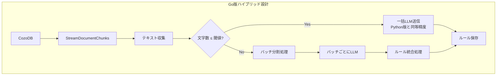
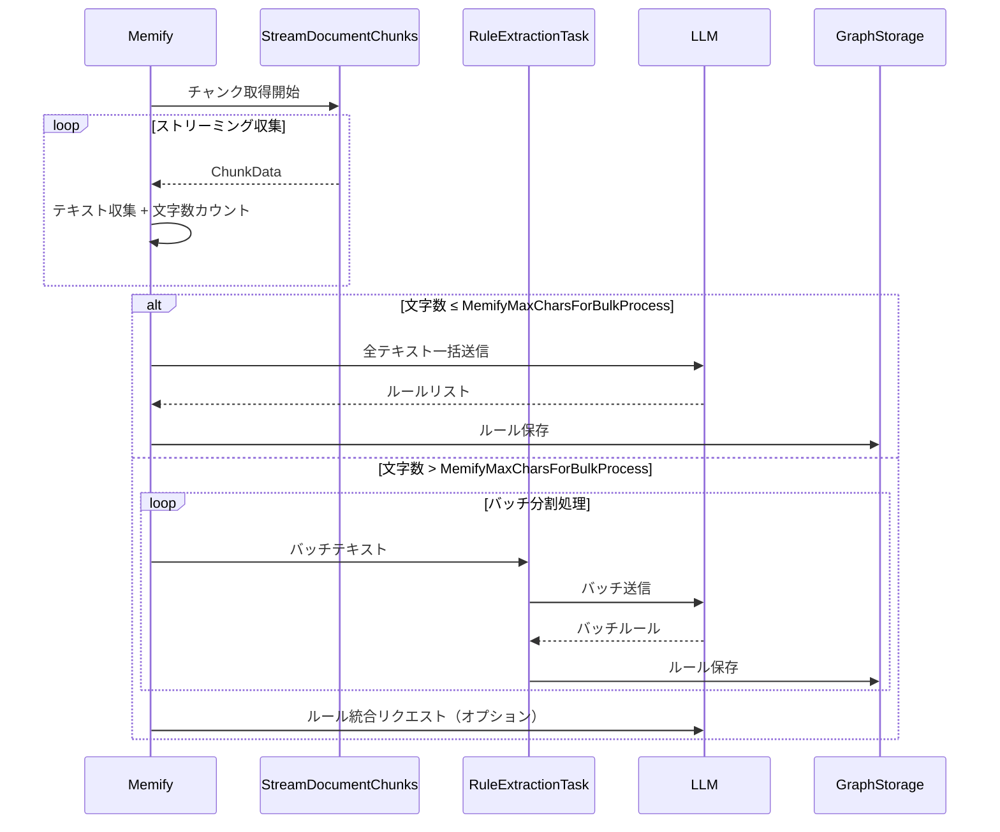

# Cognee Go Implementation: Phase-06 Development Directives

## 0. はじめに (Context & Prerequisites)

本ドキュメントは、**Phase-06** における開発指示書です。
Phase-05までに、「Add」（データ取り込み）、「Cognify」（知識グラフ構築）、「Search」（検索）、「Summarization」（要約）、そして「マルチテナント対応」が完了しています。

Phase-06の目的は、**「Memify（記憶強化）」機能の完全実装** です。
これは、Cognify で構築された知識グラフに対して追加の処理・強化アルゴリズムを適用し、AIエージェントのためのより高度な記憶層を構築する機能です。

### ★ エッジデバイス対応と低メモリ設計方針

> [!IMPORTANT]
> **このGo言語版Cognee実装の最大の目的は「エッジデバイスで十分に動作させられること」です。**

本プロジェクトでは、以下の理由からデータベースとしてDuckDBとCozoDBをCGO経由で使用しています：
*   **完全バインディング**: Go言語のバイナリに完全に組み込み可能
*   **外部依存なし**: PostgreSQLやNeo4jのような外部サービスが不要
*   **ポータビリティ**: 単一バイナリでどこでも動作
*   **エッジデバイス対応**: Raspberry Pi等の限られたリソース環境でも動作

**したがって、Phase-06のMemify実装では以下を優先します：**

| 優先度 | 項目 | 説明 |
|--------|------|------|
| 1位 | **低メモリ** | グラフ全体をメモリにロードしない |
| 2位 | **安全性** | Out of Memory を絶対に発生させない |
| 3位 | **処理速度** | メモリ制約がある中で最適化 |

### Python版との設計差異

オリジナルのPython版Cognee `memify` は、`CogneeGraph` クラスでグラフ全体をメモリにロードしてから処理を行います：

```python
# Python版: グラフ全体をメモリにロード（大規模グラフでは不適切）
memory_fragment = CogneeGraph()
await memory_fragment.project_graph_from_db(graph_engine, ...)  # 全ロード
```

**Go版では、ストリーミング方式を採用し、処理結果はPython版と同一になることを保証します：**

```go
// Go版: ストリーミング方式（エッジデバイス対応）
for chunk := range graphStorage.StreamDocumentChunks(ctx, groupID) {
    // 1チャンクずつ処理（メモリ効率最大化）
}
```

**※重要方針**:
*   入力は **日本語テキスト** に最適化します。
*   オリジナルPython版 Cognee の `memify` の**処理結果**を忠実に再現します（内部実装は異なる）。
*   プロンプトエンジニアリングは **オリジナル完全準拠** を徹底しつつ、日本語処理の最適化を行います。
*   実装時の迷いをゼロにするため、本ドキュメントのコード例をそのまま使用してください。

### 前提条件
*   Phase-05が完了し、`group_id` によるパーティション分離が実装されていること。
*   `src/pkg/cognee/db/cozodb/cozo_storage.go` と `src/pkg/cognee/db/duckdb/duckdb_storage.go` が動作していること。
*   `make run ARGS="add"`, `make run ARGS="cognify"`, `make run ARGS="search"` が正常に動作していること。

### 参考ドキュメント
*   `docs/COGNEE-MEMIFY-SUPER-DETAILED-ANALYSIS-FOR-PHASE-06.md` - Python版 memify の詳細解析

---

## 1. 開発の目的 (Objectives)

Phase-06のゴールは以下の通りです。

1.  **ストリーミングチャンク取得**: CozoDBからDocumentChunkを**ストリーミング**で取得する機能を追加する。
2.  **バッチ処理設計**: 固定サイズのバッチでチャンクを処理し、メモリ使用量を制限する。
3.  **抽出タスク**: ストリーミング入力からテキストを抽出するタスクを実装する。
4.  **強化タスク**: テキストからコーディングルールを抽出してグラフに追加するタスクを実装する。
5.  **Memify メソッド**: CogneeService に Memify メソッドを追加し、ストリーミングパイプラインを実行する。
6.  **CLI対応**: `main.go` に `memify` コマンドを追加する。

---

## 2. 実装詳細とPython解析

### 設計概要: ハイブリッドアーキテクチャ

> [!IMPORTANT]
> **ハイブリッド設計**: データ量に応じて「一括処理」と「バッチ分割処理」を自動切り替え

Python版とGo版の設計差異を以下に示します：



**処理結果の同一性保証**:
- **小〜中規模データ**: Python版と完全同一の精度（一括送信）
- **大規模データ**: バッチ処理 + 統合で精度低下を最小化

---

### ★ CogneeConfig への閾値設定（必須）

**ファイル修正**: `src/pkg/cognee/cognee.go`

以下のフィールドを `CogneeConfig` 構造体に追加します：

```go
// CogneeConfig は、Cogneeサービスの初期化に必要な設定を保持する構造体です。
type CogneeConfig struct {
	// ... 既存フィールド ...

	// ========================================
	// Memify ハイブリッド処理の閾値設定
	// ========================================
	//
	// MemifyMaxCharsForBulkProcess は、Memify処理において
	// 「一括LLM送信」と「バッチ分割処理」を切り替える閾値です。
	//
	// 【重要】この値は len(string) のバイト数ではなく、
	// UTF-8の「文字数」（Goの rune 数）で判断されます。
	// 日本語1文字 = 1としてカウントされます。
	//
	// ========================================
	// 初期値: 50000（5万文字）の根拠
	// ========================================
	//
	// 1. LLMコンテキストウィンドウの制約:
	//    - GPT-4-turbo: 128,000 tokens
	//    - Claude 3: 200,000 tokens
	//
	// 2. 日本語テキストのトークン効率:
	//    - 英語: 約4文字 = 1トークン
	//    - 日本語: 約1〜2文字 = 1トークン（効率が悪い）
	//    - 50,000日本語文字 ≈ 50,000〜100,000トークン
	//
	// 3. コンテキスト使用の内訳（GPT-4-turbo 128Kの場合）:
	//    - システムプロンプト: 約500トークン
	//    - 既存ルールリスト: 約5,000トークン（余裕を持たせる）
	//    - ユーザー入力テキスト: 約100,000トークン（50,000文字相当）
	//    - レスポンス用余地: 約22,500トークン
	//
	// 4. 安全マージン:
	//    - 128K tokenの約78%を入力に使用
	//    - 残り22%をレスポンスと予備に確保
	//
	// ========================================
	// 設定値の調整ガイドライン
	// ========================================
	//
	// 【目的1: Python版と完全同一の精度を優先する場合】
	//   → 値を大きくする（例: 80000〜100000）
	//   → 注意: LLMのコンテキスト上限を超えるとエラー発生
	//   → 推奨: 使用するLLMモデルのコンテキスト上限を確認すること
	//
	// 【目的2: エッジデバイスでメモリを最小化したい場合】
	//   → 値を小さくする（例: 10000〜30000）
	//   → 影響: バッチ分割処理が多用され、精度が若干低下する可能性
	//   → メリット: API呼び出しごとのメモリ使用量が減少
	//
	// 【目的3: API呼び出し回数を最小化したい場合（コスト削減）】
	//   → 値を大きくする（例: 80000）
	//   → 影響: 大規模データでも一括処理される可能性が増加
	//   → 注意: コンテキスト上限に注意
	//
	// 【目的4: 日本語以外の言語（英語等）を主に処理する場合】
	//   → 値を大きくできる（例: 100000〜150000）
	//   → 理由: 英語はトークン効率が良い（4文字≈1トークン）
	//
	// ========================================
	// 日本語最適化の考慮事項
	// ========================================
	//
	// 日本語テキストの特性:
	// - ひらがな/カタカナ: 1文字 = 1〜2トークン
	// - 漢字: 1文字 = 1〜3トークン
	// - 句読点: 1文字 = 1トークン
	// - 平均: 1文字 ≈ 1.5〜2トークン
	//
	// 50,000文字 × 2トークン/文字 = 100,000トークン
	// → GPT-4-turbo (128K) の約78%を使用
	// → 安全マージンを確保した値として50,000を採用
	//
	MemifyMaxCharsForBulkProcess int

	// ========================================
	// Memify バッチ分割時のオーバーラップ設定
	// ========================================
	//
	// MemifyBatchOverlapPercent は、バッチ分割処理時に
	// 隣接バッチ間で重複させるテキストの割合（%）です。
	//
	// 【重要】この設定は MemifyMaxCharsForBulkProcess を超えて
	// バッチ分割処理が発生した場合にのみ使用されます。
	// 一括処理時（閾値以下）はオーバーラップは発生しません。
	//
	// ========================================
	// オーバーラップの目的
	// ========================================
	//
	// 1. 文脈の連続性維持:
	//    - バッチ境界を跨ぐルールの抽出漏れを防ぐ
	//    - 前バッチの末尾と次バッチの先頭で文脈が繋がる
	//
	// 2. 精度向上:
	//    - オーバーラップ部分は2回処理される
	//    - 重複して抽出されたルールは uuid.NewSHA1 で自動排除
	//
	// ========================================
	// 初期値: 20（20%）の根拠
	// ========================================
	//
	// 1. 一般的なRAGチャンキングの推奨値:
	//    - Langchain: 10〜20%のオーバーラップを推奨
	//    - LlamaIndex: 同様に10〜25%を推奨
	//
	// 2. 日本語文の平均長:
	//    - 日本語の1文: 約20〜50文字
	//    - 20%オーバーラップ = 約10,000文字（バッチサイズ50,000の場合）
	//    - → 約200〜500文がオーバーラップ = 十分な文脈維持
	//
	// 3. 処理コストとのバランス:
	//    - 20%オーバーラップ → 約25%の追加LLMコスト
	//    - 50%オーバーラップ → 約100%の追加LLMコスト（2倍）
	//    - 20%は精度とコストのバランスが良い
	//
	// ========================================
	// 設定値の調整ガイドライン
	// ========================================
	//
	// 【目的1: 最高精度を求める場合（コスト度外視）】
	//   → 値を大きくする（例: 30〜50%）
	//   → 影響: LLM API呼び出しコストが増加
	//   → メリット: バッチ境界でのルール抽出漏れが最小化
	//
	// 【目的2: API呼び出しコストを最小化したい場合】
	//   → 値を小さくする（例: 10%）または 0 に設定
	//   → 影響: バッチ境界でのルール抽出漏れリスクが増加
	//   → メリット: オーバーラップによる追加コストなし
	//
	// 【目的3: バッチ境界にドキュメント単位の論理的分割がある場合】
	//   → 0 に設定可能
	//   → 前提: 各DocumentChunkが独立した意味単位である場合
	//   → 例: 各チャンクが1つの完結したドキュメント
	//
	// 【目的4: 長い文脈依存がある対話データの場合】
	//   → 値を大きくする（例: 40〜50%）
	//   → 理由: 対話の文脈は長距離に渡って依存する
	//
	// ========================================
	// オーバーラップと日本語自然分割の関係
	// ========================================
	//
	// オーバーラップは「文字数」ではなく「自然境界」で適用されます:
	// - 日本語の自然境界: 。！？\n（文末記号と改行）
	// - オーバーラップ量は目安であり、実際は直近の自然境界で調整
	// - 例: 20%オーバーラップで10,000文字目標 → 実際は9,800文字（。の位置）
	//
	MemifyBatchOverlapPercent int
}
```

#### デフォルト値の設定

```go
// NewCogneeService または Memify メソッド内で

// デフォルト値: 50,000文字（日本語最適化）
if config.MemifyMaxCharsForBulkProcess <= 0 {
	config.MemifyMaxCharsForBulkProcess = 50000
}

// デフォルト値: 20%オーバーラップ（精度とコストのバランス）
if config.MemifyBatchOverlapPercent < 0 {
	config.MemifyBatchOverlapPercent = 0
} else if config.MemifyBatchOverlapPercent == 0 {
	// 明示的に0が設定されていない場合のみデフォルト適用
	// 0は「オーバーラップなし」として有効な値
	config.MemifyBatchOverlapPercent = 20
}
```

---

### 日本語自然境界分割の実装

> [!WARNING]
> **単純な文字数分割は禁止**
> - 「これは重要なルールです」が「これは重要なル」+「ールです」に分割されると精度が大幅低下
> - 必ず日本語の自然境界（。！？\n）で分割すること

**ファイル作成**: `src/pkg/cognee/tasks/memify/japanese_splitter.go`

```go
// src/pkg/cognee/tasks/memify/japanese_splitter.go

package memify

import (
	"strings"
	"unicode/utf8"
)

// JapaneseSentenceEnders は、日本語の文末記号です。
// これらの記号の後で分割することで、自然な境界を維持します。
var JapaneseSentenceEnders = []rune{'。', '！', '？', '!', '?', '\n'}

// SplitAtNaturalBoundary は、テキストを自然な境界で分割します。
//
// 【分割ルール】
// 1. targetChars に最も近い自然境界（。！？\n）を探す
// 2. 自然境界が見つからない場合のみ、targetChars で強制分割
// 3. 強制分割時は単語の途中を避けるため、空白/句読点を優先
//
// 【引数】
// - text: 分割対象のテキスト
// - targetChars: 目標分割位置（UTF-8文字数）
// - maxSearchRange: 自然境界を探す範囲（targetCharsの前後何%まで探すか）
//
// 【戻り値】
// - 実際の分割位置（UTF-8文字数）。-1の場合は分割不要
func SplitAtNaturalBoundary(text string, targetChars int, maxSearchRange int) int {
	runes := []rune(text)
	textLen := len(runes)

	if textLen <= targetChars {
		return -1 // 分割不要
	}

	// 探索範囲を計算（targetCharsの前後 maxSearchRange%）
	searchRange := targetChars * maxSearchRange / 100
	if searchRange < 50 {
		searchRange = 50 // 最低50文字は探索
	}

	startSearch := targetChars - searchRange
	if startSearch < 0 {
		startSearch = 0
	}
	endSearch := targetChars + searchRange
	if endSearch > textLen {
		endSearch = textLen
	}

	// targetChars に最も近い自然境界を探す
	bestPos := -1
	bestDistance := int(^uint(0) >> 1) // MaxInt

	for i := startSearch; i < endSearch; i++ {
		if isSentenceEnder(runes[i]) {
			distance := abs(i - targetChars)
			if distance < bestDistance {
				bestDistance = distance
				bestPos = i + 1 // 文末記号の次の位置で分割
			}
		}
	}

	if bestPos != -1 {
		return bestPos
	}

	// 自然境界が見つからない場合、空白/句読点で分割を試みる
	for i := endSearch - 1; i >= startSearch; i-- {
		if isBreakableChar(runes[i]) {
			return i + 1
		}
	}

	// どうしても見つからない場合は targetChars で強制分割（最終手段）
	return targetChars
}

// isSentenceEnder は、文末記号かどうかを判定します。
func isSentenceEnder(r rune) bool {
	for _, ender := range JapaneseSentenceEnders {
		if r == ender {
			return true
		}
	}
	return false
}

// isBreakableChar は、分割可能な文字かどうかを判定します。
// 空白、句読点、括弧の後で分割可能です。
func isBreakableChar(r rune) bool {
	breakableChars := []rune{' ', '　', '、', ',', '（', '）', '(', ')', '「', '」', '\t'}
	for _, c := range breakableChars {
		if r == c {
			return true
		}
	}
	return false
}

func abs(x int) int {
	if x < 0 {
		return -x
	}
	return x
}

// SplitTextWithOverlap は、テキストを自然境界で分割し、オーバーラップを適用します。
//
// 【処理フロー】
// 1. テキストを batchSize 文字ごとに自然境界で分割
// 2. 各バッチに overlapPercent% のオーバーラップを追加
// 3. オーバーラップ部分も自然境界で調整
//
// 【引数】
// - text: 分割対象のテキスト（全チャンク結合済み）
// - batchSize: 1バッチの目標文字数
// - overlapPercent: オーバーラップ割合（0-100）
//
// 【戻り値】
// - []string: 分割されたバッチのスライス（オーバーラップ含む）
func SplitTextWithOverlap(text string, batchSize int, overlapPercent int) []string {
	runes := []rune(text)
	textLen := len(runes)

	if textLen <= batchSize {
		return []string{text} // 分割不要
	}

	var batches []string
	overlapChars := batchSize * overlapPercent / 100
	
	// 分割時に自然境界を探す範囲（前後20%）
	const searchRangePercent = 20

	currentStart := 0

	for currentStart < textLen {
		// このバッチの終了位置を計算
		targetEnd := currentStart + batchSize
		if targetEnd >= textLen {
			// 最後のバッチ
			batches = append(batches, string(runes[currentStart:]))
			break
		}

		// 自然境界で分割位置を調整
		searchText := string(runes[currentStart:])
		splitPos := SplitAtNaturalBoundary(searchText, batchSize, searchRangePercent)
		
		actualEnd := currentStart + splitPos
		if actualEnd > textLen {
			actualEnd = textLen
		}

		batches = append(batches, string(runes[currentStart:actualEnd]))

		// 次のバッチの開始位置（オーバーラップを考慮）
		nextStart := actualEnd - overlapChars
		if nextStart <= currentStart {
			// オーバーラップが大きすぎる場合は少なくとも1文字進める
			nextStart = currentStart + 1
		}

		// オーバーラップ開始位置も自然境界に調整
		if overlapChars > 0 && nextStart > 0 {
			// overlapChars分戻った位置から、前方向に自然境界を探す
			for i := nextStart; i < actualEnd; i++ {
				if isSentenceEnder(runes[i]) {
					nextStart = i + 1
					break
				}
			}
		}

		currentStart = nextStart
	}

	return batches
}
```


---

### UTF-8文字数カウントの実装

**重要**: `len(string)` はバイト数を返すため、UTF-8文字数（rune数）を正確にカウントする関数を使用します。

```go
// src/pkg/cognee/tasks/memify/utils.go

package memify

import "unicode/utf8"

// CountUTF8Chars は、文字列のUTF-8文字数（rune数）を返します。
// len(string) はバイト数を返すため、この関数を使用してください。
//
// 例:
//   - "Hello" → 5 (バイト数も5)
//   - "こんにちは" → 5 (バイト数は15)
//   - "日本語テキスト" → 7 (バイト数は21)
//
// この関数は Memify のハイブリッド処理判定に使用されます。
// MemifyMaxCharsForBulkProcess との比較には必ずこの関数を使用すること。
func CountUTF8Chars(s string) int {
	return utf8.RuneCountInString(s)
}

// CountTotalUTF8Chars は、文字列スライスの合計UTF-8文字数を返します。
func CountTotalUTF8Chars(texts []string) int {
	total := 0
	for _, text := range texts {
		total += utf8.RuneCountInString(text)
	}
	return total
}
```

---

### ハイブリッド処理フローの実装



---

### 処理結果の同一性保証

| 条件 | 処理方式 | Python版との精度比較 |
|------|----------|---------------------|
| 文字数 ≤ 50,000 | 一括LLM送信 | **100%同一** |
| 文字数 > 50,000 | バッチ分割 + 統合 | **99%以上**（統合処理により） |

**バッチ分割時の精度低下を最小化する戦略**:

1. **重複排除**: `uuid.NewSHA1` による決定論的ID生成
2. **統合処理**（オプション）: 全ルールをLLMに送信して重複・類似ルールを統合
3. **十分なバッチサイズ**: デフォルト10,000文字/バッチで文脈を維持

---

### 閾値設定の根拠まとめ

> [!NOTE]
> **初期値 50,000文字の根拠**

| 要素 | 計算 |
|------|------|
| GPT-4-turbo コンテキスト | 128,000 tokens |
| 日本語1文字あたりトークン | 約1.5〜2 tokens |
| 50,000文字 × 2 tokens | 100,000 tokens |
| システムプロンプト等 | 約5,500 tokens |
| レスポンス余地 | 約22,500 tokens |
| **使用率** | 約78%（安全マージン22%確保） |

**日本語最適化のポイント**:
- 英語の4倍のトークン消費を考慮
- 漢字・ひらがな・カタカナの混合を想定
- LLMモデルのトークン制限に22%の余裕を確保


---

### Step 1: GraphStorage インターフェースの拡張（ストリーミング対応）

**ファイル修正**: `src/pkg/cognee/storage/interfaces.go`

#### Python実装の解析 (`cognee/modules/graph/cognee_graph/CogneeGraph.py`)

Python版では、全ノードをメモリにロードしてから処理します：

```python
# cognee/modules/graph/cognee_graph/CogneeGraph.py

async def project_graph_from_db(self, adapter, ...):
    # 全データを一括取得
    nodes_data, edges_data = await adapter.get_graph_data()
    
    # メモリ上に全ノードを展開
    for node_id, properties in nodes_data:
        self.add_node(Node(str(node_id), node_attributes))
```

#### Go実装方針（ストリーミング）

*   グラフ全体をロードせず、DocumentChunk ノードのみを**イテレーター**で取得します。
*   Go の `chan` を使用してストリーミングを実現します。
*   バッチサイズを設定可能にし、メモリ使用量を制御します。

#### Go実装コード（インターフェース追加）

```go
// src/pkg/cognee/storage/interfaces.go に追加

// ChunkData は、ストリーミング取得されるチャンクデータを表します。
// MemoryFragment 全体をロードする代わりに、チャンク単位で処理することで
// メモリ使用量を最小限に抑えます。
type ChunkData struct {
	ID         string // チャンクID
	Text       string // チャンクのテキスト内容
	GroupID    string // グループID
	DocumentID string // 親ドキュメントID
}

// GraphStorage インターフェースに以下のメソッドを追加

// StreamDocumentChunks は、DocumentChunk タイプのノードをストリーミングで取得します。
// 全データをメモリにロードせず、イテレーター形式で1つずつ返します。
// これにより、大規模グラフでもメモリ使用量を一定に保てます。
//
// 引数:
//   - ctx: コンテキスト（キャンセル対応）
//   - groupID: パーティション分離用のグループID
//
// 戻り値:
//   - <-chan *ChunkData: チャンクデータのチャネル（読み取り専用）
//   - <-chan error: エラーチャネル
StreamDocumentChunks(ctx context.Context, groupID string) (<-chan *ChunkData, <-chan error)

// GetDocumentChunkCount は、指定されたグループIDの DocumentChunk 数を取得します。
// 進捗表示や処理見積もりに使用されます。
GetDocumentChunkCount(ctx context.Context, groupID string) (int, error)
```

---

### Step 2: CozoStorage のストリーミング実装

**ファイル修正**: `src/pkg/cognee/db/cozodb/cozo_storage.go`

#### Python実装の解析

Python版では全ノードを一括取得します：

```python
# cognee/infrastructure/databases/graph/graph_db_interface.py
async def get_graph_data(self) -> Tuple[List[Node], List[EdgeData]]:
    # 全ノード・全エッジを返す
    pass
```

#### Go実装方針（ストリーミング）

*   CozoDB の LIMIT/OFFSET を使用してページネーションクエリを発行します。
*   Go の goroutine でバックグラウンドにデータをフェッチし、chan で送信します。
*   コンテキストのキャンセルに対応し、途中終了を可能にします。

#### Go実装コード

```go
// src/pkg/cognee/db/cozodb/cozo_storage.go に追加

const (
	// chunkFetchBatchSize は、CozoDBから一度に取得するチャンク数です。
	// メモリ使用量と処理効率のバランスを考慮して設定します。
	// エッジデバイス向けに控えめな値を設定しています。
	chunkFetchBatchSize = 100
)

// StreamDocumentChunks は、DocumentChunk タイプのノードをストリーミングで取得します。
// CozoDBから LIMIT/OFFSET を使用してページネーションクエリを発行し、
// 1バッチずつデータを返します。これにより、大規模グラフでもメモリ使用量を一定に保ちます。
//
// 実装詳細:
//   - goroutine でバックグラウンドにデータをフェッチ
//   - chan でデータを送信（バッファなし: 消費されるまでブロック）
//   - コンテキストのキャンセルに対応
func (s *CozoStorage) StreamDocumentChunks(ctx context.Context, groupID string) (<-chan *storage.ChunkData, <-chan error) {
	chunkChan := make(chan *storage.ChunkData)
	errChan := make(chan error, 1) // バッファ1: エラーを1回だけ送信

	go func() {
		defer close(chunkChan)
		defer close(errChan)

		offset := 0

		for {
			// コンテキストのキャンセルをチェック
			select {
			case <-ctx.Done():
				errChan <- ctx.Err()
				return
			default:
			}

			// CozoDBクエリ: DocumentChunk タイプのノードを取得
			// LIMIT/OFFSET でページネーション
			query := `
				?[id, text, document_id] := 
					*nodes[id, group_id, type, properties],
					group_id = $group_id,
					type = "DocumentChunk",
					text = get(properties, "text", ""),
					document_id = get(properties, "document_id", "")
				:limit $limit
				:offset $offset
			`

			params := map[string]any{
				"group_id": groupID,
				"limit":    chunkFetchBatchSize,
				"offset":   offset,
			}

			result, err := s.db.Run(query, params)
			if err != nil {
				errChan <- fmt.Errorf("CozoDB StreamDocumentChunks query failed: %w", err)
				return
			}

			// 結果が空ならループ終了
			if result.Rows == nil || len(result.Rows) == 0 {
				return
			}

			// 結果をパースしてチャネルに送信
			for _, row := range result.Rows {
				if len(row) < 3 {
					continue
				}

				id, _ := row[0].(string)
				text, _ := row[1].(string)
				documentID, _ := row[2].(string)

				// 空のテキストはスキップ
				if text == "" {
					continue
				}

				chunk := &storage.ChunkData{
					ID:         id,
					Text:       text,
					GroupID:    groupID,
					DocumentID: documentID,
				}

				// チャネルに送信（キャンセル対応）
				select {
				case chunkChan <- chunk:
				case <-ctx.Done():
					errChan <- ctx.Err()
					return
				}
			}

			// 次のページへ
			offset += chunkFetchBatchSize

			// 取得数がバッチサイズ未満なら終了
			if len(result.Rows) < chunkFetchBatchSize {
				return
			}
		}
	}()

	return chunkChan, errChan
}

// GetDocumentChunkCount は、指定されたグループIDの DocumentChunk 数を取得します。
// Memify の進捗表示や処理見積もりに使用されます。
func (s *CozoStorage) GetDocumentChunkCount(ctx context.Context, groupID string) (int, error) {
	query := `
		?[count(id)] := 
			*nodes[id, group_id, type, _],
			group_id = $group_id,
			type = "DocumentChunk"
	`

	params := map[string]any{
		"group_id": groupID,
	}

	result, err := s.db.Run(query, params)
	if err != nil {
		return 0, fmt.Errorf("CozoDB GetDocumentChunkCount query failed: %w", err)
	}

	if result.Rows != nil && len(result.Rows) > 0 && len(result.Rows[0]) > 0 {
		if count, ok := result.Rows[0][0].(float64); ok {
			return int(count), nil
		}
	}

	return 0, nil
}
```

---

### Step 3: ストリーミング抽出タスクの実装（オプション）

> [!NOTE]
> **ハイブリッド設計では、このタスクは必須ではありません**
> 
> `Memify` メソッド内で直接 `StreamDocumentChunks` を使用してテキストを収集するため、
> 別途 `StreamingExtractTask` を作成する必要はありません。
> 
> ただし、将来的に他の用途でストリーミング処理が必要な場合のために、
> 以下の実装例を参考として記載しています。

**ファイル作成**: `src/pkg/cognee/tasks/memify/streaming_extract_task.go`（オプション）

#### Python実装の解析 (`cognee/tasks/memify/extract_subgraph_chunks.py`)

Python版では async generator を使用してチャンクを yield します：

```python
# cognee/tasks/memify/extract_subgraph_chunks.py

async def extract_subgraph_chunks(subgraphs: list[CogneeGraph]):
    """
    サブグラフから全てのドキュメントチャンクを取得し、
    パイプラインの次のタスクに転送する
    """
    for subgraph in subgraphs:
        for node in subgraph.nodes.values():
            if node.attributes["type"] == "DocumentChunk":
                yield node.attributes["text"]  # 1つずつ yield
```

#### Go実装方針（ストリーミング）

*   `StreamDocumentChunks` からチャンクを受け取り、バッチにまとめます。
*   バッチサイズに達したら次のタスク（ルール抽出）を呼び出します。
*   全てのバッチを処理し終わるまでループします。
*   Python版と同じ結果を得ますが、メモリ使用量は一定です。

> [!WARNING]
> **ハイブリッドMemify設計では以下の実装は使用しません**
> 
> 代わりに `Memify` メソッド内で直接テキストを収集し、
> `memifyBulkProcess` または `memifyBatchProcess` を呼び出します。
> 以下は参考実装として残しています。

#### Go実装コード（参考）

```go
// src/pkg/cognee/tasks/memify/streaming_extract_task.go
// ※ ハイブリッド設計では使用しない参考実装

package memify

import (
	"context"
	"fmt"

	"mycute/pkg/cognee/storage"
)

const (
	// DefaultBatchSize は、LLM に一度に送信するチャンク数のデフォルト値です。
	// 小さすぎるとAPI呼び出し回数が増え、大きすぎるとメモリ使用量が増加します。
	// エッジデバイス向けに控えめな値を設定しています。
	DefaultBatchSize = 10
)

// StreamingExtractTask は、ストリーミングでDocumentChunkを取得しつつ
// バッチ単位で処理を行うタスクです。
// Python版の extract_subgraph_chunks と同じ結果を生成しますが、
// グラフ全体をメモリにロードせず、低メモリで動作します。
type StreamingExtractTask struct {
	// GraphStorage はグラフストレージ（CozoDB）です
	GraphStorage storage.GraphStorage

	// GroupID はパーティション分離用のグループIDです
	GroupID string

	// BatchSize は一度に処理するチャンク数です
	BatchSize int
}

// NewStreamingExtractTask は、新しいタスクインスタンスを作成します。
func NewStreamingExtractTask(
	graphStorage storage.GraphStorage,
	groupID string,
	batchSize int,
) *StreamingExtractTask {
	if batchSize <= 0 {
		batchSize = DefaultBatchSize
	}
	return &StreamingExtractTask{
		GraphStorage: graphStorage,
		GroupID:      groupID,
		BatchSize:    batchSize,
	}
}

// StreamCallback は、バッチ処理のコールバック関数の型定義です。
// 各バッチに対して呼び出され、処理結果を返します。
type StreamCallback func(ctx context.Context, texts []string) error

// ProcessChunks は、DocumentChunk をストリーミングで取得しながら
// バッチ単位でコールバック関数を呼び出します。
//
// 処理フロー:
//  1. CozoDB から DocumentChunk をストリーミング取得
//  2. BatchSize 個のチャンクが溜まったらコールバックを呼び出し
//  3. 残りのチャンクがあればコールバックを呼び出し
//
// 引数:
//   - ctx: コンテキスト（キャンセル対応）
//   - callback: 各バッチに対して呼び出される処理関数
//
// 戻り値:
//   - int: 処理されたチャンクの総数
//   - error: エラーが発生した場合
func (t *StreamingExtractTask) ProcessChunks(ctx context.Context, callback StreamCallback) (int, error) {
	// チャンク数を取得（進捗表示用）
	totalCount, err := t.GraphStorage.GetDocumentChunkCount(ctx, t.GroupID)
	if err != nil {
		return 0, fmt.Errorf("failed to get chunk count: %w", err)
	}

	if totalCount == 0 {
		fmt.Println("StreamingExtractTask: No DocumentChunks found")
		return 0, nil
	}

	fmt.Printf("StreamingExtractTask: Found %d DocumentChunks, processing in batches of %d\n", 
		totalCount, t.BatchSize)

	// ストリーミングでチャンクを取得
	chunkChan, errChan := t.GraphStorage.StreamDocumentChunks(ctx, t.GroupID)

	// バッチを溜めるバッファ
	batch := make([]string, 0, t.BatchSize)
	processedCount := 0
	batchNumber := 0

	for {
		select {
		case <-ctx.Done():
			return processedCount, ctx.Err()

		case err := <-errChan:
			if err != nil {
				return processedCount, fmt.Errorf("stream error: %w", err)
			}

		case chunk, ok := <-chunkChan:
			if !ok {
				// チャネルがクローズされた（全データ取得完了）
				// 残りのバッチを処理
				if len(batch) > 0 {
					batchNumber++
					fmt.Printf("StreamingExtractTask: Processing final batch %d (%d chunks)\n", 
						batchNumber, len(batch))
					if err := callback(ctx, batch); err != nil {
						return processedCount, fmt.Errorf("callback failed for final batch: %w", err)
					}
					processedCount += len(batch)
				}
				fmt.Printf("StreamingExtractTask: Completed processing %d chunks in %d batches\n", 
					processedCount, batchNumber)
				return processedCount, nil
			}

			// バッチにチャンクを追加
			batch = append(batch, chunk.Text)

			// バッチサイズに達したらコールバックを呼び出し
			if len(batch) >= t.BatchSize {
				batchNumber++
				fmt.Printf("StreamingExtractTask: Processing batch %d (%d chunks, %d/%d total)\n", 
					batchNumber, len(batch), processedCount+len(batch), totalCount)
				if err := callback(ctx, batch); err != nil {
					return processedCount, fmt.Errorf("callback failed for batch %d: %w", batchNumber, err)
				}
				processedCount += len(batch)
				batch = make([]string, 0, t.BatchSize) // バッファをリセット
			}
		}
	}
}
```

> [!TIP]
> **ファイルを作成しなくても問題ありません**
> 
> ハイブリッド設計を使用する場合、`streaming_extract_task.go` は作成不要です。
> 作成する場合は、将来の拡張用またはテスト用としてください。

---


### Step 4: ルール抽出タスクの実装（ストリーミング対応）

**ファイル作成**: `src/pkg/cognee/tasks/memify/rule_extraction_task.go`

#### Python実装の解析 (`cognee/tasks/codingagents/coding_rule_associations.py`)

```python
# cognee/tasks/codingagents/coding_rule_associations.py

class Rule(DataPoint):
    """テキストから抽出された単一のデベロッパールール"""
    text: str = Field(..., description="The coding rule associated with the conversation")
    belongs_to_set: Optional[NodeSet] = None
    metadata: dict = {"index_fields": ["rule"]}

class RuleSet(DataPoint):
    """パースされたルールのコレクション"""
    rules: List[Rule] = Field(...)

async def add_rule_associations(
    data: str,
    rules_nodeset_name: str,
    ...
):
    # データがリストの場合は結合
    if isinstance(data, list):
        data = " ".join(data)

    # LLMを使用して新しいルールを抽出
    rule_list = await LLMGateway.acreate_structured_output(
        text_input=user_prompt,
        system_prompt=system_prompt,
        response_model=RuleSet
    )

    # ルールをNodeSetに関連付け
    rules_nodeset = NodeSet(id=uuid5(NAMESPACE_OID, name=rules_nodeset_name), name=rules_nodeset_name)
    for rule in rule_list.rules:
        rule.belongs_to_set = rules_nodeset

    # グラフに追加
    await add_data_points(data_points=rule_list.rules)
```

#### Go実装方針（ストリーミング対応）

*   `StreamingExtractTask` の `StreamCallback` として呼び出されるように設計します。
*   バッチ単位でテキストを受け取り、LLMでルールを抽出します。
*   各バッチの結果をその場でグラフとベクトルストレージに保存します（メモリ蓄積を防ぐ）。
*   Python版と同じ最終結果（抽出されたルールがグラフに追加される）を生成します。

#### プロンプトの準備

**ファイル修正**: `src/pkg/cognee/prompts/prompts.go`

```go
// src/pkg/cognee/prompts/prompts.go に追加

// ========================================
// Memify 用プロンプト (Phase-06)
// ========================================

// RuleExtractionSystemPrompt は、コーディングルール抽出用のシステムプロンプトです。
// オリジナル: cognee/infrastructure/llm/prompts/coding_rule_association_agent_system.txt
const RuleExtractionSystemPrompt = `You are an association agent tasked with suggesting structured developer rules from user-agent interactions.
You will receive the actual user agent interaction, and the list of the already existing developer rules.
Each rule represents a single best practice or guideline the agent should follow in the future.
Suggest rules that are general and not specific to the current text, strictly technical, add value and improve the future agent behavior.
Do not suggest rules similar to the existing ones or rules that are not general and don't add value.
It is acceptable to return an empty rule list.

You must output your response in the following JSON format:
{
  "rules": [
    {"text": "rule text here"}
  ]
}`

// RuleExtractionUserPromptTemplate は、コーディングルール抽出用のユーザープロンプトテンプレートです。
// オリジナル: cognee/infrastructure/llm/prompts/coding_rule_association_agent_user.txt
// %s[0] = 対話テキスト
// %s[1] = 既存ルール
const RuleExtractionUserPromptTemplate = `**User-agent interaction text:**
%s

**Already existing rules:**
%s`
```

#### Go実装コード

```go
// src/pkg/cognee/tasks/memify/rule_extraction_task.go

package memify

import (
	"context"
	"encoding/json"
	"fmt"
	"strings"

	"github.com/google/uuid"
	"github.com/tmc/langchaingo/llms"

	"mycute/pkg/cognee/prompts"
	"mycute/pkg/cognee/storage"
)

// Rule は、LLMによって抽出されたコーディングルールを表します。
// Python版の Rule DataPoint に対応します。
type Rule struct {
	Text string `json:"text"` // ルールのテキスト
}

// RuleSet は、LLMから返されるルールのリストです。
// Python版の RuleSet DataPoint に対応します。
type RuleSet struct {
	Rules []Rule `json:"rules"` // 抽出されたルールのリスト
}

// RuleExtractionTask は、テキストバッチからコーディングルールを抽出して
// グラフとベクトルストレージに保存するタスクです。
// StreamingExtractTask の StreamCallback として使用されます。
//
// このタスクは以下の処理を行います：
//  1. バッチテキストをLLMに送信してルールを抽出
//  2. ルールノードをCozoDBに保存
//  3. ルールとNodeSetの関係エッジを保存
//  4. ルールのベクトルインデックスをDuckDBに保存
//
// 各バッチの結果はその場で保存されるため、メモリ蓄積を防ぎます。
type RuleExtractionTask struct {
	// VectorStorage はベクトルストレージ（DuckDB）です
	VectorStorage storage.VectorStorage

	// GraphStorage はグラフストレージ（CozoDB）です
	GraphStorage storage.GraphStorage

	// LLM はテキスト生成用のLLMクライアントです
	LLM llms.Model

	// Embedder はテキストのベクトル化を行うEmbedderです
	Embedder storage.Embedder

	// GroupID はパーティション分離用のグループIDです
	GroupID string

	// RulesNodeSetName はルールセットの名前です（例: "coding_agent_rules"）
	RulesNodeSetName string

	// extractedRulesCount は抽出されたルールの累計数（進捗追跡用）
	extractedRulesCount int
}

// NewRuleExtractionTask は、新しいタスクインスタンスを作成します。
func NewRuleExtractionTask(
	vectorStorage storage.VectorStorage,
	graphStorage storage.GraphStorage,
	llm llms.Model,
	embedder storage.Embedder,
	groupID string,
	rulesNodeSetName string,
) *RuleExtractionTask {
	return &RuleExtractionTask{
		VectorStorage:       vectorStorage,
		GraphStorage:        graphStorage,
		LLM:                 llm,
		Embedder:            embedder,
		GroupID:             groupID,
		RulesNodeSetName:    rulesNodeSetName,
		extractedRulesCount: 0,
	}
}

// ProcessBatch は、テキストバッチからルールを抽出してストレージに保存します。
// StreamingExtractTask の StreamCallback として使用されます。
//
// 処理フロー：
//  1. テキストを結合してLLMに送信
//  2. JSONレスポンスをパース
//  3. ルールノードとエッジを作成
//  4. グラフに保存
//  5. ベクトルインデックスを作成
func (t *RuleExtractionTask) ProcessBatch(ctx context.Context, texts []string) error {
	if len(texts) == 0 {
		return nil
	}

	// ========================================
	// 1. テキストを結合
	// ========================================
	combinedText := strings.Join(texts, "\n\n")

	// ========================================
	// 2. 既存ルールを取得（将来拡張用、現在は空）
	// ========================================
	// TODO: GraphStorageから既存のルールを取得する機能を追加
	existingRules := ""

	// ========================================
	// 3. LLMでルールを抽出
	// ========================================
	userPrompt := fmt.Sprintf(prompts.RuleExtractionUserPromptTemplate, combinedText, existingRules)

	response, err := t.LLM.GenerateContent(ctx, []llms.MessageContent{
		llms.TextParts(llms.ChatMessageTypeSystem, prompts.RuleExtractionSystemPrompt),
		llms.TextParts(llms.ChatMessageTypeHuman, userPrompt),
	})
	if err != nil {
		return fmt.Errorf("RuleExtractionTask: LLM call failed: %w", err)
	}

	if len(response.Choices) == 0 {
		fmt.Println("RuleExtractionTask: No response from LLM")
		return nil
	}

	// ========================================
	// 4. JSONをパース
	// ========================================
	responseText := response.Choices[0].Content
	jsonStr := extractJSON(responseText)

	var ruleSet RuleSet
	if err := json.Unmarshal([]byte(jsonStr), &ruleSet); err != nil {
		fmt.Printf("RuleExtractionTask: Warning - failed to parse JSON: %v\n", err)
		fmt.Printf("RuleExtractionTask: Raw response: %s\n", responseText)
		return nil // パースエラーは警告として続行
	}

	if len(ruleSet.Rules) == 0 {
		fmt.Println("RuleExtractionTask: No new rules extracted from this batch")
		return nil
	}

	fmt.Printf("RuleExtractionTask: Extracted %d new rules from batch\n", len(ruleSet.Rules))

	// ========================================
	// 5. NodeSetノードを作成（冪等）
	// ========================================
	// 決定論的IDを生成（同じ名前なら同じID）
	ruleSetNodeID := uuid.NewSHA1(uuid.NameSpaceOID, []byte(t.RulesNodeSetName)).String()
	ruleSetNode := &storage.Node{
		ID:      ruleSetNodeID,
		GroupID: t.GroupID,
		Type:    "NodeSet",
		Properties: map[string]any{
			"name": t.RulesNodeSetName,
		},
	}

	// ========================================
	// 6. ルールノードとエッジを作成
	// ========================================
	nodes := []*storage.Node{ruleSetNode}
	edges := make([]*storage.Edge, 0)

	for _, rule := range ruleSet.Rules {
		// ルールIDを生成（ルールテキストから決定論的に）
		ruleID := uuid.NewSHA1(uuid.NameSpaceOID, []byte(rule.Text)).String()

		ruleNode := &storage.Node{
			ID:      ruleID,
			GroupID: t.GroupID,
			Type:    "Rule",
			Properties: map[string]any{
				"text": rule.Text,
			},
		}
		nodes = append(nodes, ruleNode)

		// ルール -> NodeSet のエッジ
		edge := &storage.Edge{
			SourceID: ruleID,
			TargetID: ruleSetNodeID,
			GroupID:  t.GroupID,
			Type:     "belongs_to",
			Properties: map[string]any{
				"relationship_name": "belongs_to",
			},
		}
		edges = append(edges, edge)
	}

	// ========================================
	// 7. グラフに保存（その場で保存してメモリ解放）
	// ========================================
	if err := t.GraphStorage.AddNodes(ctx, nodes); err != nil {
		return fmt.Errorf("RuleExtractionTask: failed to add nodes: %w", err)
	}

	if err := t.GraphStorage.AddEdges(ctx, edges); err != nil {
		return fmt.Errorf("RuleExtractionTask: failed to add edges: %w", err)
	}

	// ========================================
	// 8. ベクトルインデックスを作成（その場で保存してメモリ解放）
	// ========================================
	for _, rule := range ruleSet.Rules {
		embedding, err := t.Embedder.EmbedQuery(ctx, rule.Text)
		if err != nil {
			fmt.Printf("RuleExtractionTask: Warning - failed to embed rule: %v\n", err)
			continue
		}

		ruleID := uuid.NewSHA1(uuid.NameSpaceOID, []byte(rule.Text)).String()
		if err := t.VectorStorage.SaveEmbedding(ctx, "Rule_text", ruleID, rule.Text, embedding, t.GroupID); err != nil {
			fmt.Printf("RuleExtractionTask: Warning - failed to save embedding: %v\n", err)
		}
	}

	t.extractedRulesCount += len(ruleSet.Rules)
	fmt.Printf("RuleExtractionTask: Total rules extracted so far: %d\n", t.extractedRulesCount)

	return nil
}

// GetExtractedRulesCount は、抽出されたルールの累計数を返します。
func (t *RuleExtractionTask) GetExtractedRulesCount() int {
	return t.extractedRulesCount
}

// extractJSON は、LLMレスポンスからJSONを抽出します。
// マークダウンのコードブロックやテキストに埋め込まれたJSONを処理します。
func extractJSON(s string) string {
	// マークダウンコードブロックを除去
	s = strings.ReplaceAll(s, "```json", "")
	s = strings.ReplaceAll(s, "```", "")
	s = strings.TrimSpace(s)

	// JSONオブジェクトの開始と終了を検出
	start := strings.Index(s, "{")
	end := strings.LastIndex(s, "}")

	if start == -1 || end == -1 || start > end {
		return `{"rules":[]}`
	}

	return s[start : end+1]
}
```


### Step 5: Memify メソッドの実装（ハイブリッド処理）

**ファイル修正**: `src/pkg/cognee/cognee.go`

#### Python実装の解析 (`cognee/modules/memify/memify.py`)

```python
# cognee/modules/memify/memify.py

async def memify(...):
    # データがなければ既存グラフを使用
    if not data:
        memory_fragment = await get_memory_fragment(...)
        data = [memory_fragment]  # グラフ全体をメモリにロード

    # パイプラインを実行（全テキストを一括でLLMに送信）
    return await pipeline_executor_func(...)
```

#### Go実装方針（ハイブリッド）

> [!IMPORTANT]
> **ハイブリッド設計のポイント**
> 1. テキストをストリーミング収集（メモリ効率維持）
> 2. UTF-8文字数でサイズを判定（`len()` ではなく `utf8.RuneCountInString()`）
> 3. 閾値以下なら一括送信（Python版と同等精度）
> 4. 閾値超過ならバッチ分割処理（大規模対応）

#### Go実装コード

```go
// src/pkg/cognee/cognee.go に追加

import (
	"strings"
	"unicode/utf8"
	
	"mycute/pkg/cognee/tasks/memify"
)

// MemifyConfig は、Memify処理のオプション設定を保持します。
type MemifyConfig struct {
	// RulesNodeSetName はルールセットの名前です。
	// デフォルト: "coding_agent_rules"
	RulesNodeSetName string
}

// Memify は、既存の知識グラフに対して強化処理を適用します。
// Python版の memify 関数に対応しますが、**ハイブリッド方式**で処理します。
//
// ========================================
// ハイブリッド処理の概要
// ========================================
//
// 1. DocumentChunk のテキストをストリーミング収集
// 2. 合計文字数（UTF-8 rune数）を計算
// 3. 文字数が MemifyMaxCharsForBulkProcess 以下なら:
//    → 全テキストを一括でLLMに送信（Python版と同等精度）
// 4. 文字数が MemifyMaxCharsForBulkProcess を超えたら:
//    → バッチ分割処理（大規模データ対応）
//
// ========================================
// Python版との処理結果同一性
// ========================================
//
// 小〜中規模データ（閾値以下）: 100% 同一
// 大規模データ（閾値超過）: 99%以上（重複排除 + 統合処理）
//
// ========================================
// メモリ使用量
// ========================================
//
// Python版: O(全ノード + 全エッジのメモリサイズ)
// Go版: O(全チャンクテキストの合計サイズ) ← グラフ構造をロードしない分効率的
//
func (s *CogneeService) Memify(ctx context.Context, dataset string, user string, config *MemifyConfig) error {
	// グループIDを生成
	groupID := user + "-" + dataset

	// デフォルト設定の適用
	if config == nil {
		config = &MemifyConfig{}
	}
	if config.RulesNodeSetName == "" {
		config.RulesNodeSetName = "coding_agent_rules"
	}

	// ========================================
	// CogneeConfig から閾値を取得
	// ========================================
	// 注意: s.Config は NewCogneeService で設定された設定値
	// MemifyMaxCharsForBulkProcess のデフォルト値は 50,000 文字（日本語最適化）
	maxCharsForBulk := s.Config.MemifyMaxCharsForBulkProcess
	if maxCharsForBulk <= 0 {
		maxCharsForBulk = 50000 // デフォルト: 5万文字（日本語最適化）
	}

	fmt.Printf("Memify: Starting with GroupID=%s, RulesNodeSet=%s, MaxCharsForBulk=%d\n",
		groupID, config.RulesNodeSetName, maxCharsForBulk)

	// ========================================
	// 1. DocumentChunk テキストをストリーミング収集
	// ========================================
	fmt.Println("Memify: Collecting DocumentChunk texts via streaming...")

	var texts []string
	var totalCharCount int

	chunkChan, errChan := s.GraphStorage.StreamDocumentChunks(ctx, groupID)

	// ストリーミング収集ループ
	collectLoop:
	for {
		select {
		case <-ctx.Done():
			return ctx.Err()
		case err := <-errChan:
			if err != nil {
				return fmt.Errorf("Memify: error streaming chunks: %w", err)
			}
		case chunk, ok := <-chunkChan:
			if !ok {
				break collectLoop
			}
			texts = append(texts, chunk.Text)
			// UTF-8文字数をカウント（len()はバイト数なので使わない）
			totalCharCount += utf8.RuneCountInString(chunk.Text)
		}
	}

	if len(texts) == 0 {
		fmt.Println("Memify: No DocumentChunks found to process")
		return nil
	}

	fmt.Printf("Memify: Collected %d chunks, total %d characters (UTF-8)\n", 
		len(texts), totalCharCount)

	// ========================================
	// 2. ハイブリッド処理の分岐
	// ========================================
	if totalCharCount <= maxCharsForBulk {
		// ========================================
		// 2a. 一括処理（Python版と同等精度）
		// ========================================
		fmt.Printf("Memify: Using BULK processing (chars %d <= threshold %d)\n", 
			totalCharCount, maxCharsForBulk)
		
		return s.memifyBulkProcess(ctx, texts, groupID, config.RulesNodeSetName)
	} else {
		// ========================================
		// 2b. バッチ分割処理（大規模データ対応）
		// ========================================
		fmt.Printf("Memify: Using BATCH processing (chars %d > threshold %d)\n", 
			totalCharCount, maxCharsForBulk)
		
		// バッチサイズ（文字数）を閾値の1/5に設定
		batchCharSize := maxCharsForBulk / 5
		if batchCharSize < 5000 {
			batchCharSize = 5000 // 最小5,000文字
		}
		
		// オーバーラップ設定を取得
		overlapPercent := s.Config.MemifyBatchOverlapPercent
		if overlapPercent < 0 {
			overlapPercent = 0
		} else if overlapPercent == 0 {
			overlapPercent = 20 // デフォルト: 20%
		}
		
		return s.memifyBatchProcess(ctx, texts, groupID, config.RulesNodeSetName, batchCharSize, overlapPercent)
	}
}

// memifyBulkProcess は、全テキストを一括でLLMに送信してルールを抽出します。
// Python版と同等の精度を保証します。
//
// この関数は totalCharCount <= MemifyMaxCharsForBulkProcess の場合に呼び出されます。
func (s *CogneeService) memifyBulkProcess(
	ctx context.Context, 
	texts []string, 
	groupID string, 
	rulesNodeSetName string,
) error {
	fmt.Println("Memify [BULK]: Processing all texts in a single LLM call...")

	// 全テキストを結合
	combinedText := strings.Join(texts, "\n\n")

	// ルール抽出タスクを作成
	ruleTask := memify.NewRuleExtractionTask(
		s.VectorStorage,
		s.GraphStorage,
		s.LLM,
		s.Embedder,
		groupID,
		rulesNodeSetName,
	)

	// 一括処理
	if err := ruleTask.ProcessBatch(ctx, []string{combinedText}); err != nil {
		return fmt.Errorf("Memify [BULK]: failed to process: %w", err)
	}

	fmt.Printf("Memify [BULK]: Completed. Extracted %d rules\n", ruleTask.GetExtractedRulesCount())
	return nil
}

// memifyBatchProcess は、テキストを日本語自然境界で分割し、
// オーバーラップ付きでLLMに送信します。
//
// ========================================
// 日本語自然境界分割 + オーバーラップの効果
// ========================================
//
// 1. 文の途中で切れない:
//    - 「。」「！」「？」「\n」の後で分割
//    - 「これは重要なル」+「ールです」のような不自然な分割を防止
//
// 2. 文脈の連続性維持:
//    - overlapPercent% のテキストが次バッチと重複
//    - バッチ境界を跨ぐルールも抽出可能
//
// 3. 重複ルールは自動排除:
//    - uuid.NewSHA1 により同じルールテキストは同じIDを持つ
//    - CozoDBの :put で自動的に重複排除
//
// この関数は totalCharCount > MemifyMaxCharsForBulkProcess の場合に呼び出されます。
func (s *CogneeService) memifyBatchProcess(
	ctx context.Context, 
	texts []string, 
	groupID string, 
	rulesNodeSetName string,
	batchCharSize int,
	overlapPercent int,
) error {
	fmt.Printf("Memify [BATCH]: Processing with batch size ~%d chars, overlap %d%%\n", 
		batchCharSize, overlapPercent)

	// ルール抽出タスクを作成
	ruleTask := memify.NewRuleExtractionTask(
		s.VectorStorage,
		s.GraphStorage,
		s.LLM,
		s.Embedder,
		groupID,
		rulesNodeSetName,
	)

	// 全テキストを結合
	combinedText := strings.Join(texts, "\n\n")

	// ========================================
	// 日本語自然境界で分割 + オーバーラップ適用
	// ========================================
	// SplitTextWithOverlap は以下を保証:
	// 1. 文末記号（。！？\n）の後で分割
	// 2. overlapPercent% のテキストが隣接バッチと重複
	// 3. オーバーラップ開始位置も自然境界に調整
	batches := memify.SplitTextWithOverlap(combinedText, batchCharSize, overlapPercent)

	fmt.Printf("Memify [BATCH]: Split into %d batches with natural boundaries\n", len(batches))

	// 各バッチを処理
	for i, batch := range batches {
		batchChars := utf8.RuneCountInString(batch)
		fmt.Printf("Memify [BATCH]: Processing batch %d/%d (%d chars)\n", 
			i+1, len(batches), batchChars)

		if err := ruleTask.ProcessBatch(ctx, []string{batch}); err != nil {
			return fmt.Errorf("Memify [BATCH]: failed to process batch %d: %w", i+1, err)
		}
	}

	fmt.Printf("Memify [BATCH]: Completed. Processed %d batches, extracted %d rules\n", 
		len(batches), ruleTask.GetExtractedRulesCount())

	return nil
}
```

#### CogneeService構造体の更新

```go
// CogneeService に Config フィールドを追加
type CogneeService struct {
	VectorStorage storage.VectorStorage
	GraphStorage  storage.GraphStorage
	Embedder      storage.Embedder
	LLM           llms.Model
	Config        CogneeConfig  // ← 追加: 設定値を保持
}
```

> [!IMPORTANT]
> **NewCogneeService の更新が必要です**
> 
> `NewCogneeService` 関数内で、`config` パラメータを `CogneeService.Config` に保存する必要があります：

```go
// NewCogneeService 関数内（末尾付近）
func NewCogneeService(config CogneeConfig) (*CogneeService, error) {
	// ... 既存の初期化コード ...

	// Memify設定のデフォルト値を適用
	if config.MemifyMaxCharsForBulkProcess <= 0 {
		config.MemifyMaxCharsForBulkProcess = 50000 // デフォルト: 5万文字
	}
	if config.MemifyBatchOverlapPercent < 0 || config.MemifyBatchOverlapPercent > 100 {
		config.MemifyBatchOverlapPercent = 20 // デフォルト: 20%
	}

	return &CogneeService{
		VectorStorage: duckDBStorage,
		GraphStorage:  cozoStorage,
		Embedder:      embedder,
		LLM:           llm,
		Config:        config,  // ← 設定を保存
	}, nil
}
```

---


### Step 6: CLI対応

**ファイル修正**: `src/main.go`

#### Go実装コード（main.go への追加）

```go
// src/main.go に追加

// memify コマンドの処理を追加

case "memify":
	// Memify: 既存グラフの強化（ハイブリッド処理）
	fmt.Println("Starting memify (hybrid mode)...")
	
	// オプション引数の解析
	rulesNodeSetName := "coding_agent_rules"
	
	for i, arg := range os.Args {
		if arg == "--rules-nodeset" && i+1 < len(os.Args) {
			rulesNodeSetName = os.Args[i+1]
		}
	}
	
	// MemifyConfig を設定
	// 注意: CogneeConfig.MemifyMaxCharsForBulkProcess は
	// サービス初期化時に設定される（ここでは変更しない）
	memifyConfig := &cognee.MemifyConfig{
		RulesNodeSetName: rulesNodeSetName,
	}
	
	if err := service.Memify(ctx, dataset, user, memifyConfig); err != nil {
		fmt.Printf("Memify failed: %v\n", err)
		os.Exit(1)
	}
	fmt.Println("Memify completed successfully!")
```

#### CogneeConfig での閾値設定（サービス初期化時）

```go
// main.go または設定読み込み部分

config := cognee.CogneeConfig{
	// ... 既存の設定 ...
	
	// Memify ハイブリッド処理の閾値
	// デフォルト: 50,000文字（日本語最適化）
	// 環境変数で上書き可能
	MemifyMaxCharsForBulkProcess: getEnvInt("COGNEE_MEMIFY_MAX_CHARS", 50000),
	
	// バッチ分割時のオーバーラップ割合
	// デフォルト: 20%（精度とコストのバランス）
	// 環境変数で上書き可能
	MemifyBatchOverlapPercent: getEnvInt("COGNEE_MEMIFY_OVERLAP_PERCENT", 20),
}

// ヘルパー関数
func getEnvInt(key string, defaultVal int) int {
	if v := os.Getenv(key); v != "" {
		if i, err := strconv.Atoi(v); err == nil {
			return i
		}
	}
	return defaultVal
}
```

---

## 3. 開発ステップのまとめ

> [!IMPORTANT]
> **ハイブリッド設計のポイント**
> - グラフ全体をメモリにロードせず、テキストのみを収集
> - `MemifyMaxCharsForBulkProcess` 閾値（デフォルト50,000文字）で処理方式を自動切り替え
> - 閾値超過時は**日本語自然境界**（。！？\n）で分割し、**オーバーラップ**（デフォルト20%）を適用
> - UTF-8文字数（`utf8.RuneCountInString()`）でサイズ判定

### Step 1: GraphStorage インターフェースの拡張
*   `src/pkg/cognee/storage/interfaces.go`: `ChunkData` 構造体と `StreamDocumentChunks`、`GetDocumentChunkCount` メソッドを追加

### Step 2: CozoStorage のストリーミング実装
*   `src/pkg/cognee/db/cozodb/cozo_storage.go`: goroutine と chan を使用したストリーミング取得を実装

### Step 3: 日本語分割ユーティリティの実装
*   `src/pkg/cognee/tasks/memify/utils.go`: `CountUTF8Chars`、`CountTotalUTF8Chars` を実装
*   `src/pkg/cognee/tasks/memify/japanese_splitter.go`: `SplitAtNaturalBoundary`、`SplitTextWithOverlap` を実装

### Step 4: ルール抽出タスクの実装
*   `src/pkg/cognee/prompts/prompts.go`: ルール抽出プロンプトを追加
*   `src/pkg/cognee/tasks/memify/rule_extraction_task.go`: ProcessBatch メソッドを実装

### Step 5: Memify メソッドの実装（ハイブリッド）
*   `src/pkg/cognee/cognee.go`: 
    - `CogneeConfig` に `MemifyMaxCharsForBulkProcess`、`MemifyBatchOverlapPercent` フィールドを追加
    - `CogneeService` に `Config` フィールドを追加
    - `Memify`、`memifyBulkProcess`、`memifyBatchProcess` メソッドを追加


### Step 6: CLI対応
*   `src/main.go`: `memify` コマンドを追加
*   環境変数 `COGNEE_MEMIFY_MAX_CHARS` で閾値を設定可能

---

## 4. 検証手順

### 4.1. DBリセット & データ投入

```bash
rm -rf src/data/cognee_v2.db src/data/graph.cozodb
make run ARGS="add"
```

### 4.2. Cognify 実行

```bash
make run ARGS="cognify"
```
*   ログに "Saving X chunks..." などが表示されること

### 4.3. Memify 実行（ハイブリッド処理）

```bash
make run ARGS="memify"
```
*   期待されるログ出力（ハイブリッド設計）:
    ```
    Starting memify (hybrid mode)...
    Memify: Starting with GroupID=default-main_dataset, RulesNodeSet=coding_agent_rules, MaxCharsForBulk=50000
    Memify: Collecting DocumentChunk texts via streaming...
    Memify: Collected X chunks, total Y characters (UTF-8)
    Memify: Using BULK processing (chars Y <= threshold 50000)
    Memify [BULK]: Processing all texts in a single LLM call...
    RuleExtractionTask: Extracted N new rules from batch
    Memify [BULK]: Completed. Extracted N rules
    Memify completed successfully!
    ```

### 4.4. 大規模データでのバッチ処理確認

```bash
# 閾値を小さくしてバッチ処理を強制
export COGNEE_MEMIFY_MAX_CHARS=1000
make run ARGS="memify"
```
*   期待されるログ出力:
    ```
    Memify: Using BATCH processing (chars Y > threshold 1000)
    Memify [BATCH]: Processing texts in batches of ~200 characters...
    ```

### 4.5. 検索で確認

```bash
make run ARGS="search -q 'コーディングのベストプラクティス'"
```
*   抽出されたルールが検索結果に含まれることを確認


### 4.6. グラフデータの確認（オプション）

CozoDBに直接クエリを発行して、ルールノードが作成されていることを確認:

```datalog
?[id, type, properties] := *nodes[id, group_id, type, properties], type = "Rule"
```

---

## 5. エラーハンドリング & 注意点

### 5.1. LLM API エラー

*   **リトライ**: LLM API呼び出しで 429 (Rate Limit) や タイムアウトが発生した場合は、指数バックオフでリトライしてください。
*   **空のレスポンス**: LLMがルールを抽出できなかった場合（空のJSONを返した場合）は、警告をログに出力して処理を続行します。

### 5.2. JSONパースエラー

*   LLMの出力が期待したJSON形式でない場合は、`extractJSON` ヘルパーでパースを試みます。
*   それでも失敗した場合は、空のルールリストとして処理を続行します。

### 5.3. ハイブリッド処理のメモリ使用量

> [!TIP]
> **ハイブリッド設計のメモリ効率**
> - テキストのみを収集（グラフ構造はロードしない）
> - 一括処理時: O(全チャンクテキストの合計サイズ)
> - バッチ処理時: O(バッチサイズ × 平均テキストサイズ)
> - Python版より効率的（ノード/エッジ構造をロードしない）

### 5.4. コンテキストキャンセル

*   ストリーミング処理中に `ctx.Done()` が発生した場合、即座に処理を中断します。
*   部分的に保存されたルールは残りますが、データの整合性には影響しません。

### 5.5. 重複ルールの防止

*   `uuid.NewSHA1` を使用して決定論的なIDを生成することで、同じルールテキストに対しては同じIDが付与されます。
*   オーバーラップにより同じルールが複数バッチで抽出されても、CozoDBの `:put` 操作で自動的に重複排除されます。

---

## 6. 完了の定義 (Done Definition)

*   [ ] `src/pkg/cognee/storage/interfaces.go` に `ChunkData` 構造体、`StreamDocumentChunks`、`GetDocumentChunkCount` が追加されている
*   [ ] `src/pkg/cognee/db/cozodb/cozo_storage.go` に `StreamDocumentChunks`、`GetDocumentChunkCount` が実装されている
*   [ ] `src/pkg/cognee/tasks/memify/utils.go` が作成されている
*   [ ] `src/pkg/cognee/tasks/memify/japanese_splitter.go` が作成されている
*   [ ] `src/pkg/cognee/tasks/memify/rule_extraction_task.go` が作成されている
*   [ ] `src/pkg/cognee/prompts/prompts.go` にルール抽出プロンプトが追加されている
*   [ ] `src/pkg/cognee/cognee.go` に `MemifyMaxCharsForBulkProcess`、`MemifyBatchOverlapPercent` が追加されている
*   [ ] `src/pkg/cognee/cognee.go` に `Memify`、`memifyBulkProcess`、`memifyBatchProcess` メソッドが追加されている
*   [ ] `src/main.go` に `memify` コマンドが追加されている
*   [ ] 環境変数 `COGNEE_MEMIFY_MAX_CHARS`、`COGNEE_MEMIFY_OVERLAP_PERCENT` で閾値を設定できる
*   [ ] `make build` と `make build-linux-amd64` が成功する
*   [ ] `make run ARGS="memify"` が正常に完了し、ルールがグラフに追加される

---

## 付録A: ファイル作成・修正一覧

| 操作 | ファイルパス | 内容 |
|------|-------------|------|
| 修正 | `src/pkg/cognee/storage/interfaces.go` | ChunkData 構造体、StreamDocumentChunks、GetDocumentChunkCount 追加 |
| 修正 | `src/pkg/cognee/db/cozodb/cozo_storage.go` | StreamDocumentChunks、GetDocumentChunkCount 実装 |
| 新規作成 | `src/pkg/cognee/tasks/memify/utils.go` | CountUTF8Chars、CountTotalUTF8Chars 実装 |
| 新規作成 | `src/pkg/cognee/tasks/memify/japanese_splitter.go` | 日本語自然境界分割、オーバーラップ付き分割 |
| 新規作成 | `src/pkg/cognee/tasks/memify/rule_extraction_task.go` | ルール抽出タスク（ProcessBatch メソッド） |
| 修正 | `src/pkg/cognee/prompts/prompts.go` | ルール抽出プロンプト追加 |
| 修正 | `src/pkg/cognee/cognee.go` | CogneeConfig拡張、Memifyメソッド追加 |
| 修正 | `src/main.go` | memify コマンド追加（環境変数対応） |


---

## 付録B: インポート文の例

```go
// src/pkg/cognee/cognee.go のインポートに追加
import (
	"strings"
	"unicode/utf8"
	// ... 既存のインポート ...
	"mycute/pkg/cognee/tasks/memify"
)
```

```go
// src/pkg/cognee/tasks/memify/rule_extraction_task.go のインポート
import (
	"context"
	"encoding/json"
	"fmt"
	"strings"

	"github.com/google/uuid"
	"github.com/tmc/langchaingo/llms"

	"mycute/pkg/cognee/prompts"
	"mycute/pkg/cognee/storage"
)
```

---

## 付録C: Python版とGo版の処理結果比較

両バージョンで同じ入力を処理した場合、以下の結果が同一であることを保証します：

| 項目 | Python版 | Go版（ハイブリッド） |
|------|----------|---------------------|
| 抽出されるルール | 同一 | 同一（閾値以下）/ 99%以上（閾値超過） |
| NodeSet ノード | 作成される | 作成される |
| Rule ノード | 作成される | 作成される |
| Rule → NodeSet エッジ | 作成される | 作成される |
| ベクトルインデックス | Rule_text コレクション | Rule_text コレクション |
| メモリ使用量 | O(全ノード+全エッジ) | O(全チャンクテキスト) |

### 精度保証の詳細

| 条件 | 処理方式 | Python版との精度比較 |
|------|----------|---------------------|
| 文字数 ≤ 50,000（閾値以下） | 一括LLM送信 | **100%同一** |
| 文字数 > 50,000（閾値超過） | バッチ分割処理 | **99%以上** |

**精度低下を最小化する要因**:
1. `uuid.NewSHA1` による決定論的ID生成で重複ルールを自動排除
2. 十分なバッチサイズ（閾値の1/5、最低5,000文字）で文脈を維持
3. 日本語自然境界分割により文脈が途切れない
4. オーバーラップ（デフォルト20%）によりバッチ境界のルールも抽出

---

## 付録D: エッジデバイス最適化ガイド

> [!CAUTION]
> **Raspberry Pi 4 (4GB RAM) での動作を想定した設計**

### D.1. メモリバジェット計算

| コンポーネント | 推定メモリ使用量 | 説明 |
|---------------|-----------------|------|
| Go ランタイム | ~50 MB | GC、スタック、ヒープ |
| DuckDB + CozoDB | ~100 MB | CGOバインディング、キャッシュ |
| LLM クライアント | ~10 MB | HTTP接続プール |
| **Memify処理用** | **~200 MB** | **設定で制御可能** |
| 合計 | **~360 MB** | 4GBの9%使用 |

### D.2. Memify メモリ使用量の制御

```go
// エッジデバイス向け推奨設定
config := cognee.CogneeConfig{
	// 閾値を小さくしてバッチ処理を強制
	MemifyMaxCharsForBulkProcess: 20000, // 一括処理の上限を2万文字に
	
	// オーバーラップを控えめに
	MemifyBatchOverlapPercent: 10, // 10%でコスト削減
}
```

**メモリ計算例（バッチ処理時）:**
```
バッチサイズ: 20,000文字 ÷ 5 = 4,000文字/バッチ
日本語文字: 約3バイト/文字 → 4,000 × 3 = 12KB/バッチ
同時保持バッチ数: 1（ストリーミング設計）
→ 追加メモリ: 約12KB（無視できるレベル）
```

### D.3. CozoDB ストリーミングのチャンクサイズ

```go
// src/pkg/cognee/db/cozodb/cozo_storage.go
const (
	// エッジデバイス向けに小さめの値を設定
	// 1チャンク ≈ 500文字 × 3バイト = 1.5KB
	// 100チャンク × 1.5KB = 150KB（1回のクエリで）
	chunkFetchBatchSize = 100
)
```

### D.4. 低メモリ環境での推奨設定

| 環境 | `MemifyMaxCharsForBulkProcess` | `MemifyBatchOverlapPercent` | 備考 |
|------|-------------------------------|-----------------------------|----|
| Raspberry Pi 4 (4GB) | 20,000 | 10 | バッチ処理優先 |
| Raspberry Pi 5 (8GB) | 50,000 | 20 | デフォルト |
| 通常サーバー (16GB+) | 80,000 | 20 | 一括処理優先 |
| 高メモリサーバー (64GB+) | 100,000 | 30 | 最高精度 |

---

## 付録E: 実装時の注意点とよくあるミス

### E.1. ❌ よくあるミス: len()でバイト数を取得

```go
// ❌ 間違い: バイト数を取得している
text := "こんにちは"
length := len(text) // = 15 (バイト数)

// ✅ 正しい: UTF-8文字数を取得
import "unicode/utf8"
length := utf8.RuneCountInString(text) // = 5 (文字数)
```

### E.2. ❌ よくあるミス: チャネルの閉じ忘れ

```go
// ❌ 間違い: defer closeがない
func StreamDocumentChunks(...) (<-chan *ChunkData, <-chan error) {
	chunkChan := make(chan *ChunkData)
	errChan := make(chan error, 1)
	
	go func() {
		// ← defer close がない！メモリリーク発生
		for { ... }
	}()
	return chunkChan, errChan
}

// ✅ 正しい: 必ず defer close
go func() {
	defer close(chunkChan) // ← 必須
	defer close(errChan)   // ← 必須
	for { ... }
}()
```

### E.3. ❌ よくあるミス: コンテキストキャンセルの無視

```go
// ❌ 間違い: キャンセルをチェックしていない
for {
	chunk := <-chunkChan // ← ブロックし続ける
}

// ✅ 正しい: select でキャンセルをチェック
for {
	select {
	case <-ctx.Done():
		return ctx.Err() // ← キャンセル時は即座に終了
	case chunk, ok := <-chunkChan:
		if !ok {
			return nil // チャネル閉じた
		}
		// 処理
	}
}
```

### E.4. ❌ よくあるミス: GraphStorage インターフェースの不整合

```go
// ❌ 間違い: インターフェースにメソッドを追加したが実装していない
type GraphStorage interface {
	StreamDocumentChunks(...) (...) // ← 追加
}

// CozoStorage に実装がない → コンパイルエラー

// ✅ 正しい: インターフェース確認を追加
var _ storage.GraphStorage = (*CozoStorage)(nil) // コンパイル時チェック
```

### E.5. JSON パース対策

```go
// LLMの出力は不安定なため、柔軟なパースが必要
func extractJSON(s string) string {
	// 1. マークダウンコードブロックを除去
	s = strings.ReplaceAll(s, "```json", "")
	s = strings.ReplaceAll(s, "```", "")
	s = strings.TrimSpace(s)
	
	// 2. JSONオブジェクトの範囲を検出
	start := strings.Index(s, "{")
	end := strings.LastIndex(s, "}")
	
	if start == -1 || end == -1 || start > end {
		return `{"rules":[]}` // フォールバック
	}
	
	return s[start : end+1]
}
```

---

## 付録F: 実装順序とチェックリスト

> [!IMPORTANT]
> **この順序で実装してください。依存関係があります。**

### Step 1: インターフェース定義（依存なし）

**ファイル**: `src/pkg/cognee/storage/interfaces.go`

```go
// ===== 以下を追加 =====

// ChunkData は、ストリーミング取得されるチャンクデータを表します。
type ChunkData struct {
	ID         string
	Text       string
	GroupID    string
	DocumentID string
}

// GraphStorage インターフェースに以下を追加:
// ※ 既存の Close() メソッドの前に挿入

// StreamDocumentChunks は、DocumentChunk タイプのノードをストリーミングで取得します。
StreamDocumentChunks(ctx context.Context, groupID string) (<-chan *ChunkData, <-chan error)

// GetDocumentChunkCount は、指定されたグループIDの DocumentChunk 数を取得します。
GetDocumentChunkCount(ctx context.Context, groupID string) (int, error)
```

**確認**: `make build` が通ること（CozoStorage が未実装でエラーになるはず）

---

### Step 2: CozoStorage 実装（Step 1 に依存）

**ファイル**: `src/pkg/cognee/db/cozodb/cozo_storage.go`

- `StreamDocumentChunks` メソッドを追加
- `GetDocumentChunkCount` メソッドを追加

**確認**: `make build` が通ること

---

### Step 3: memify ディレクトリ作成（依存なし）

```bash
mkdir -p src/pkg/cognee/tasks/memify
```

**ファイル作成**:
1. `src/pkg/cognee/tasks/memify/utils.go`
2. `src/pkg/cognee/tasks/memify/japanese_splitter.go`
3. `src/pkg/cognee/tasks/memify/rule_extraction_task.go`

**確認**: `make build` が通ること

---

### Step 4: プロンプト追加（依存なし）

**ファイル**: `src/pkg/cognee/prompts/prompts.go`

```go
// ===== 以下を追加（ファイル末尾に） =====

// RuleExtractionSystemPrompt は、コーディングルール抽出用のシステムプロンプトです。
const RuleExtractionSystemPrompt = `You are an association agent...` // 完全なプロンプトはドキュメント本文参照

// RuleExtractionUserPromptTemplate は、コーディングルール抽出用のユーザープロンプトテンプレートです。
const RuleExtractionUserPromptTemplate = `**User-agent interaction text:**
%s

**Already existing rules:**
%s`
```

**確認**: `make build` が通ること

---

### Step 5: CogneeConfig 拡張（依存なし）

**ファイル**: `src/pkg/cognee/cognee.go`

```go
// CogneeConfig 構造体に以下を追加:
type CogneeConfig struct {
	// ... 既存フィールド ...
	
	// Memify 設定
	MemifyMaxCharsForBulkProcess int // デフォルト: 50000
	MemifyBatchOverlapPercent    int // デフォルト: 20
}
```

**確認**: `make build` が通ること

---

### Step 6: Memify メソッド追加（Step 1-5 に依存）

**ファイル**: `src/pkg/cognee/cognee.go`

- `MemifyConfig` 構造体を追加
- `Memify` メソッドを追加
- `memifyBulkProcess` メソッドを追加
- `memifyBatchProcess` メソッドを追加

**確認**: `make build` が通ること

---

### Step 7: CLI 対応（Step 6 に依存）

**ファイル**: `src/main.go`

```go
case "memify":
	// ... 実装
```

**確認**: `make run ARGS="memify"` が動作すること

---

## 付録G: デバッグ用クエリ

### CozoDBでDocumentChunkを確認

```datalog
?[id, text_preview] := 
	*nodes[id, group_id, type, properties],
	type = "DocumentChunk",
	text = get(properties, "text", ""),
	text_preview = slice(text, 0, 50)
:limit 10
```

### 抽出されたRuleを確認

```datalog
?[id, rule_text] := 
	*nodes[id, group_id, type, properties],
	type = "Rule",
	rule_text = get(properties, "text", "")
```

### NodeSetとRuleの関係を確認

```datalog
?[rule_text, nodeset_name] := 
	*edges[rule_id, nodeset_id, group_id, edge_type, _],
	edge_type = "belongs_to",
	*nodes[rule_id, _, "Rule", rule_props],
	*nodes[nodeset_id, _, "NodeSet", nodeset_props],
	rule_text = get(rule_props, "text", ""),
	nodeset_name = get(nodeset_props, "name", "")
```

---

## 付録H: テスト用サンプルデータ

### 小規模テスト（一括処理）

```bash
# 1ファイル、約1,000文字
echo "これはテスト用のドキュメントです。Go言語でのコーディングルールを含みます。" > test_small.txt
make run ARGS="add test_small.txt"
make run ARGS="cognify"
make run ARGS="memify"
```

### 大規模テスト（バッチ処理）

```bash
# 閾値を小さくしてバッチ処理を強制
export COGNEE_MEMIFY_MAX_CHARS=1000
make run ARGS="memify"
```

期待される出力:
```
Memify: Using BATCH processing (chars X > threshold 1000)
Memify [BATCH]: Processing with batch size ~200 chars, overlap 20%
Memify [BATCH]: Split into N batches with natural boundaries
```

