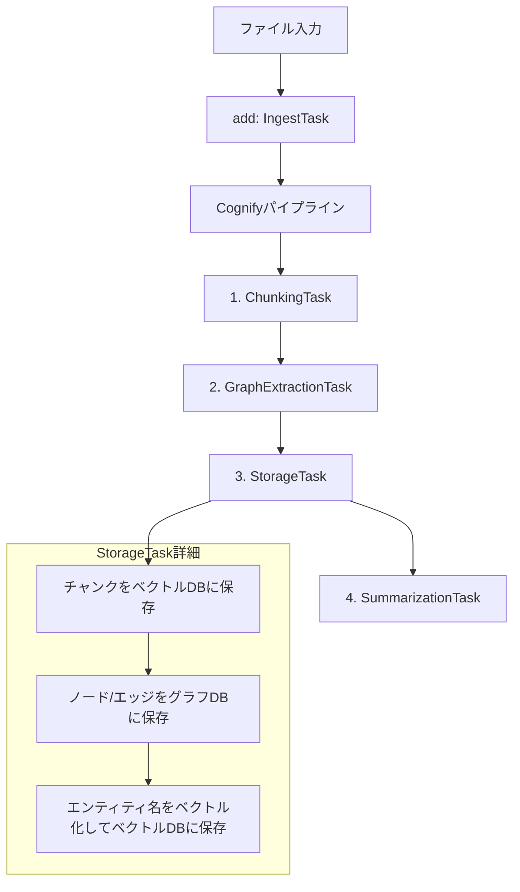
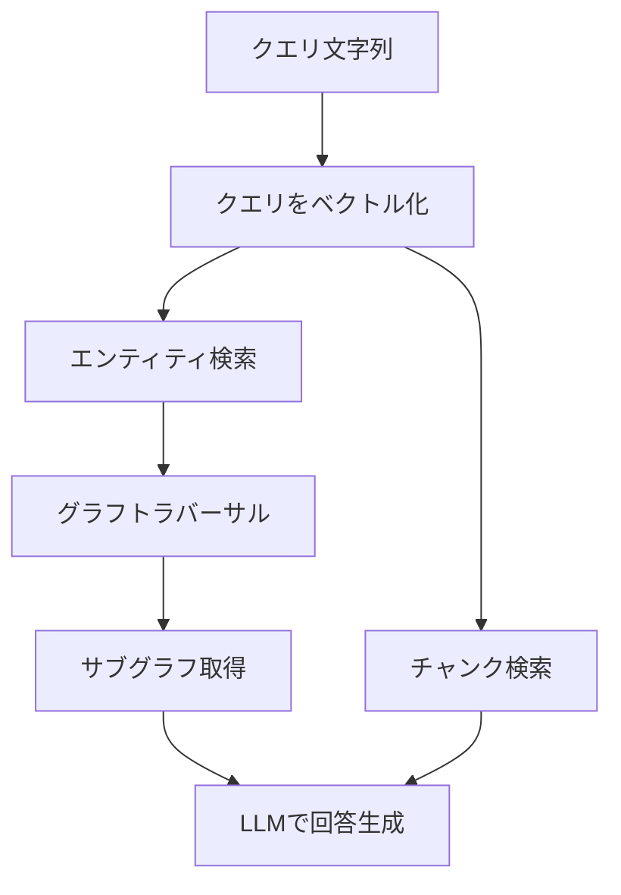

# Absorb (IN) / Query (OUT) フロー詳細解説

このドキュメントは、`src/pkg/cuber` におけるAbsorb（入力処理）とQuery（出力処理）の処理フローを詳細に解説します。

---

## IN: Absorb（入力処理）フロー

### 概要

Absorbは、ファイルを取り込み、知識グラフとベクトルインデックスを構築する処理です。内部では `add` → `cognify` の2段階で処理されます。

### 詳細フロー



---

### ステップ 0: ファイル取り込み（add）

```go
// cuber.go L583-598
ingestTask := ingestion.NewIngestTask(st.Vector, memoryGroup, s.S3Client, s.Logger, eb)
p := pipeline.NewPipeline([]pipeline.Task{ingestTask})
_, usage, err = p.Run(ctx, filePaths)
```

- ファイルをS3または一時ストレージに保存
- メタデータ（`storage.Data`）をデータベースに記録
- この段階ではテキスト処理は行わない

---

### ステップ 1: テキストをチャンクに分割（ChunkingTask）

```go
// chunking_task.go L150-194
func (t *ChunkingTask) chunkText(text string, documentID string, memoryGroup string) ([]*storage.Chunk, types.TokenUsage, error) {
    // 文単位に分割（文の途中で切れることを防ぐ）
    sentences := splitSentences(text)
    
    // 文字数ベースでチャンクを構築
    for _, sentence := range sentences {
        if currentChars+sentenceChars > t.ChunkSize && len(currentChunk) > 0 {
            // チャンクを確定してembeddingを生成
            t.finalizeChunk(...)
        }
        currentChunk = append(currentChunk, sentence)
    }
    return chunks, usage, nil
}
```

**重要な点:**
- 日本語/英語の句読点（。！？.!?）と連続改行で文を分割
- **文単位で分割** - 文の途中で切断しない
- **embedding生成はこの時点で実行される**（各チャンクに対してEmbedderを呼び出し）

---

### ステップ 2: LLMで知識グラフを抽出（GraphExtractionTask）

```go
// graph_extraction_task.go
// チャンクをLLMに送信して、エンティティ（ノード）と関係（エッジ）を抽出
// 出力: *storage.GraphData (Nodes, Edges)
```

- LLMがテキストからエンティティ（人物、場所、概念など）を抽出
- エンティティ間の関係（関係エッジ）を抽出
- ノードには `name`, `type` などのプロパティが設定される

---

### ステップ 3: ストレージに保存（StorageTask）

```go
// storage_task.go L45-219
func (t *StorageTask) Run(ctx context.Context, input any) (any, types.TokenUsage, error) {
    // 1. チャンク（ベクトル）を保存
    for i, chunk := range output.Chunks {
        t.VectorStorage.SaveChunk(ctx, chunk)
    }
    
    // 2. グラフ（ノード/エッジ）を保存
    t.GraphStorage.AddNodes(ctx, output.GraphData.Nodes)
    t.GraphStorage.AddEdges(ctx, output.GraphData.Edges)
    
    // 3. エンティティ名のembeddingを生成して保存（重要！）
    for _, node := range output.GraphData.Nodes {
        if node.Type == SPECIAL_NODE_TYPE_DOCUMENT_CHUNK {
            continue // チャンクノードはスキップ
        }
        name := node.Properties["name"]
        embedding, _, _ := t.Embedder.EmbedQuery(ctx, name)
        t.VectorStorage.SaveEmbedding(ctx, TABLE_NAME_ENTITY, node.ID, name, embedding, memoryGroup)
    }
}
```

**重要な修正点（ユーザーの理解との差異）:**

| ユーザーの理解 | 実際の実装 |
|---|---|
| エンティティを取り出しベクトル化 | ✅ 正しい（`name`プロパティをベクトル化） |
| チャンクをベクトル化 | ⚠️ ChunkingTaskで事前にベクトル化済み |
| 知識グラフをグラフDBに入れる | ✅ 正しい |

---

### ステップ 4: 要約を生成（SummarizationTask）

```go
// summarization_task.go
// 各チャンクに対してLLMで要約を生成
// 要約をベクトル化してTABLE_NAME_SUMMARYテーブルに保存
```

**ユーザーの理解に含まれていなかった要素:**
- **SummarizationTask** がパイプラインの最終段階で実行される
- チャンクの要約を事前に生成して保存
- Queryの `QUERY_TYPE_GET_PRE_MADE_SUMMARIES` で検索可能

---

## OUT: Query（出力処理）フロー

### 概要

Queryは、クエリ文字列に基づいて知識グラフとベクトルDBから情報を検索し、LLMで回答を生成します。

### 詳細フロー（Hybrid RAG）



---

### ステップ 0: クエリをベクトル化

```go
// graph_completion.go L220-240
tmpEmbeddingVectors, u, errr := t.Embedder.EmbedQuery(ctx, query)
embeddingVectors = tmpEmbeddingVectors
```

---

### ステップ 1: エンティティをベクトル検索

```go
// graph_completion.go L249-260
entityResults, err := t.VectorStorage.Query(ctx, types.TABLE_NAME_ENTITY, embeddingVectors, entityTopk, t.memoryGroup)

// GraphNodeIDを収集（重複を除く）
var graphNodeIDs []string
for _, res := range entityResults {
    graphNodeIDs = append(graphNodeIDs, res.ID)
}
```

- `TABLE_NAME_ENTITY` テーブルから類似エンティティを検索
- `entityTopk` パラメータで検索数を制御

---

### ステップ 2: サブグラフを取得（グラフトラバーサル）

```go
// graph_completion.go L279-292
triples, err := t.GraphStorage.GetTriples(ctx, graphNodeIDs, t.memoryGroup)
graph = &triples
```

- エンティティIDリストを起点にグラフDBを検索
- 関連するトリプル（Subject-Predicate-Object）を取得
- **ユーザーの理解は正しい**

---

### ステップ 3: チャンクをベクトル検索

```go
// graph_completion.go L295-340
chunkResults, err := t.VectorStorage.Query(ctx, types.TABLE_NAME_CHUNK, embeddingVectors, chunkTopk, t.memoryGroup)

var chunks []string
for _, result := range chunkResults {
    chunks = append(chunks, result.Text)
}
```

- `TABLE_NAME_CHUNK` テーブルから類似チャンクを検索
- `chunkTopk` パラメータで検索数を制御

---

### ステップ 4: LLMで回答を生成

```go
// graph_completion.go (getGraphCompletionJA/EN)
// サブグラフとチャンクをコンテキストとしてLLMに回答を生成させる

// Hybrid RAG prompt:
// Context: [チャンク群]
// Graph Summary: [サブグラフの自然言語要約]
// Question: [クエリ]
```

---

## まとめ: ユーザー理解の検証

### IN（Absorb）フロー

| # | ユーザーの理解 | 検証結果 |
|---|---|---|
| 0 | 日本語文章をチャンクに切る | ✅ 正しい（文単位で分割） |
| 1 | チャンクをLLMで知識グラフに変換 | ✅ 正しい |
| 2 | ノードからエンティティをベクトル化してベクトルDBへ | ✅ 正しい（nameプロパティをベクトル化） |
| 3 | チャンクをベクトル化してベクトルDBへ | ⚠️ 順序が異なる：チャンキング時にベクトル化 |
| 4 | 知識グラフをグラフDBに入れる | ✅ 正しい |
| - | **欠落: 要約を生成してベクトルDBへ保存** | ❌ 追加が必要 |

### OUT（Query）フロー

| # | ユーザーの理解 | 検証結果 |
|---|---|---|
| 0 | クエリをベクトル化 | ✅ 正しい |
| 1 | エンティティをベクトルDBから取得 | ✅ 正しい |
| 2 | エンティティリストでサブグラフを取得 | ✅ 正しい |
| 3 | チャンクをベクトルDBから取得 | ✅ 正しい |
| 4 | サブグラフとチャンクでLLMに回答させる | ✅ 正しい |

---

## 修正版フロー

```
# IN: 入力の処理
0. ファイルを取り込みメタデータを保存（add）
1. 入力情報となる日本語文章を文単位でチャンクに切る（ChunkingTask）
   - この時点でチャンクをベクトル化
2. チャンクをLLMを使って知識グラフに変換（GraphExtractionTask）
3. StorageTask:
   3a. チャンク（事前ベクトル化済み）をベクトルDBに保存
   3b. 知識グラフ（ノード/エッジ）をグラフDBに保存
   3c. 各ノードのエンティティ名をベクトル化してベクトルDBに保存
4. 各チャンクの要約を生成してベクトルDBに保存（SummarizationTask）

# OUT-A: チャンク使用パターン（QueryType 11: ANSWER_BY_CHUNKS_AND_GRAPH_SUMMARY）
0. クエリ文字列をベクトル化
1. クエリベクトルでエンティティをベクトルDBから取得してリスト
2. エンティティリストを全て使ってグラフDBからサブグラフを取得
3. クエリベクトルでチャンクをベクトルDBから取得
4. サブグラフ + チャンクをコンテキストにしてLLMに回答を作らせる

# OUT-B: 要約使用パターン（QueryType 10: ANSWER_BY_PRE_MADE_SUMMARIES_AND_GRAPH_SUMMARY）
0. クエリ文字列をベクトル化
1. クエリベクトルでエンティティをベクトルDBから取得してリスト
2. エンティティリストを全て使ってグラフDBからサブグラフを取得
3. クエリベクトルで事前作成済み要約をベクトルDBから取得（←IN:4で保存したもの）
4. サブグラフ + 要約をコンテキストにしてLLMに回答を作らせる

**使い分け:**
- **OUT-A（チャンク）**: 原文の詳細情報が必要な場合。精度は高いがトークン消費が多い。
- **OUT-B（要約）**: 概要的な回答で十分な場合。トークン消費が少なく高速。
```
