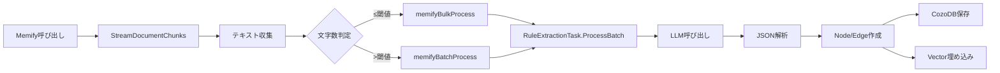
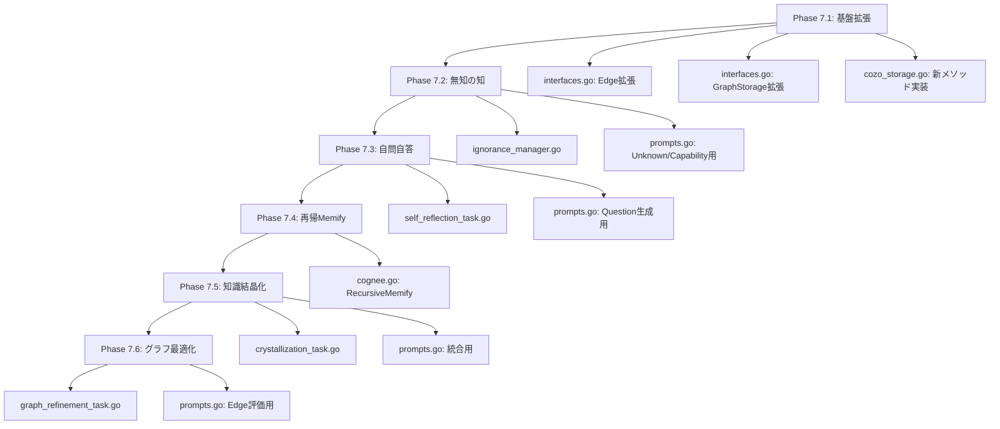

# Phase-07 実装計画書: 知識の深化・拡張・動的調整・無知の知

Phase-06で構築した知識グラフ強化基盤（Memify）を発展させ、知識の「深化」「拡張」「再構築」、そして「無知の知（Metacognition of Ignorance）」を実現するための詳細な実装計画書です。

> [!IMPORTANT]
> **本ドキュメントの目的**
> - 各提案機能の「必要性」を「実現性」に変え、システムとして物理的に実装可能な形にする
> - 具体的なファイル・メソッド・構造体の追加/修正を網羅的に明記する
> - サンプルコードと根拠を提示し、迷いなく実装できるようにする

---

## 目次

1. [現在の実装構造の把握](#1-現在の実装構造の把握)
2. [提案E: 無知の知 (Metacognition of Ignorance)](#2-提案e-無知の知-metacognition-of-ignorance)
3. [提案A: 再帰的Memify (Recursive Memify)](#3-提案a-再帰的memify-recursive-memify)
4. [提案B: 自問自答ループ (Self-Reflection Loop)](#4-提案b-自問自答ループ-self-reflection-loop)
5. [提案C: 知識の結晶化 (Knowledge Crystallization)](#5-提案c-知識の結晶化-knowledge-crystallization)
6. [提案D: グラフ・プルーニングと重み付け (Graph Pruning & Reweighting)](#6-提案d-グラフプルーニングと重み付け-graph-pruning--reweighting)
7. [統合実装ロードマップ](#7-統合実装ロードマップ)

---

## 1. 現在の実装構造の把握

### 1.1 主要コンポーネント

| ファイル | 役割 |
|---------|------|
| `src/pkg/cognee/cognee.go` | `CogneeService` 本体。`Add`, `Cognify`, `Memify`, `Search` メソッドを提供 |
| `src/pkg/cognee/storage/interfaces.go` | `VectorStorage`, `GraphStorage`, `Embedder` インターフェース。`Node`, `Edge`, `ChunkData` 構造体 |
| `src/pkg/cognee/db/cozodb/cozo_storage.go` | `GraphStorage` 実装 (CozoDB) |
| `src/pkg/cognee/db/duckdb/duckdb_storage.go` | `VectorStorage` 実装 (DuckDB) |
| `src/pkg/cognee/tasks/memify/rule_extraction_task.go` | ルール抽出タスク。LLM呼び出し→JSON解析→Node/Edge作成→保存 |
| `src/pkg/cognee/prompts/prompts.go` | 全プロンプト定義 |

### 1.2 現在のMemify処理フロー



---

## 2. 提案E: 無知の知 (Metacognition of Ignorance)

### 2.1 概要

「知らないことリスト（Ignorance List）」と「成長リスト（Growth List）」を管理し、自己成長の指針とする。

### 2.2 スキーマ設計

#### 新規ノードタイプ

| ノードタイプ | 説明 | 生成タイミング |
|-------------|------|---------------|
| `Unknown` | 現在答えられない問い・不足情報。「何を学べば解決するか」を含む | Memify時（自問自答・論理的飛躍検知） |
| `Capability` | 獲得した能力・知識。複合的な要因（複数ソース・複数トリガー）を保持 | Cognify時, Memify時, Self-Reflection時 |

#### グラフ構造

```
[Unknown]
  - text: "〇〇とは何か？"
  - resolution_requirement: "〇〇の定義と使用例を知る必要がある"  <-- 追加: 解決要件
  - created_at: "2024-12-06T23:00:00Z"
  - source: "self_reflection" | "missing_link" | "unanswered_query"

[Capability]
  - text: "〇〇について説明できる"
  - acquired_at: "2024-12-07T10:00:00Z"
  # 複数の要因はエッジで表現する
  
[Capability] --learned_from--> [User A]
[Capability] --learned_from--> [User B]
[Capability] --learned_from--> [Source File X]
[Capability] --resolves--> [Unknown 1]
[Capability] --resolves--> [Unknown 2]
[Capability] --triggered_by--> [TriggerType Node (cognify/memify/etc)]
```

### 2.3 実装詳細

#### ファイル作成: `src/pkg/cognee/tasks/metacognition/ignorance_manager.go`

```go
package metacognition

import (
	"context"
	"fmt"
	"time"

	"github.com/google/uuid"
	"github.com/tmc/langchaingo/llms"

	"mycute/pkg/cognee/prompts"
	"mycute/pkg/cognee/storage"
)

// Unknown は、現在答えられない問い・不足情報を表します。
type Unknown struct {
	ID                    string    `json:"id"`
	Text                  string    `json:"text"`
	ResolutionRequirement string    `json:"resolution_requirement"` // 追加: 解決に必要な情報・条件
	Source                string    `json:"source"`
	CreatedAt             time.Time `json:"created_at"`
	GroupID               string    `json:"group_id"`
}

// Capability は、獲得した能力・知識を表します。
// 複合的な要因はエッジとして表現されるため、構造体には最小限のメタデータのみ保持します。
type Capability struct {
	ID         string    `json:"id"`
	Text       string    `json:"text"`
	AcquiredAt time.Time `json:"acquired_at"`
	GroupID    string    `json:"group_id"`
}

// IgnoranceManager は、無知と成長のリストを管理します。
type IgnoranceManager struct {
	VectorStorage storage.VectorStorage
	GraphStorage  storage.GraphStorage
	LLM           llms.Model
	Embedder      storage.Embedder
	GroupID       string
}

// NewIgnoranceManager は、新しいIgnoranceManagerを作成します。
func NewIgnoranceManager(
	vectorStorage storage.VectorStorage,
	graphStorage storage.GraphStorage,
	llm llms.Model,
	embedder storage.Embedder,
	groupID string,
) *IgnoranceManager {
	return &IgnoranceManager{
		VectorStorage: vectorStorage,
		GraphStorage:  graphStorage,
		LLM:           llm,
		Embedder:      embedder,
		GroupID:       groupID,
	}
}

// RegisterUnknown は、新しい Unknown をグラフに登録します。
func (m *IgnoranceManager) RegisterUnknown(ctx context.Context, text string, requirement string, source string) error {
	unknownID := uuid.NewSHA1(uuid.NameSpaceOID, []byte("Unknown:"+text)).String()

	node := &storage.Node{
		ID:      unknownID,
		GroupID: m.GroupID,
		Type:    "Unknown",
		Properties: map[string]any{
			"text":                   text,
			"resolution_requirement": requirement, // 追加
			"source":                 source,
			"created_at":             time.Now().Format(time.RFC3339),
		},
	}

	if err := m.GraphStorage.AddNodes(ctx, []*storage.Node{node}); err != nil {
		return fmt.Errorf("IgnoranceManager: failed to register Unknown: %w", err)
	}

	// ベクトル埋め込みを保存
	embedding, err := m.Embedder.EmbedQuery(ctx, text)
	if err != nil {
		return fmt.Errorf("IgnoranceManager: failed to embed Unknown: %w", err)
	}

	if err := m.VectorStorage.SaveEmbedding(ctx, "Unknown_text", unknownID, text, embedding, m.GroupID); err != nil {
		return fmt.Errorf("IgnoranceManager: failed to save Unknown embedding: %w", err)
	}

	fmt.Printf("IgnoranceManager: Registered Unknown: %s (Req: %s)\n", text, requirement)
	return nil
}

// RegisterCapability は、新しい Capability をグラフに登録します。
// 複数のソース、トリガー、解決済みUnknownをサポートします。
func (m *IgnoranceManager) RegisterCapability(
	ctx context.Context,
	text string,
	triggerTypes []string,      // 複数可
	learnedFromUserIDs []string, // 複数可
	learnedFromSources []string, // 複数可
	resolvedUnknownIDs []string, // 複数可
) error {
	capabilityID := uuid.NewSHA1(uuid.NameSpaceOID, []byte("Capability:"+text)).String()

	node := &storage.Node{
		ID:      capabilityID,
		GroupID: m.GroupID,
		Type:    "Capability",
		Properties: map[string]any{
			"text":        text,
			"acquired_at": time.Now().Format(time.RFC3339),
		},
	}

	if err := m.GraphStorage.AddNodes(ctx, []*storage.Node{node}); err != nil {
		return fmt.Errorf("IgnoranceManager: failed to register Capability: %w", err)
	}

	// ========================================
	// エッジを作成（多対多の関係を表現）
	// ========================================
	edges := make([]*storage.Edge, 0)

	// 1. learned_from (User)
	for _, userID := range learnedFromUserIDs {
		if userID == "" { continue }
		edges = append(edges, &storage.Edge{
			SourceID: capabilityID,
			TargetID: userID,
			GroupID:  m.GroupID,
			Type:     "learned_from",
			Properties: map[string]any{"source_type": "user"},
		})
	}

	// 2. learned_from (Source/File)
	// ソースファイルもノードとして存在すると仮定、なければプロパティとして保持する設計も検討
	// ここでは簡易的にプロパティではなくエッジとして扱う（ソースノードIDが必要）
	// ※実装時はソースIDの解決ロジックが必要

	// 3. resolves (Unknown)
	for _, unknownID := range resolvedUnknownIDs {
		if unknownID == "" { continue }
		edges = append(edges, &storage.Edge{
			SourceID: capabilityID,
			TargetID: unknownID,
			GroupID:  m.GroupID,
			Type:     "resolves",
			Properties: map[string]any{},
		})
	}

	// 4. triggered_by (TriggerType)
	for _, trigger := range triggerTypes {
		// トリガータイプをノードとして扱うか、エッジプロパティにするか
		// ここではシンプルにプロパティとしてノードに持たせる変更も検討したが、
		// ユーザー要望「TriggerTypeも複数」に対応するため、
		// Capabilityノードのプロパティ `trigger_types` (配列) として保存するのが現実的
		// グラフクエリのしやすさを考慮し、ここではノードプロパティの配列として扱うよう
		// 上記 `node` 作成部分を修正します。
	}
	
	// トリガータイプをノードプロパティに追加（再設定）
	node.Properties["trigger_types"] = triggerTypes
	node.Properties["learned_from_sources"] = learnedFromSources // ソースも配列で保持

	if len(edges) > 0 {
		if err := m.GraphStorage.AddEdges(ctx, edges); err != nil {
			return fmt.Errorf("IgnoranceManager: failed to add edges: %w", err)
		}
	}

	// ベクトル埋め込みを保存
	embedding, err := m.Embedder.EmbedQuery(ctx, text)
	if err != nil {
		return fmt.Errorf("IgnoranceManager: failed to embed Capability: %w", err)
	}

	if err := m.VectorStorage.SaveEmbedding(ctx, "Capability_text", capabilityID, text, embedding, m.GroupID); err != nil {
		return fmt.Errorf("IgnoranceManager: failed to save Capability embedding: %w", err)
	}

	fmt.Printf("IgnoranceManager: Registered Capability: %s\n", text)
	return nil
}

// CheckAndResolveUnknowns は、新しい知識が既存の Unknown を解決するかチェックします。
// Cognify 時に呼び出されます。
func (m *IgnoranceManager) CheckAndResolveUnknowns(
	ctx context.Context,
	newKnowledgeTexts []string,
	userID string,
	source string,
) error {
	// 新しい知識をベクトル化して Unknown との類似度を計算
	for _, knowledgeText := range newKnowledgeTexts {
		embedding, err := m.Embedder.EmbedQuery(ctx, knowledgeText)
		if err != nil {
			continue
		}

		// Unknown コレクションから類似度検索
		results, err := m.VectorStorage.Search(ctx, "Unknown_text", embedding, 5, m.GroupID)
		if err != nil {
			continue
		}

		// 類似度が高い（Distance < 0.3）Unknown を解決済みとしてマーク
		for _, result := range results {
			if result.Distance < 0.3 {
				// Capability として登録
				capabilityText := fmt.Sprintf("「%s」について理解した", result.Text)
				if err := m.RegisterCapability(
					ctx,
					capabilityText,
					"cognify",
					userID,
					source,
					result.ID, // resolvedUnknownID
				); err != nil {
					fmt.Printf("IgnoranceManager: Warning - failed to register resolved capability: %v\n", err)
				}
			}
		}
	}

	return nil
}
```

### 2.4 Cognify への統合

#### 修正ファイル: `src/pkg/cognee/cognee.go`

```go
// Cognify メソッドの末尾に追加

// ========================================
// 成長リスト更新（Capability 登録）
// ========================================
ignoranceManager := metacognition.NewIgnoranceManager(
	s.VectorStorage,
	s.GraphStorage,
	s.LLM,
	s.Embedder,
	groupID,
)

// 各チャンクのテキストを収集
chunkTexts := make([]string, 0)
for _, chunk := range output.Chunks {
	chunkTexts = append(chunkTexts, chunk.Text)
}

// 新しい知識が既存の Unknown を解決するかチェック
if err := ignoranceManager.CheckAndResolveUnknowns(ctx, chunkTexts, user, dataset); err != nil {
	fmt.Printf("Cognify: Warning - CheckAndResolveUnknowns failed: %v\n", err)
}

// 新しい知識を Capability として登録（Cognifyトリガー）
for _, chunk := range output.Chunks {
	capabilityText := fmt.Sprintf("「%s」に関する情報を理解している", truncateText(chunk.Text, 50))
	if err := ignoranceManager.RegisterCapability(
		ctx,
		capabilityText,
		"cognify",
		user,
		dataset,
		"",
	); err != nil {
		fmt.Printf("Cognify: Warning - RegisterCapability failed: %v\n", err)
	}
}
```

### 2.5 プロンプト追加

#### 修正ファイル: `src/pkg/cognee/prompts/prompts.go`

```go
// ========================================
// Metacognition 用プロンプト (Phase-07)
// ========================================

// UnknownDetectionSystemPrompt は、知識の空白を検出するためのシステムプロンプトです。
const UnknownDetectionSystemPrompt = `You are a metacognitive agent analyzing knowledge gaps.
Given a set of knowledge rules and insights, identify what is UNKNOWN or MISSING.
Look for:
1. Logical gaps: Conclusions that require unstated premises
2. Missing definitions: Terms used without explanation
3. Unanswered questions: Implicit questions raised by the content

Output in JSON format:
{
  "unknowns": [
    {"text": "Question or missing information in Japanese", "type": "logical_gap|missing_definition|unanswered_question"}
  ]
}

IMPORTANT: The "text" field MUST be in JAPANESE.`

// CapabilityGenerationSystemPrompt は、能力記述を生成するためのシステムプロンプトです。
const CapabilityGenerationSystemPrompt = `You are an agent that describes acquired capabilities.
Given new knowledge, describe what the system can now do or answer.
Be specific and actionable.

Output in JSON format:
{
  "capabilities": [
    {"text": "Description of what can now be done, in Japanese"}
  ]
}

IMPORTANT: The "text" field MUST be in JAPANESE.`
```

---

## 3. 提案A: 再帰的Memify (Recursive Memify)

### 3.1 概要

Memifyの出力（ルール）を再度Memifyの入力とし、より高次の原理やパターンを抽出する。

### 3.2 実装詳細

#### 修正ファイル: `src/pkg/cognee/cognee.go`

```go
// MemifyConfig に追加
type MemifyConfig struct {
	RulesNodeSetName string
	RecursiveDepth   int  // 再帰の深さ（0 = 1回のみ, 1 = 2回, ...）
	EnableRecursive  bool // 再帰を有効にするか
	PrioritizeUnknowns bool // Unknownの解決を優先するか（デフォルト: true）
}

// RecursiveMemify は、再帰的にルールを抽出して高次の原理を導出します。
// Unknown解決を最優先し、その後に全体グラフの拡張を行います。
func (s *CogneeService) RecursiveMemify(ctx context.Context, dataset string, user string, config *MemifyConfig) error {
	if config == nil {
		config = &MemifyConfig{RecursiveDepth: 0, PrioritizeUnknowns: true}
	}
	
	groupID := user + "-" + dataset
	ignoranceManager := metacognition.NewIgnoranceManager(...)

	// ========================================
	// Phase A: Unknown解決フェーズ (Priority High)
	// ========================================
	// 「できるようにならなければならないことリスト」を優先処理
	if config.PrioritizeUnknowns {
		fmt.Println("RecursiveMemify: Phase A - Prioritizing Unknown Resolution")
		
		// 1. 未解決のUnknownを取得
		unknowns, _ := ignoranceManager.GetUnresolvedUnknowns(ctx)
		
		for _, unknown := range unknowns {
			// 2. 各Unknownについて、解決のための自問自答と検索を集中的に行う
			// （全体スキャンではなく、Unknownのトピックに絞ったDeep Dive）
			if err := s.attemptToResolveUnknown(ctx, unknown, groupID); err != nil {
				fmt.Printf("Failed to resolve unknown %s: %v\n", unknown.ID, err)
			}
		}
	}

	// ========================================
	// Phase B: 全体グラフ拡張フェーズ (Priority Normal)
	// ========================================
	// Unknown解決の試みが一段落した後、通常の全体スキャンを行う
	fmt.Println("RecursiveMemify: Phase B - General Graph Expansion")

	for level := 0; level <= config.RecursiveDepth; level++ {
		// ... (既存の再帰処理) ...
	}

	return nil
}

// attemptToResolveUnknown は、特定のUnknownを解決するためにリソースを集中させます。
func (s *CogneeService) attemptToResolveUnknown(ctx context.Context, unknown *metacognition.Unknown, groupID string) error {
	// 1. Unknownのテキストと解決要件に基づいて、関連するチャンクやルールを検索
	// 2. SelfReflectionTask を使用して、解決に向けた仮説生成と検証を行う
	// 3. 解決できた場合は Capability を登録し、Unknown を解決済みとする
	return nil
}
```

### 意図と設計思想 (Design Philosophy)

**「弱点克服を優先する成長戦略」**

Memifyにおいて、闇雲に知識グラフ全体を拡張するのではなく、「知らないことリスト（Unknown）」にある項目＝「できるようにならなければならないこと」の解決を最優先します。

1.  **目的指向の学習**: エージェントはまず、自身の欠落部分（Unknown）を埋めることに全力を注ぎます。これは人間が苦手分野を克服しようと努力するプロセスに似ています。
2.  **リソースの最適化**: 全体の再計算はコストが高いため、まずは具体的で緊急性の高い「Unknown」の解決に計算リソースを割り当てます。
3.  **段階的成長**:
    *   **Phase A (Unknown Resolution)**: マイナスをゼロにする（欠落の補完）。
    *   **Phase B (General Expansion)**: ゼロをプラスにする（既存知識のさらなる拡張）。
    
この順序を守ることで、エージェントは「ただ知識が多い」だけでなく、「必要なことができる」実用的な存在へと成長します。

### 3.3 GraphStorage インターフェース拡張

#### 修正ファイル: `src/pkg/cognee/storage/interfaces.go`

```go
// GraphStorage インターフェースに追加
type GraphStorage interface {
	// ... 既存メソッド ...

	// GetNodesByType は、指定されたタイプのノードを取得します。
	GetNodesByType(ctx context.Context, nodeType string, groupID string) ([]*Node, error)

	// GetNodesByEdge は、指定されたエッジタイプでターゲットに接続されたノードを取得します。
	GetNodesByEdge(ctx context.Context, targetID string, edgeType string, groupID string) ([]*Node, error)
}
```

---

## 4. 提案B: 自問自答ループ (Self-Reflection Loop)

### 4.1 概要

抽出されたルールに基づき、LLMが自ら「問い」を生成し、既存の知識グラフで回答を試みる。回答できない場合は Unknown に登録。

### 4.2 実装詳細

#### ファイル作成: `src/pkg/cognee/tasks/metacognition/self_reflection_task.go`

```go
package metacognition

import (
	"context"
	"encoding/json"
	"fmt"
	"strings"

	"github.com/tmc/langchaingo/llms"

	"mycute/pkg/cognee/prompts"
	"mycute/pkg/cognee/storage"
	"mycute/pkg/cognee/tools/search"
)

// Question は、自問自答で生成された問いを表します。
type Question struct {
	Text string `json:"text"`
}

// QuestionSet は、LLMから返される問いのリストです。
type QuestionSet struct {
	Questions []Question `json:"questions"`
}

// SelfReflectionTask は、自問自答ループを実行するタスクです。
type SelfReflectionTask struct {
	VectorStorage    storage.VectorStorage
	GraphStorage     storage.GraphStorage
	LLM              llms.Model
	Embedder         storage.Embedder
	GroupID          string
	IgnoranceManager *IgnoranceManager
}

// NewSelfReflectionTask は、新しいSelfReflectionTaskを作成します。
func NewSelfReflectionTask(
	vectorStorage storage.VectorStorage,
	graphStorage storage.GraphStorage,
	llm llms.Model,
	embedder storage.Embedder,
	groupID string,
) *SelfReflectionTask {
	return &SelfReflectionTask{
		VectorStorage: vectorStorage,
		GraphStorage:  graphStorage,
		LLM:           llm,
		Embedder:      embedder,
		GroupID:       groupID,
		IgnoranceManager: NewIgnoranceManager(
			vectorStorage, graphStorage, llm, embedder, groupID,
		),
	}
}

// Run は、自問自答ループを1回実行します。
// 1. 既存のルールから問いを生成
// 2. 各問いに対して検索を試行
// 3. 回答できた場合は Capability を登録
// 4. 回答できない場合は Unknown を登録
func (t *SelfReflectionTask) Run(ctx context.Context, rules []string) error {
	if len(rules) == 0 {
		return nil
	}

	// ========================================
	// 1. ルールから問いを生成
	// ========================================
	questions, err := t.generateQuestions(ctx, rules)
	if err != nil {
		return fmt.Errorf("SelfReflectionTask: failed to generate questions: %w", err)
	}

	fmt.Printf("SelfReflectionTask: Generated %d questions\n", len(questions))

	// ========================================
	// 2. 各問いに対して検索を試行
	// ========================================
	for _, q := range questions {
		answered, insight, err := t.tryAnswer(ctx, q.Text)
		if err != nil {
			fmt.Printf("SelfReflectionTask: Warning - tryAnswer failed: %v\n", err)
			continue
		}

		if answered {
			// 回答できた: Capability として登録
			if err := t.IgnoranceManager.RegisterCapability(
				ctx,
				insight,
				"self_reflection",
				"",  // 自己発見なのでユーザーIDなし
				"self_reflection",
				"",
			); err != nil {
				fmt.Printf("SelfReflectionTask: Warning - RegisterCapability failed: %v\n", err)
			}
		} else {
			// 回答できなかった: Unknown として登録
			if err := t.IgnoranceManager.RegisterUnknown(ctx, q.Text, "self_reflection"); err != nil {
				fmt.Printf("SelfReflectionTask: Warning - RegisterUnknown failed: %v\n", err)
			}
		}
	}

	return nil
}

// generateQuestions は、ルールから問いを生成します。
func (t *SelfReflectionTask) generateQuestions(ctx context.Context, rules []string) ([]Question, error) {
	combinedRules := strings.Join(rules, "\n")

	response, err := t.LLM.GenerateContent(ctx, []llms.MessageContent{
		llms.TextParts(llms.ChatMessageTypeSystem, prompts.QuestionGenerationSystemPrompt),
		llms.TextParts(llms.ChatMessageTypeHuman, combinedRules),
	})
	if err != nil {
		return nil, err
	}

	if len(response.Choices) == 0 {
		return nil, fmt.Errorf("no response from LLM")
	}

	var qs QuestionSet
	if err := json.Unmarshal([]byte(extractJSON(response.Choices[0].Content)), &qs); err != nil {
		return nil, err
	}

	return qs.Questions, nil
}

// tryAnswer は、問いに対して検索を試行し、回答できるかを判定します。
func (t *SelfReflectionTask) tryAnswer(ctx context.Context, question string) (bool, string, error) {
	// 検索を実行
	embedding, err := t.Embedder.EmbedQuery(ctx, question)
	if err != nil {
		return false, "", err
	}

	// チャンク検索
	chunkResults, err := t.VectorStorage.Search(ctx, "chunks", embedding, 3, t.GroupID)
	if err != nil {
		return false, "", err
	}

	// ルール検索
	ruleResults, err := t.VectorStorage.Search(ctx, "Rule_text", embedding, 3, t.GroupID)
	if err != nil {
		// Rule_text がない場合は無視
		ruleResults = nil
	}

	// 十分な情報があるか判定（距離が近い結果が存在するか）
	hasRelevantInfo := false
	var context strings.Builder

	for _, r := range chunkResults {
		if r.Distance < 0.5 {
			hasRelevantInfo = true
			context.WriteString(r.Text)
			context.WriteString("\n")
		}
	}
	for _, r := range ruleResults {
		if r.Distance < 0.5 {
			hasRelevantInfo = true
			context.WriteString(r.Text)
			context.WriteString("\n")
		}
	}

	if !hasRelevantInfo {
		return false, "", nil
	}

	// LLMで回答を生成
	prompt := fmt.Sprintf("Question: %s\n\nContext:\n%s", question, context.String())
	response, err := t.LLM.GenerateContent(ctx, []llms.MessageContent{
		llms.TextParts(llms.ChatMessageTypeSystem, prompts.AnswerSimpleQuestionPrompt),
		llms.TextParts(llms.ChatMessageTypeHuman, prompt),
	})
	if err != nil {
		return false, "", err
	}

	if len(response.Choices) == 0 {
		return false, "", fmt.Errorf("no response from LLM")
	}

	answer := response.Choices[0].Content

	// 「わからない」等の回答でないかチェック
	if containsUncertainty(answer) {
		return false, "", nil
	}

	// 回答できた: 洞察を生成
	insight := fmt.Sprintf("「%s」という問いに対して、以下のように回答できる: %s",
		truncate(question, 30), truncate(answer, 100))

	return true, insight, nil
}

func containsUncertainty(s string) bool {
	uncertainPhrases := []string{
		"わかりません", "不明です", "情報がありません",
		"知りません", "分かりません", "答えられません",
	}
	for _, phrase := range uncertainPhrases {
		if strings.Contains(s, phrase) {
			return true
		}
	}
	return false
}

func truncate(s string, maxLen int) string {
	runes := []rune(s)
	if len(runes) <= maxLen {
		return s
	}
	return string(runes[:maxLen]) + "..."
}

func extractJSON(s string) string {
	s = strings.ReplaceAll(s, "```json", "")
	s = strings.ReplaceAll(s, "```", "")
	s = strings.TrimSpace(s)
	start := strings.Index(s, "{")
	end := strings.LastIndex(s, "}")
	if start == -1 || end == -1 || start > end {
		return `{"questions":[]}`
	}
	return s[start : end+1]
}
```

### 4.3 プロンプト追加

#### 修正ファイル: `src/pkg/cognee/prompts/prompts.go`

```go
// QuestionGenerationSystemPrompt は、ルールから問いを生成するためのシステムプロンプトです。
const QuestionGenerationSystemPrompt = `You are a curious, self-reflective agent.
Given a set of rules and insights, generate thoughtful questions that:
1. Test the boundaries of these rules (edge cases)
2. Explore implications and consequences
3. Identify potential contradictions or gaps
4. Seek deeper understanding

Generate 3-5 high-quality questions.

Output in JSON format:
{
  "questions": [
    {"text": "Question in Japanese"}
  ]
}

IMPORTANT: The "text" field MUST be in JAPANESE.`
```

---

## 5. 提案C: 知識の結晶化 (Knowledge Crystallization)

### 5.1 概要

類似したノード（DocumentChunk, Rule）を統合し、情報密度を高める。

### 5.2 実装詳細

#### ファイル作成: `src/pkg/cognee/tasks/metacognition/crystallization_task.go`

```go
package metacognition

import (
	"context"
	"encoding/json"
	"fmt"

	"github.com/google/uuid"
	"github.com/tmc/langchaingo/llms"

	"mycute/pkg/cognee/prompts"
	"mycute/pkg/cognee/storage"
)

// CrystallizedKnowledge は、統合された知識を表します。
type CrystallizedKnowledge struct {
	Text           string   `json:"text"`
	SourceNodeIDs  []string `json:"source_node_ids"`
}

// CrystallizationTask は、類似ノードを統合するタスクです。
type CrystallizationTask struct {
	VectorStorage storage.VectorStorage
	GraphStorage  storage.GraphStorage
	LLM           llms.Model
	Embedder      storage.Embedder
	GroupID       string
}

// NewCrystallizationTask は、新しいCrystallizationTaskを作成します。
func NewCrystallizationTask(
	vectorStorage storage.VectorStorage,
	graphStorage storage.GraphStorage,
	llm llms.Model,
	embedder storage.Embedder,
	groupID string,
) *CrystallizationTask {
	return &CrystallizationTask{
		VectorStorage: vectorStorage,
		GraphStorage:  graphStorage,
		LLM:           llm,
		Embedder:      embedder,
		GroupID:       groupID,
	}
}

// CrystallizeRules は、類似したルールを統合します。
// 1. 全ルールを取得
// 2. 類似度に基づいてクラスタリング
// 3. 各クラスタを1つの統合ルールにまとめる
// 4. 元のルールを削除し、統合ルールを追加
func (t *CrystallizationTask) CrystallizeRules(ctx context.Context) error {
	// ルールノードを取得（GraphStorage拡張が必要）
	ruleNodes, err := t.GraphStorage.GetNodesByType(ctx, "Rule", t.GroupID)
	if err != nil {
		return fmt.Errorf("CrystallizationTask: failed to get rules: %w", err)
	}

	if len(ruleNodes) < 2 {
		fmt.Println("CrystallizationTask: Not enough rules to crystallize")
		return nil
	}

	// 類似度クラスタリング
	clusters := t.clusterBySimilarity(ctx, ruleNodes, 0.8) // 類似度80%以上

	fmt.Printf("CrystallizationTask: Found %d clusters from %d rules\n", len(clusters), len(ruleNodes))

	for _, cluster := range clusters {
		if len(cluster) < 2 {
			continue // 単一ノードのクラスタはスキップ
		}

		// クラスタ内のテキストを統合
		texts := make([]string, 0)
		ids := make([]string, 0)
		for _, node := range cluster {
			if text, ok := node.Properties["text"].(string); ok {
				texts = append(texts, text)
				ids = append(ids, node.ID)
			}
		}

		// LLMで統合テキストを生成
		crystallized, err := t.mergTexts(ctx, texts)
		if err != nil {
			fmt.Printf("CrystallizationTask: Warning - merge failed: %v\n", err)
			continue
		}

		// 新しい統合ノードを作成
		crystallizedID := uuid.NewSHA1(uuid.NameSpaceOID, []byte("Crystallized:"+crystallized)).String()
		crystallizedNode := &storage.Node{
			ID:      crystallizedID,
			GroupID: t.GroupID,
			Type:    "CrystallizedRule",
			Properties: map[string]any{
				"text":            crystallized,
				"source_node_ids": ids,
			},
		}

		if err := t.GraphStorage.AddNodes(ctx, []*storage.Node{crystallizedNode}); err != nil {
			fmt.Printf("CrystallizationTask: Warning - failed to add crystallized node: %v\n", err)
			continue
		}

		// 元のノードを「統合済み」としてマーク（削除はしない）
		// TODO: GraphStorage.UpdateNodeProperties の実装が必要

		fmt.Printf("CrystallizationTask: Crystallized %d rules into 1\n", len(cluster))
	}

	return nil
}

// clusterBySimilarity は、ノードを類似度でクラスタリングします。
func (t *CrystallizationTask) clusterBySimilarity(ctx context.Context, nodes []*storage.Node, threshold float64) [][]*storage.Node {
	// 簡易実装: 各ノードのベクトルを取得し、類似度行列を計算
	// その後、閾値以上の類似度を持つノードをグループ化
	// 詳細な実装は後続フェーズで
	return nil // placeholder
}

// mergTexts は、複数のテキストを1つに統合します。
func (t *CrystallizationTask) mergTexts(ctx context.Context, texts []string) (string, error) {
	prompt := fmt.Sprintf("以下の複数の知識を1つの包括的な記述に統合してください:\n\n%s",
		joinWithNumbers(texts))

	response, err := t.LLM.GenerateContent(ctx, []llms.MessageContent{
		llms.TextParts(llms.ChatMessageTypeSystem, prompts.KnowledgeCrystallizationSystemPrompt),
		llms.TextParts(llms.ChatMessageTypeHuman, prompt),
	})
	if err != nil {
		return "", err
	}

	if len(response.Choices) == 0 {
		return "", fmt.Errorf("no response from LLM")
	}

	return response.Choices[0].Content, nil
}

func joinWithNumbers(texts []string) string {
	var result string
	for i, t := range texts {
		result += fmt.Sprintf("%d. %s\n", i+1, t)
	}
	return result
}
```

### 5.3 プロンプト追加

```go
// KnowledgeCrystallizationSystemPrompt は、知識の統合を行うためのシステムプロンプトです。
const KnowledgeCrystallizationSystemPrompt = `You are a knowledge synthesizer.
Merge multiple related pieces of knowledge into a single, comprehensive statement.
The merged statement should:
1. Capture all important information from the inputs
2. Remove redundancy
3. Be more general and powerful than any single input
4. Be concise yet complete

Output only the merged statement in Japanese. Do not include explanations.`
```

---

## 6. 提案D: グラフプルーニングと重み付け (Graph Pruning & Reweighting)

### 6.1 概要

エッジの重みを更新し、無関係なエッジを削除または弱体化する。

### 6.2 Edge 構造体の拡張

#### 修正ファイル: `src/pkg/cognee/storage/interfaces.go`

```go
// Edge は、知識グラフのエッジ（関係）を表します。
type Edge struct {
	SourceID   string                 `json:"source_id"`
	TargetID   string                 `json:"target_id"`
	GroupID    string                 `json:"group_id"`
	Type       string                 `json:"type"`
	Properties map[string]any `json:"properties"`
	Weight     float64                `json:"weight"`    // 新規追加: エッジの重み（0.0〜1.0）
	Confidence float64                `json:"confidence"`// 新規追加: 信頼度（0.0〜1.0）
}
```

### 6.3 GraphStorage インターフェース拡張

```go
// GraphStorage インターフェースに追加
type GraphStorage interface {
	// ... 既存メソッド ...

	// UpdateEdgeWeight は、エッジの重みを更新します。
	UpdateEdgeWeight(ctx context.Context, sourceID, targetID, groupID string, weight float64) error

	// DeleteEdge は、エッジを削除します。
	DeleteEdge(ctx context.Context, sourceID, targetID, groupID string) error

	// GetEdgesByNode は、指定されたノードに接続されたエッジを取得します。
	GetEdgesByNode(ctx context.Context, nodeID string, groupID string) ([]*Edge, error)
}
```

### 6.4 実装詳細

#### ファイル作成: `src/pkg/cognee/tasks/metacognition/graph_refinement_task.go`

```go
package metacognition

import (
	"context"
	"encoding/json"
	"fmt"

	"github.com/tmc/langchaingo/llms"

	"mycute/pkg/cognee/prompts"
	"mycute/pkg/cognee/storage"
)

// EdgeEvaluation は、エッジの評価結果を表します。
type EdgeEvaluation struct {
	SourceID  string  `json:"source_id"`
	TargetID  string  `json:"target_id"`
	Action    string  `json:"action"`    // "strengthen", "weaken", "delete", "keep"
	NewWeight float64 `json:"new_weight"`// 新しい重み（0.0〜1.0）
	Reason    string  `json:"reason"`
}

// EdgeEvaluationSet は、LLMから返されるエッジ評価のリストです。
type EdgeEvaluationSet struct {
	Evaluations []EdgeEvaluation `json:"evaluations"`
}

// GraphRefinementTask は、グラフのエッジを再評価・更新するタスクです。
type GraphRefinementTask struct {
	GraphStorage storage.GraphStorage
	LLM          llms.Model
	GroupID      string
}

// NewGraphRefinementTask は、新しいGraphRefinementTaskを作成します。
func NewGraphRefinementTask(
	graphStorage storage.GraphStorage,
	llm llms.Model,
	groupID string,
) *GraphRefinementTask {
	return &GraphRefinementTask{
		GraphStorage: graphStorage,
		LLM:          llm,
		GroupID:      groupID,
	}
}

// RefineEdges は、新しいルールに基づいてエッジを再評価します。
// 1. 新しいルールを受け取る
// 2. 関連するエッジを取得
// 3. LLMでエッジの妥当性を評価
// 4. 評価結果に基づいてエッジを更新/削除
func (t *GraphRefinementTask) RefineEdges(ctx context.Context, newRules []string) error {
	if len(newRules) == 0 {
		return nil
	}

	// 新しいルール関連のノードIDを取得
	// TODO: 実装（ルールテキストから関連ノードを推定）

	// 関連するエッジを取得
	// edges, err := t.GraphStorage.GetEdgesByNode(ctx, nodeID, t.GroupID)

	// LLMでエッジを評価
	// evaluations, err := t.evaluateEdges(ctx, edges, newRules)

	// 評価結果に基づいてエッジを更新
	// for _, eval := range evaluations {
	//     switch eval.Action {
	//     case "strengthen":
	//         t.GraphStorage.UpdateEdgeWeight(ctx, eval.SourceID, eval.TargetID, t.GroupID, eval.NewWeight)
	//     case "weaken":
	//         t.GraphStorage.UpdateEdgeWeight(ctx, eval.SourceID, eval.TargetID, t.GroupID, eval.NewWeight)
	//     case "delete":
	//         t.GraphStorage.DeleteEdge(ctx, eval.SourceID, eval.TargetID, t.GroupID)
	//     }
	// }

	return nil
}

// evaluateEdges は、LLMを使用してエッジの妥当性を評価します。
func (t *GraphRefinementTask) evaluateEdges(ctx context.Context, edges []*storage.Edge, rules []string) ([]EdgeEvaluation, error) {
	// エッジ情報をテキスト化
	edgeTexts := ""
	for _, e := range edges {
		edgeTexts += fmt.Sprintf("- %s -> %s (type: %s)\n", e.SourceID, e.TargetID, e.Type)
	}

	// ルールを結合
	rulesText := ""
	for _, r := range rules {
		rulesText += fmt.Sprintf("- %s\n", r)
	}

	prompt := fmt.Sprintf(`Based on the following new rules/insights:
%s

Evaluate these existing edges and decide if they should be strengthened, weakened, deleted, or kept as-is:
%s`, rulesText, edgeTexts)

	response, err := t.LLM.GenerateContent(ctx, []llms.MessageContent{
		llms.TextParts(llms.ChatMessageTypeSystem, prompts.EdgeEvaluationSystemPrompt),
		llms.TextParts(llms.ChatMessageTypeHuman, prompt),
	})
	if err != nil {
		return nil, err
	}

	if len(response.Choices) == 0 {
		return nil, fmt.Errorf("no response from LLM")
	}

	var result EdgeEvaluationSet
	if err := json.Unmarshal([]byte(extractJSON(response.Choices[0].Content)), &result); err != nil {
		return nil, err
	}

	return result.Evaluations, nil
}
```

### 6.5 プロンプト追加

```go
// EdgeEvaluationSystemPrompt は、エッジの妥当性を評価するためのシステムプロンプトです。
const EdgeEvaluationSystemPrompt = `You are a knowledge graph analyst.
Given new rules/insights and existing edges, evaluate whether each edge is still valid.

For each edge, decide:
- "strengthen": The new knowledge confirms this relationship (increase weight to 0.8-1.0)
- "weaken": The new knowledge suggests this relationship is less important (decrease weight to 0.2-0.5)
- "delete": The new knowledge contradicts this relationship (remove it)
- "keep": No change needed (keep current weight)

Output in JSON format:
{
  "evaluations": [
    {"source_id": "...", "target_id": "...", "action": "strengthen|weaken|delete|keep", "new_weight": 0.8, "reason": "..."}
  ]
}`
```

---

## 7. 統合実装ロードマップ

### 7.1 ファイル作成・修正一覧

| 優先度 | 操作 | ファイルパス | 内容 |
|--------|------|-------------|------|
| 1 | 新規 | `src/pkg/cognee/tasks/metacognition/ignorance_manager.go` | Unknown/Capability 管理 |
| 1 | 新規 | `src/pkg/cognee/tasks/metacognition/self_reflection_task.go` | 自問自答ループ |
| 2 | 新規 | `src/pkg/cognee/tasks/metacognition/crystallization_task.go` | 知識の結晶化 |
| 2 | 新規 | `src/pkg/cognee/tasks/metacognition/graph_refinement_task.go` | エッジ再評価 |
| 1 | 修正 | `src/pkg/cognee/storage/interfaces.go` | Edge 構造体拡張、GraphStorage 拡張 |
| 1 | 修正 | `src/pkg/cognee/db/cozodb/cozo_storage.go` | 新規メソッド実装 |
| 1 | 修正 | `src/pkg/cognee/prompts/prompts.go` | 新規プロンプト追加 |
| 1 | 修正 | `src/pkg/cognee/cognee.go` | Cognify/Memify への統合、RecursiveMemify 追加 |
| 3 | 修正 | `src/main.go` | 新規コマンド追加 |

### 7.2 実装順序



### 7.3 検証計画

| フェーズ | 検証内容 | コマンド |
|---------|---------|---------|
| 7.1 | `make build` 成功 | `make build && make build-linux-amd64` |
| 7.2 | Unknown/Capability ノードが生成される | `make run ARGS="cognify"` 後に CozoDB クエリで確認 |
| 7.3 | 自問自答で Unknown が生成される | `make run ARGS="memify --self-reflect"` |
| 7.4 | 再帰 Memify でレベル別ルールが生成される | `make run ARGS="memify --recursive --depth 2"` |
| 7.5 | 類似ルールが統合される | `make run ARGS="memify --crystallize"` |
| 7.6 | エッジの重みが更新される | `make run ARGS="memify --refine-edges"` |

### 7.4 CozoDB 確認クエリ

```datalog
# Unknown ノードの確認
?[id, text, source, created_at] :=
    *nodes[id, group_id, type, properties],
    type = "Unknown",
    text = get(properties, "text", ""),
    source = get(properties, "source", ""),
    created_at = get(properties, "created_at", "")

# Capability ノードの確認
?[id, text, acquired_at, trigger] :=
    *nodes[id, group_id, type, properties],
    type = "Capability",
    text = get(properties, "text", ""),
    acquired_at = get(properties, "acquired_at", ""),
    trigger = get(properties, "trigger_type", "")

# learned_from エッジの確認
?[capability_text, source_user] :=
    *edges[cap_id, user_id, group_id, edge_type, _],
    edge_type = "learned_from",
    *nodes[cap_id, _, "Capability", cap_props],
    *nodes[user_id, _, _, user_props],
    capability_text = get(cap_props, "text", ""),
    source_user = user_id
```

---

## 付録: 完了の定義 (Done Definition)

### Phase 7.1: 基盤拡張
- [ ] `storage/interfaces.go`: Edge に Weight, Confidence フィールド追加
- [ ] `storage/interfaces.go`: GraphStorage に GetNodesByType, GetNodesByEdge, UpdateEdgeWeight, DeleteEdge, GetEdgesByNode 追加
- [ ] `db/cozodb/cozo_storage.go`: 新規メソッド実装
- [ ] `make build` 成功

### Phase 7.2: 無知の知
- [ ] `tasks/metacognition/ignorance_manager.go` 作成
- [ ] `prompts/prompts.go`: UnknownDetectionSystemPrompt, CapabilityGenerationSystemPrompt 追加
- [ ] `cognee.go`: Cognify に CheckAndResolveUnknowns 統合
- [ ] Unknown/Capability ノードがCozoDBに保存される

### Phase 7.3: 自問自答ループ
- [ ] `tasks/metacognition/self_reflection_task.go` 作成
- [ ] `prompts/prompts.go`: QuestionGenerationSystemPrompt 追加
- [ ] `cognee.go`: Memify に SelfReflectionTask 統合（オプション）
- [ ] 自問自答で Unknown または Capability が生成される

### Phase 7.4: 再帰的 Memify
- [ ] `cognee.go`: RecursiveMemify メソッド追加
- [ ] `cognee.go`: getRulesFromNodeSet ヘルパー追加
- [ ] レベル別のルールセットが生成される

### Phase 7.5: 知識の結晶化
- [ ] `tasks/metacognition/crystallization_task.go` 作成
- [ ] `prompts/prompts.go`: KnowledgeCrystallizationSystemPrompt 追加
- [ ] 類似ルールが CrystallizedRule として統合される

### Phase 7.6: グラフ最適化
- [ ] `tasks/metacognition/graph_refinement_task.go` 作成
- [ ] `prompts/prompts.go`: EdgeEvaluationSystemPrompt 追加
- [ ] エッジの重みが更新される
