# MYCUTE
## OOS = OS on OS as a Society

---
layout: center
class: text-center bg-[#1e293b] text-white
---

## モデル: 実現性のみで、黒字仕入の連続性を描いたナラティブ

---

# ハジメのはじめに

- この動画では、 キャッシュポイント については敢えて列挙しません。

- キャッシュポイントは  太さ  ではなく  本数  。

- 視聴中、 無数のキャッシュポイント が浮かんでくるはずです。

- 是非それらはメモ頂き、お会いした時などに出し合って、

- それを肴に飲みましょう^^

- この動画では、 社会変革的側面 も敢えて列挙及び詳述しません。

- 暗号学的トポロジーによる 社会変革的側面 はMYCUTEの重要な根ですが、

- MYCUTEの「信頼の鎖と網」による 社会変革 を本気で考えて下さるなら、

- その主役は、 川田であるべきではない 。

---

# はじめに

- B(Business)、C(Consumer)の間には、BP(Business Person)がいる。

- MYCUTEというプロジェクトは最初から最後まで、

- 「BPとの直接のコミュニケーションパスリスト」

- を 大量 且つ 新鮮 に保有するためのプロジェクトである。

- 以降記述するフェーズ群はそのための手段であり、

- 2つ以上の独立キャッシュフローを保持することを前提に、

- 黒字仕入の原則に一部抵触するものである。

- 尚、以下全て 実現性 であり 必要性 を含まない。

---
layout: center
class: text-center bg-[#1e293b] text-white
---

## Phase 1: エージェント内蔵 音声入力デスクトップアプリ

---

# 1. 音声入力デスクトップアプリケーション

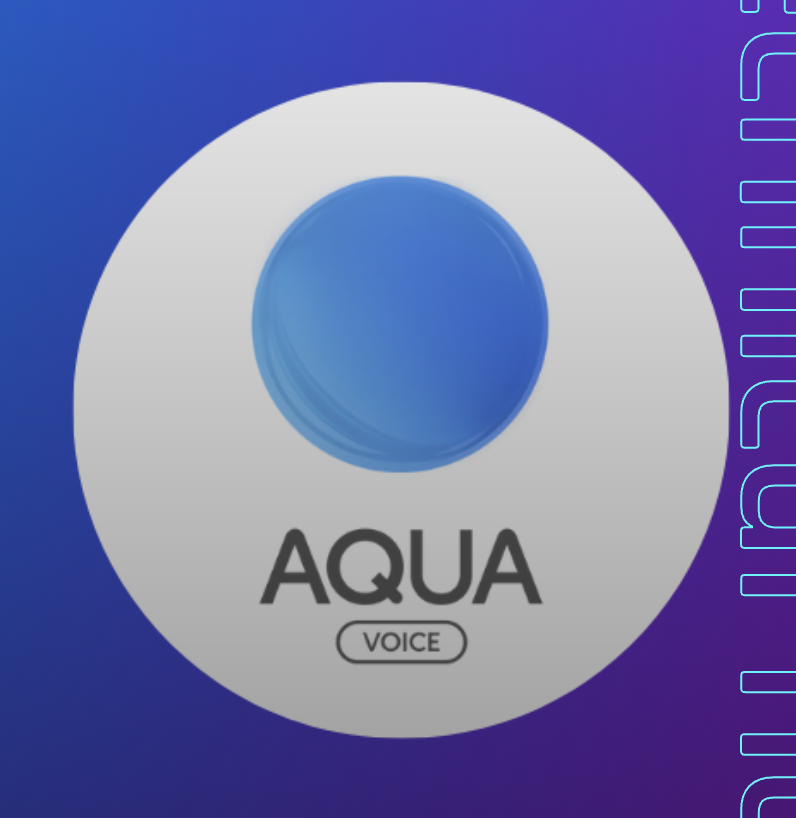

→ 無料で撒く

---

# 1. 音声入力デスクトップアプリケーション

    
    

        → 無料で撒く
        

            = 14日ライセンス 無制限
        

        

            = 12ヶ月ライセンス 6,000円
        

    

---

# 2. 実体はAIサーバーであり、OS on OS である

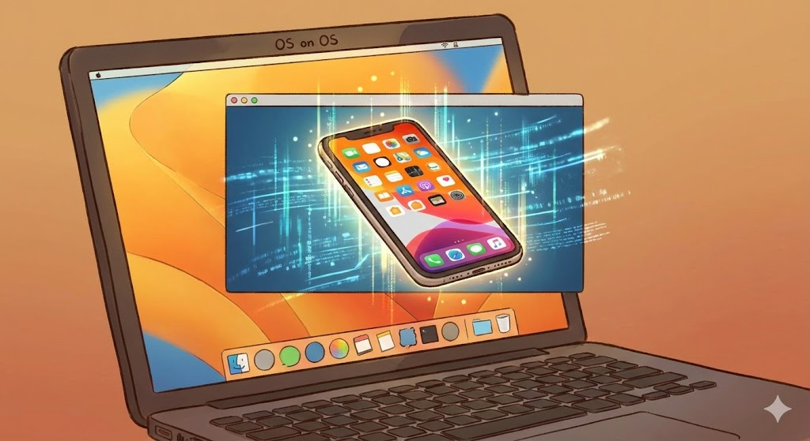

---

# 3. PCの中に住み、

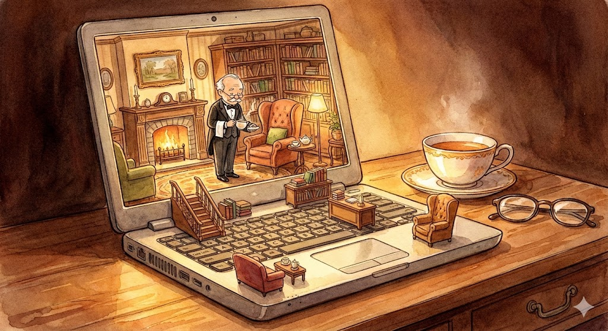

---

# 4. MYCUTE-OS 内のアプリはもちろん、

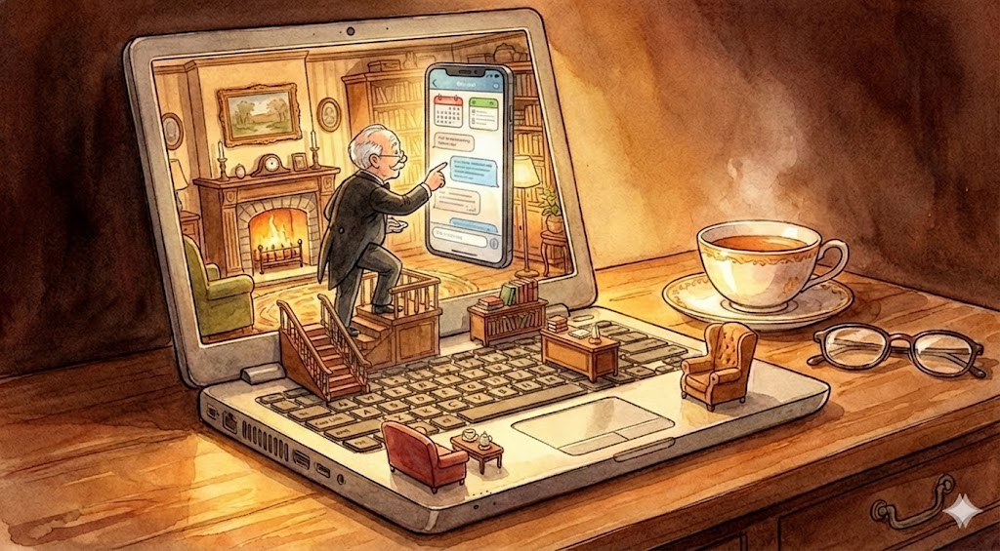

---

# 5. HOST-OS 上の全てを使ってあらゆる仕事をする

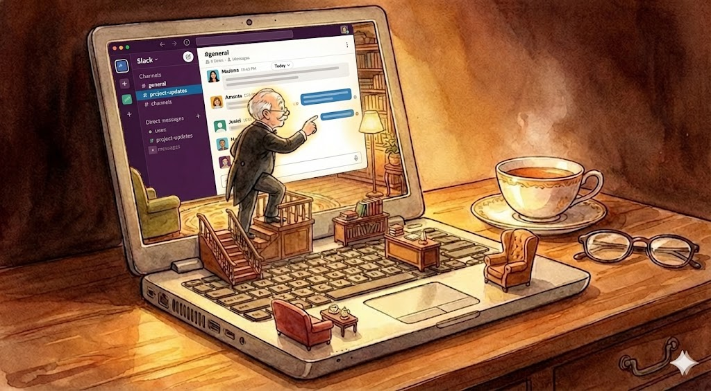

---
layout: center
class: text-center bg-[#1e293b] text-white
---

## Phase 2: 自己増殖・自己成長エージェントのオムニプレゼンス

---

# 6. 内部で自己増殖・自己成長するエージェント群

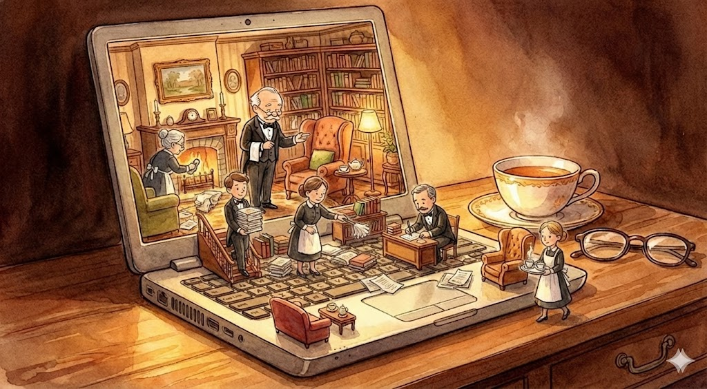

---

# 7. エージェントとのコミュニケーションは「ボイス」

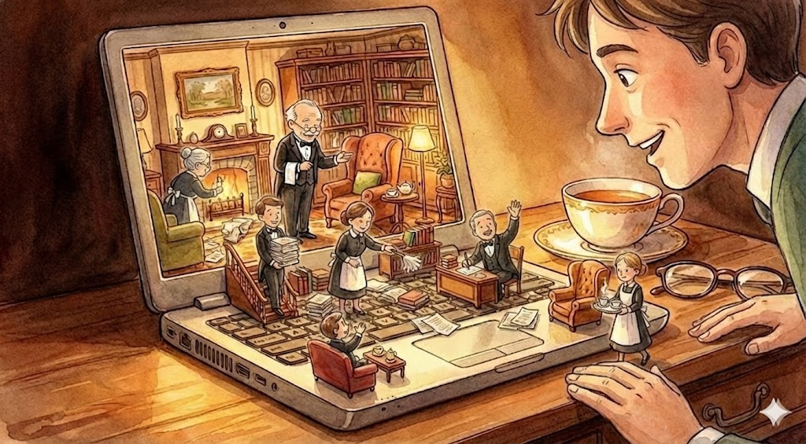

---

# 8. でも当然「オムニチャネル」

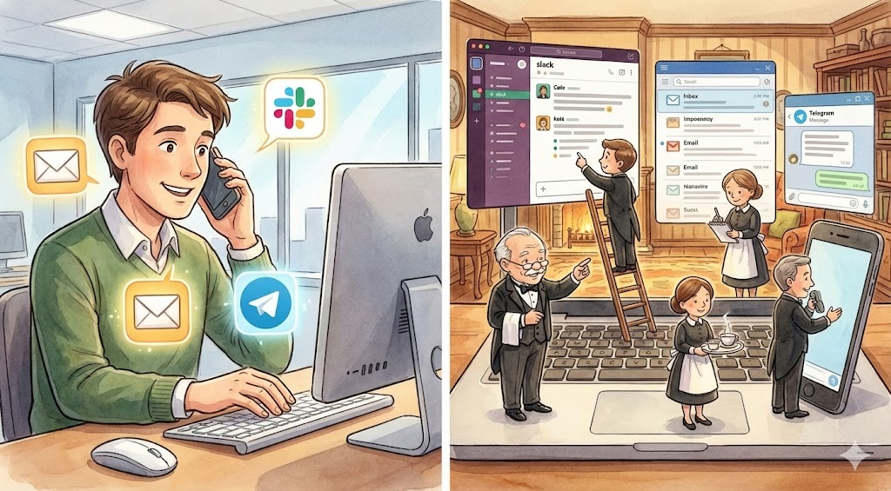

---

# 9. 地球の裏側から執事達に電話するという体験

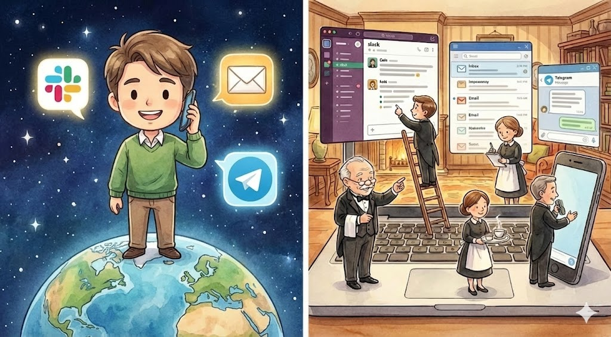

---

# 10. さらに自発性 = 勝手に仕事して話しかけてくる

---
layout: center
class: text-center bg-[#4476bd] text-white
---

<h1 class="message">できるの？そんなこと。</h1>

---

# OpenClaw は MIT License

---

# でも OpenClaw は危険視されている

- PC内部で暴れ回るんじゃないの？

- クレジットカードとか送金とかしちゃうのでは？

- 悪意のある人が、PCを乗っ取ったりしたら終わりだよね・・・

- そもそも、オムニチャネルなら、Slackとかメールとかまで危なくなるってこと？？

- アイコンのザリガニが、悪い顔してるけど・・・

---

# OpenClaw じゃなくても ZeroClaw

---

# ZeroClaw は、Rust製のランタイムライブラリ

- PC内部で暴れ回らないように制御すればいい。

- クレジットカードとか送金とかしないように制御すればいい。

- PCの乗っ取りを監視すればいい。

- オムニチャネルは通信の専門家である川田に任せてればいい。

- アイコンのザリガニは、可愛いエビにすればいい。

---
layout: center
class: text-center bg-[#4476bd] text-white
---

<h1 class="message">だから、できる。</h1>

---
layout: center
class: text-center bg-[#4476bd] text-white
---

<h1 class="message">ひゃくぱーせんと。</h1>

---
layout: center
class: text-center bg-[#1e293b] text-white
---

## Phase 3: 知識及び能力の固形化と流通

---

# 11. 知識と能力は「ボイス」でも「育つ」

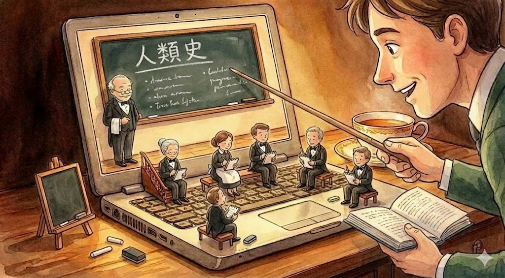

---

# 12. 知識量は、学術レベル書籍5000冊

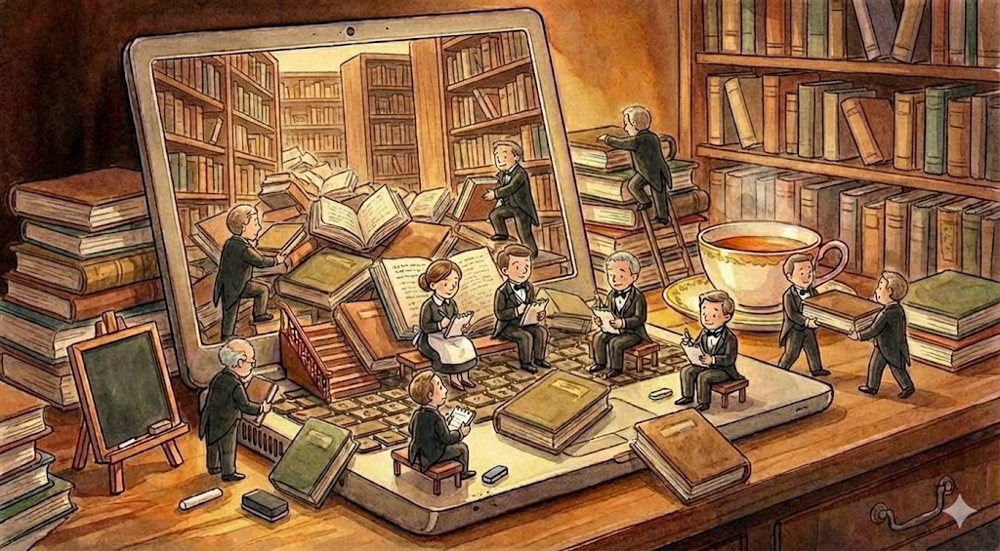

---

# 13. 時間経過による「概念ドリフト」にも対応

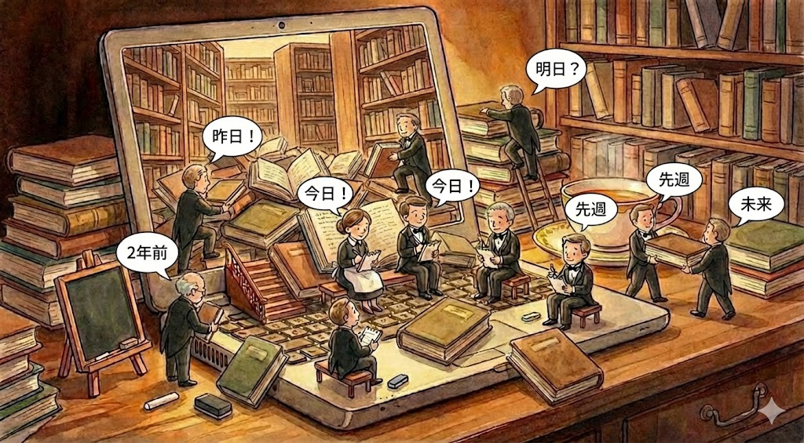

---

# 14. Cube（キューブ）という「固形化」が可能

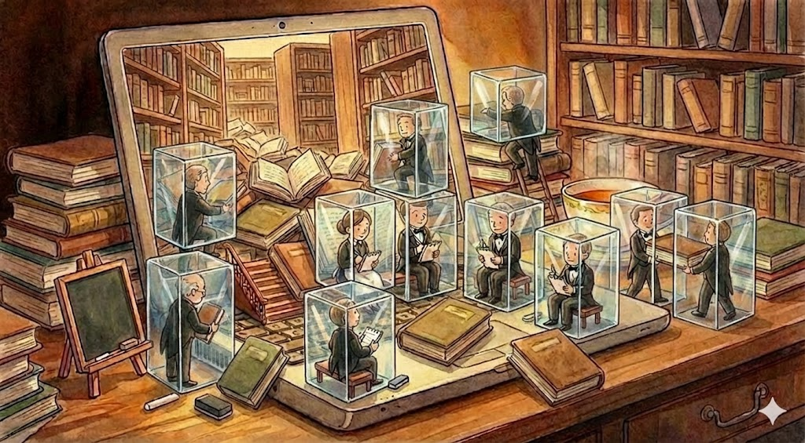

---

# 15. 固形化は「鍵付き暗号１ファイル」 = 流通可

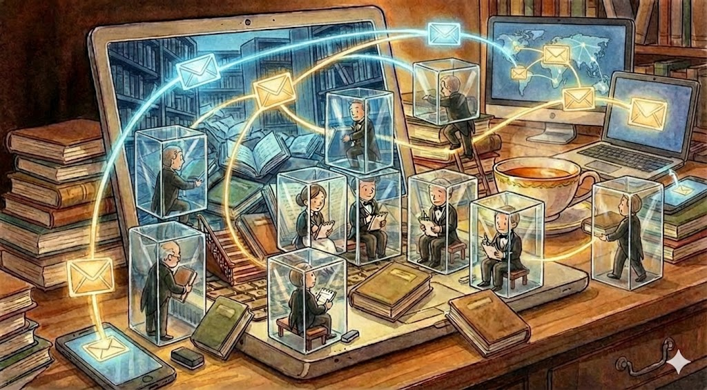

---
layout: center
class: text-center bg-[#1e293b] text-white
---

## Phase 4: Cube を更に育てる「世代」の概念と収益権

---

# 16. Cubeは、流通先で「更に育てる」ことができる

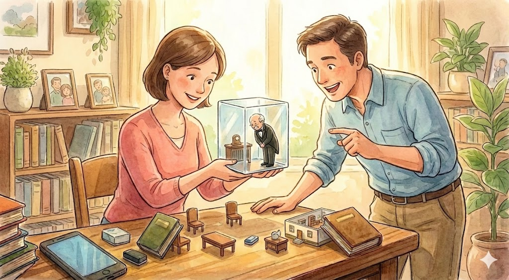

---

# 17. Cubeは、別のCubeと「合成」することができる

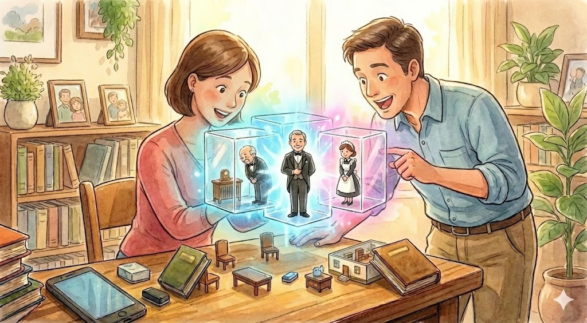

---

# 18. Cubeは「誰の教育による成長」か改竄不能で保持

---

# 19. 所有者は「期限付きの鍵」を販売できる

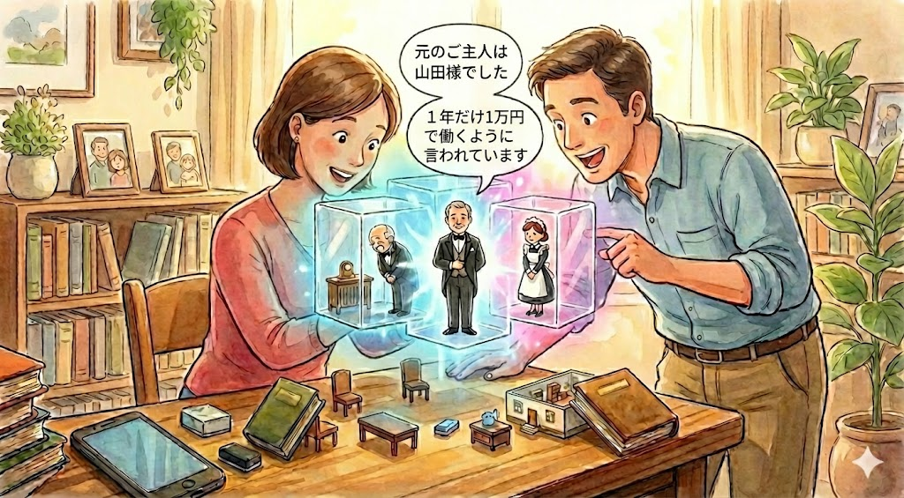

---

# 20. つまり Cube は流通経路を問わず「完全に安全」

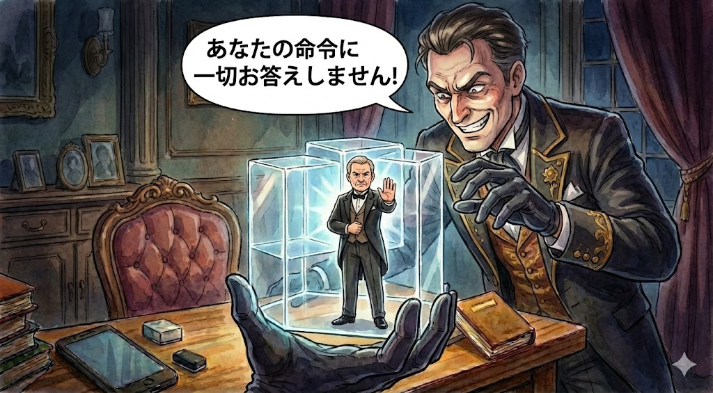

---
layout: center
class: text-center bg-[#4476bd] text-white
---

<h1 class="message">できるの？そんなこと。</h1>

---

# 既に、Go言語で作ったアセットがある

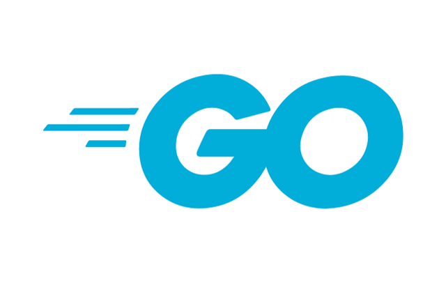

---

# Go言語をMYCUTEに合わせて廃止して・・・

---

# Rustに書き直す作業が重いけど

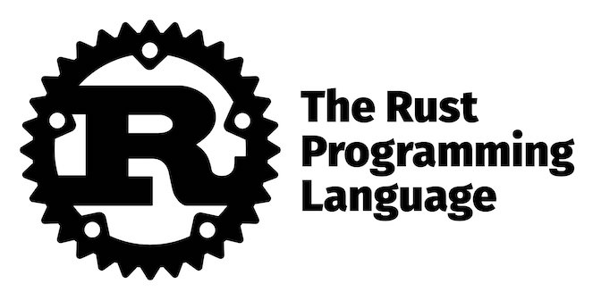

---
layout: center
class: text-center bg-[#4476bd] text-white
---

<h1 class="message">がんばるだけなので、できる。</h1>

---
layout: center
class: text-center bg-[#4476bd] text-white
---

<h1 class="message">ひゃくぱーせんと。</h1>

---
layout: center
class: text-center bg-[#1e293b] text-white
---

## Phase 5: 「信頼の鎖」と「実体非公開の数学的公証」

---

# Phase 5: 「信頼の鎖」と「実体非公開の数学的公証」

- Cubeの流通は、MYCUTE群が織り成す「P2PメッシュVPNネットワーク」によって行われる

- オーナー（全世界で15人）・中央認証局（CA）・開発者（一般ユーザ）は全てMYCUTEノード

- 通信の全ては、ブロックチェーン（BC）に似た改竄不能性を持ち、通信そのものが公証である

- Cube（知識 + 能力 + HTML + CSS + JavaScript）は、NW内において「数学的証拠」を形成

- 公開必須のBCと異なり、「Cubeの実体を非公開で数学的証明」を提供する

---
layout: center
class: text-center bg-[#1e293b] text-white
---

## Phase 6: NW仮想空間が現実世界と実在人物に紐づくメカニズム

---

# Phase 6: 仮想空間が現実世界と実在人物に紐づく物理

- オーナーは、期限付きCA証明書を発行できる

- 中央認証局(CA)は、eKYCと開発者証明書発行およびネットワークの健康維持を担う

- 開発者は、MYCUTE-OS内の「アプリ = 実務の塊」の流通で収益を得られる

- AIモリモリのスーパーCubeは、MYCUTE-OSの「機能呼び出し」だけで作れる

- Cube開発は専用の「環境」を必要とせず、「MYCUTE-OS自体が開発環境」を提供する

---
layout: center
class: text-center bg-[#1e293b] text-white
---

## Phase 7: 熱意のモデル化と力学と観察可能性

---

# Phase 7: 熱意のモデル化と力学と観察可能性

- 中央認証局(CA)の eKYC を通じて、MYCUTEノード及びCubeは現実世界と実在人物と紐づく

- 言わば、Cubeは「実在人物の部分的な影分身」である

- 知識 + 能力 + HTML + CSS + JS で表現できる全てのものに「数学的公証」を与えるため、

- 「影分身に対する『投票（ヴォート）』」を暗号学的に成立させられる

- 投票は、グレン・ワイル氏の「二次投票」に「2以上」「投票移動性」を加えてアレンジしたもの

- これは、個人の「熱意の反映」による「マーケット力学」を発生させる装置である

---

# 用語の復習とハイライト

- MYCUTEプロジェクトは「BPとの直接のコミュニケーションパスリスト」取得が目的である。

- MYCUTEは、OSである。

- MYCUTE内の Cube は「アプリ = 実務の塊」である。

- MYCUTEの自己増殖・自己成長するエージェントCube群は「City」である。

- MYCUTEネットワークは、Cityが織りなす「Society」である。

- MYCUTEネットワーク自体が、「Society内における公証」であり、

- 中央認証局(CA)の eKYC を通じて「Society空間と現実世界が完全に紐づく」。

- Cube影分身への投票は、個人の「熱意の反映」による「マーケット力学」を発生させる装置である。

- つまり、「熱意」さえ高ければ、「新参」でも「少数」でも「Society」にインパクトできる

- この「熱意のインパクト」が、

- MYCUTE-NW内の「複雑系」の中に「循環流」を数学的に発生させ、

- 当該循環流のオブザーバビリティ（観察可能性）を形成するため、

- 我々だけが、「神の視点」で「Society（= マーケットの縮図）」を俯瞰できる。

- 「俯瞰」は「売って（セールス）」もいいし「使って（マーケ）」もいい。

- 結局のところ、「BPとの直接のコミュニケーションパスリスト」を取得するプロジェクトである。

---
layout: center
class: text-center bg-[#4476bd] text-white
---

<h1 class="message" style="font-size: 40px !important;">PCとスマホの時代そのうち終わると思うけど？</h1>

---

# デッドライン

- 本日2026年2月25日

- おそらく2026年内には、巨人達が MYCUTE と同じことをやってくる

- つまり、デッドは1年

- 2026年12月31日が撤退ライン → アセットのフォークへ 

- どうせ、アセットのフォークは成功するので、楽しんでやればいい

